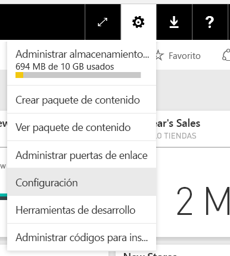
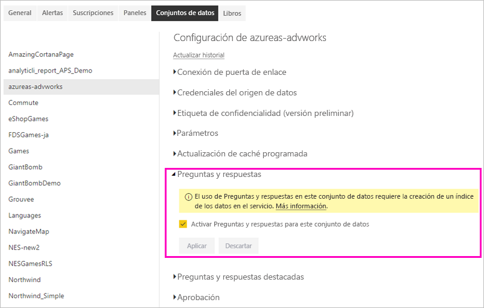

# Habilitación de Preguntas y respuestas en Power BI
## ¿Qué es la puerta de enlace de datos local?  ¿Qué es una conexión dinámica?
Los conjuntos de datos de Power BI se pueden importar a Power BI, o bien puede crear una conexión dinámica con ellos. Con frecuencia, los conjuntos de datos de conexión dinámica se conocen como "locales". Las conexiones dinámicas se administran mediante una [puerta de enlace](../connect-data/service-gateway-onprem.md) y los datos y las consultas se envían de un lado a otro mediante consultas dinámicas.

## Preguntas y respuestas acerca de los conjuntos de datos de la puerta de enlace de datos local
Si quiere usar Preguntas y respuestas con los conjuntos de datos a los que tiene acceso a través de una puerta de enlace, primero debe habilitarlos.

Una vez que lo haga, Power BI crea un índice del origen de datos y carga un subconjunto de esos datos a Power BI para habilitar la formulación de preguntas. Puede que la creación del índice inicial demore varios minutos; además, Power BI mantiene y actualiza automáticamente el índice a medida que cambian los datos. El uso de Preguntas y respuestas con estos conjuntos de datos se comporta del mismo modo que con los datos publicados en Power BI. En ambos casos, se admite el conjunto completo de características disponibles en la experiencia de Preguntas y respuestas.

Cuando formule preguntas en Power BI, Preguntas y respuestas determina el mejor objeto visual que se construirá o la hoja de informe que se va a usar para responder a la pregunta con un índice del conjunto de datos. Una vez que determine la respuesta con mejor potencial, Preguntas y respuestas usa DirectQuery para capturar datos activos desde el origen de datos a través de la puerta de enlace para rellenar diagramas y gráficos. Como resultado, Preguntas y respuestas de Power BI siempre muestra los datos más actualizados directamente desde el origen de datos subyacente.

Debido a que Preguntas y respuestas de Power BI usa los valores de texto y esquema del origen de datos para determinar cómo consultar el modelo subyacente para conocer las respuestas, las búsquedas de los valores específicos de texto nuevo o eliminado (como preguntar el nombre de un cliente relacionado con un registro de texto recién agregado) se basan en que el índice se actualice con los valores más recientes. Power BI mantiene actualizado el índice de texto y esquema automáticamente dentro de una ventana de cambios de 60 minutos.

Para más información, consulte:

* ¿Qué es la [puerta de enlace de datos local](../connect-data/service-gateway-onprem.md)?
* [Preguntas y respuestas de Power BI para consumidores](../consumer/end-user-q-and-a.md)

## Habilitación de Preguntas y respuestas
Una vez que haya configurado la puerta de enlace de datos, conéctese a los datos desde Power BI.  Puede crear un panel con sus datos locales, o bien puede cargar un archivo .pbix que use datos locales.  Además, puede que ya tenga datos locales en paneles, informes y conjuntos de datos que le hayan compartido.

1. En la esquina superior derecha de Power BI, seleccione el icono de engranaje  y elija **Configuración**.
   
   
2. Seleccione **conjuntos de datos** y elija el conjunto de datos que se va a habilitar para Preguntas y respuestas.
   
   
3. Expanda **Preguntas y respuestas**, active la casilla **Activar Preguntas y respuestas para este conjunto de datos** y elija **Aplicar**.
   
    

## ¿Qué datos se almacenan en caché y cómo se protege la privacidad?
Cuando habilita Preguntas y respuestas para los datos locales, se almacena un subconjunto de los datos en el caché del servicio. Este almacenamiento en caché garantiza que Preguntas y respuestas tenga un rendimiento razonable. Power BI excluye del almacenamiento en caché los valores que superan los 24 caracteres. La memoria caché se elimina dentro de unas horas cuando desactiva la opción **Activar Preguntas y respuestas para este conjunto de datos** para deshabilitar Preguntas y respuestas, o bien cuando elimina el conjunto de datos.

## Consideraciones y solución de problemas
La característica tiene algunas limitaciones:

* Inicialmente, la característica solo está disponible para orígenes de datos tabulares de SQL Server 2016 Analysis Services. La característica está optimizada para trabajar con datos tabulares. Preguntas y respuestas todavía no se admite para dimensiones múltiples. Los orígenes de datos adicionales admitidos por la puerta de enlace de datos local se lanzarán con el tiempo.
* La compatibilidad total con la seguridad de nivel de fila definida en SQL Server Analysis Services no está disponible inicialmente. Cuando se formulan cuestiones en Preguntas y respuestas, la característica “autocompletar” de las preguntas mientras se escribe puede mostrar los valores de cadena a los que un usuario no tiene acceso. Sin embargo, se respeta la RLS definida en el modelo para los objetos visuales de informe y gráfico, por lo que ningún dato numérico subyacente queda expuesto. En próximas actualizaciones se lanzarán opciones para controlar este comportamiento.
* La seguridad de nivel de objeto (OLS) no es compatible. Preguntas y respuestas no respeta la seguridad de nivel de objeto, con lo cual puede revelar nombres de tabla o de columna a usuarios que no tengan acceso. Conviene habilitar RLS para asegurarse de que los valores de los datos también estén correctamente protegidos. 
* Las conexiones dinámicas solo se admiten con la puerta de enlace de datos local. Como resultado, esta característica no se puede usar con la puerta de enlace personal.

## Pasos siguientes

- [Puerta de enlace de datos local](../connect-data/service-gateway-onprem.md)  
- [Administrar el origen de datos: Analysis Services](../connect-data/service-gateway-enterprise-manage-ssas.md)  
- [Conceptos básicos para diseñadores en el servicio Power BI](../fundamentals/service-basic-concepts.md)  
- [Introducción a Preguntas y respuestas de Power BI](../consumer/end-user-q-and-a.md)  

¿Tiene más preguntas? [Pruebe a preguntar a la comunidad de Power BI](https://community.powerbi.com/)
