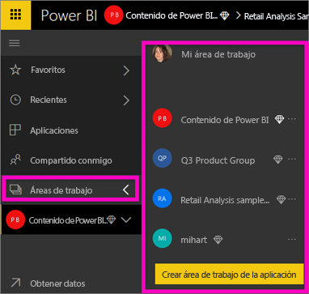
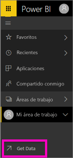
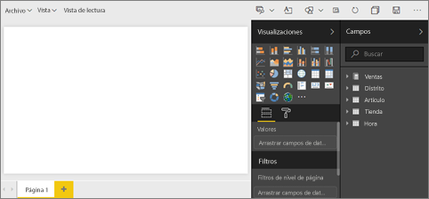
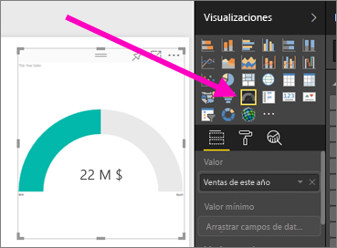
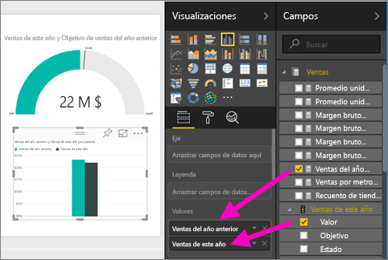
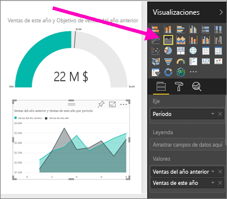
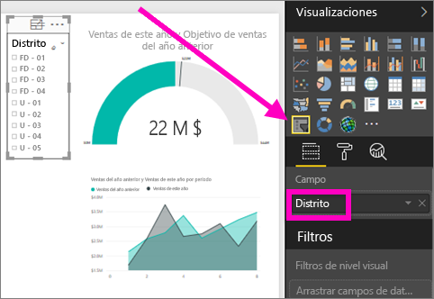

# Creación de un informe en el servicio Power BI mediante la importación de un conjunto de datos
Ha leído [Informes en Power BI](../consumer/end-user-reports.md) y ahora desea crear los suyos propios. Hay diferentes formas de crear un informe. En este artículo, comenzaremos por crear un informe básico en el servicio Power BI a partir de un conjunto de datos de Excel. Una vez que conozca los aspectos básicos de la creación de informes, consulte la sección [Pasos siguientes](#next-steps) al final de la página para ver temas de informes más avanzados.  

## Requisitos previos
- [Suscribirse al servicio Power BI](../fundamentals/service-self-service-signup-for-power-bi.md). Para crear informes con Power BI Desktop, consulte [Vista de informes en Power BI Desktop](desktop-report-view.md). 
- [Descargar el conjunto de datos de Excel del Ejemplo de análisis de minoristas](https://go.microsoft.com/fwlink/?LinkId=529778) y guardarlo en OneDrive para la Empresa o localmente.

## Importación del conjunto de datos
Este método de creación de informes comienza con un conjunto de datos y un lienzo de informe en blanco. Puede continuar con el conjunto de datos del Ejemplo de análisis de minoristas.

1. El informe lo crearemos en un área de trabajo del servicio Power BI, así que seleccione un área de trabajo existente o cree una.
   
   
2. Seleccione **Obtener datos** en la parte inferior del panel de navegación.
   
   
3. Seleccione **Archivos** y navegue hasta la ubicación en que guardó el archivo Retail Analysis Sample.
   
    
4. Para este ejercicio, seleccione **Importar**.
   
   
5. Una vez importado el conjunto de datos, seleccione **Ver conjunto de datos**.
   
   
6. Al visualizar un conjunto de datos, en realidad se abre el editor de informes.  Verá un lienzo en blanco y las herramientas de edición del informe.
   
   

> [!TIP]
> Si nunca ha usado el lienzo de edición de informes o necesita que le recuerden cómo funciona, [realice un recorrido por el editor de informes](service-the-report-editor-take-a-tour.md) antes de continuar. 
> 

## Adición de un medidor radial al informe
Una vez que ha importado el conjunto de datos, ha llegado el momento de responder algunas preguntas.  Nuestro director de marketing (CMO) desea saber lo cerca que estamos de cumplir los objetivos de ventas de este año. Un medidor es una [buena opción de visualización](../visuals/power-bi-report-visualizations.md) para mostrar este tipo de información.

1. En el panel Campos, seleccione **Ventas** > **Ventas de este año** > **Valor**.
   
    
2. Para convertir el objeto visual en un medidor, seleccione la plantilla Medidor  en el panel **Visualizaciones**.
   
    
3. Arrastre **Ventas** > **Ventas de este año** > **Objetivo** al área **Valor del objetivo**. Parece que estamos muy cerca de nuestro objetivo.
   
    
4. Este sería un buen momento para guardar el informe.
   
   

## Adición de un gráfico de áreas y segmentación de datos al informe
Nuestro director de marketing quiere que respondamos a varias preguntas más. Quiere ver la comparación de las ventas de este año con las del año anterior. Y también quiere ver los resultados por distrito.

1. En primer lugar, vamos a hacer algo de espacio en el lienzo. Seleccione el medidor y muévalo a la esquina superior derecha. Después, arrastre una de las esquinas para hacerlo menor.
2. Anule la selección del medidor. En el panel Campos, seleccione **Ventas** > **Ventas de este año** > **Valor** y seleccione **Ventas** > **Ventas del año anterior**.
   
    
3. Para convertir el objeto visual en un gráfico de áreas, seleccione la plantilla Gráfico de áreas  en el panel **Visualizaciones**.
4. Seleccione **Tiempo** > **Período** para agregarlo al área **Ejes**.
   
    
5. Para ordenar la visualización por período de tiempo, seleccione los puntos suspensivos y elija **Sort by Period**.
6. Ahora vamos a agregar la segmentación de datos. Seleccione un área vacía en el lienzo y elija la plantilla  Segmentación. Ahora tenemos una segmentación de datos vacía en nuestro lienzo.
   
        
7. En el panel Campos, seleccione **Distrito**  >  **Distrito**. Mueva la segmentación de datos y cámbiela de tamaño.
   
      
8. Use la segmentación de datos para buscar patrones e información por distrito.
   
     

Continúe explorando los datos y agregando visualizaciones. Cuando encuentre una información especialmente interesante, [ánclela a un panel](service-dashboard-pin-tile-from-report.md).

## Pasos siguientes

* Aprenda a [anclar visualizaciones a un panel](service-dashboard-pin-tile-from-report.md)   
* ¿Tiene más preguntas? [Pruebe la comunidad de Power BI](https://community.powerbi.com/)
