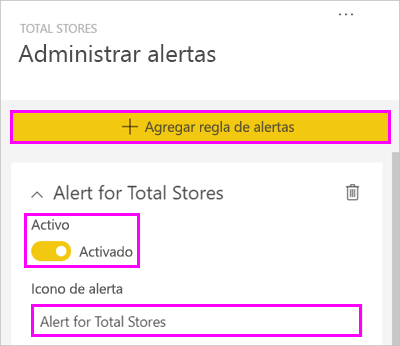
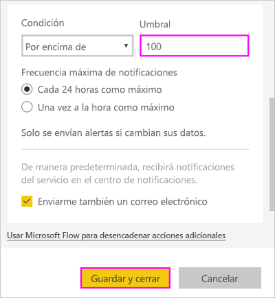
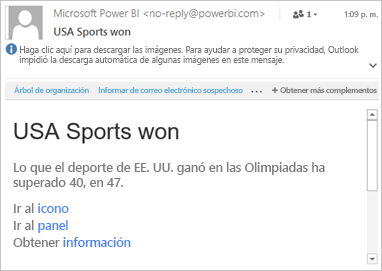
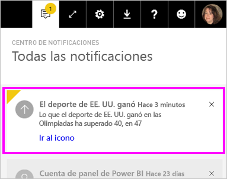
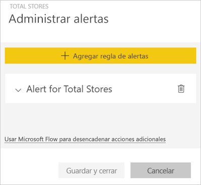
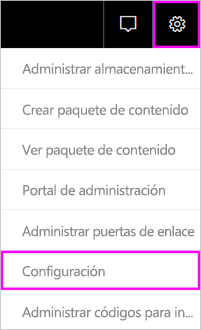

# Alertas de datos en el servicio Power BI

Establezca alertas que le envíen notificaciones cada vez que los datos de sus paneles cambien más allá de los límites establecidos.

Puede establecer alertas en iconos de Mi área de trabajo. También se pueden establecer alertas si alguien comparte un panel que se encuentra en una [capacidad Premium](../admin/service-premium-what-is.md). Si tiene una licencia de Power BI Pro, puede establecer alertas también en los iconos de cualquier otra área de trabajo. Las alertas solo se pueden configurar en los iconos anclados desde objetos visuales de informes y solo en medidores, KPI y tarjetas. Las alertas se pueden establecer en los objetos visuales creados a partir de conjuntos de objetos de streaming que se anclan desde un informe a un panel. No se pueden establecer alertas en iconos de streaming creados directamente en el panel mediante **Agregar icono** > **Datos de transmisión personalizados**.

Nadie más podrá ver las alertas que establezca, aunque comparta el panel. Ni siquiera el propietario del panel puede ver las alertas establecidas en la vista del panel. Las alertas de datos están completamente sincronizadas en las plataformas; establezca y vea las alertas de datos [en las aplicaciones móviles de Power BI](../consumer/mobile/mobile-set-data-alerts-in-the-mobile-apps.md) y en el servicio Power BI. No están disponibles para Power BI Desktop. Incluso puede automatizar e integrar alertas con Power Automate. Puede probarlo personalmente en este artículo sobre [Power Automate y Power BI](../collaborate-share/service-flow-integration.md).

> [!WARNING]
> Las notificaciones de alerta controladas por datos proporcionan información acerca de los datos. Si ve los datos de Power BI en un dispositivo móvil y roban ese dispositivo o se pierde, se recomienda usar el servicio Power BI para desactivar todas las reglas de alertas controladas por datos.

## Establecer alertas de datos en el servicio Power BI

Vea cómo Amanda agrega varias alertas a los iconos del panel. Luego, siga las instrucciones paso a paso que aparecen debajo del vídeo para intentarlo.

<iframe width="560" height="315" src="https://www.youtube.com/embed/JbL2-HJ8clE" frameborder="0" allowfullscreen></iframe>

Este ejemplo utiliza un icono de tarjeta del panel de ejemplo de análisis de minoristas. Si quiere continuar, abra el [informe del Ejemplo de análisis de minoristas](sample-retail-analysis.md#get-the-content-pack-for-this-sample).

1. Empiece en un panel. En el icono **Total de tiendas**, seleccione los puntos suspensivos.

   

1. Seleccione el icono de campana  para agregar una o varias alertas para **Total de tiendas**.

1. Para empezar, seleccione **+ Agregar regla de alertas**, asegúrese de que el control deslizante **Activo** esté establecido en **Activado**, y asigne un título a la alerta. Los títulos le ayudan a reconocer fácilmente las alertas.

   

1. Desplácese hacia abajo y escriba los detalles de la alerta.  En este ejemplo, se creará una alerta que enviará una notificación una vez al día si el número total de tiendas supera las 100.

   

    Las alertas aparecen en el **Centro de notificaciones**. Power BI también envía un correo electrónico sobre la alerta, si activa la casilla.

1. Haga clic en **Guardar y cerrar**.

## Recibir alertas

Si los datos de seguimiento alcanzan uno de los umbrales que ha establecido, se realizan varias acciones. En primer lugar, Power BI comprueba si han pasado más de una hora, o de 24 horas (según la opción seleccionada), desde la última alerta. Si los datos superan el umbral, recibirá una alerta.

Después, Power BI envía una alerta al **Centro de notificaciones** y, opcionalmente, un correo electrónico. Cada alerta contiene un vínculo directo a los datos. Seleccione el vínculo para ver el icono correspondiente que le permitirá explorar, compartir y obtener más información.  

* Si ha configurado la alerta para que se envíe un correo electrónico, encontrará algo parecido a esto en su bandeja de entrada.

   

* Power BI añade un mensaje a su **Centro de notificaciones** y una nueva alerta en el icono aplicable.

   

* En el **Centro de notificaciones** se muestran los detalles de la alerta.

    

   > [!NOTE]
   > Las alertas solo funcionan en los datos actualizados. Cuando los datos se actualizan, Power BI busca si se ha configurado una alerta para esos datos. Si los datos han alcanzado un umbral de alerta, Power BI desencadena una alerta.

## Administración de alertas

Hay muchas maneras de administrar las alertas:

* Desde el icono del panel.

* Desde el menú de configuración de Power BI.

* En un icono en las [aplicaciones móviles de Power BI](../consumer/mobile/mobile-set-data-alerts-in-the-mobile-apps.md).

### Desde el icono del panel

1. Si tiene que cambiar o quitar una alerta de un icono, seleccione el icono de campana **icono de alerta** para volver a abrir la ventana .

    Power BI muestra todas las alertas que ha configurado para ese icono.

    

1. Para modificar una alerta, seleccione la flecha situada a la izquierda del nombre de la alerta.

    

1. Para eliminar una alerta, seleccione la papelera situada a la derecha del nombre de la alerta.

      

### Desde el menú de configuración de Power BI

1. Seleccione el icono de engranaje de la barra de menús de Power BI y seleccione **Configuración**.

    .

1. En **Configuración**, seleccione **Alertas**.

    

1. Desde aquí, puede activar y desactivar alertas, abrir la ventana **Administrar de alertas** para realizar cambios o eliminar alertas.

## Consideraciones y solución de problemas

* Las alertas no se admiten para los iconos de tarjeta con medidas de fecha y hora.
* Las alertas solo funcionan con tipos de datos numéricos.
* Las alertas solo funcionan en los datos actualizados. No funcionan con datos estáticos.
* Las alertas solo funcionan en conjuntos de datos de streaming si crea un KPI, una tarjeta o un objeto visual de informe de medidor y después lo ancla al panel.

## Pasos siguientes

* [Creación de una instancia de Power Automate que incluya una alerta de datos](../collaborate-share/service-flow-integration.md).

* [Establecer alertas de datos en las aplicaciones móviles de Power BI](../consumer/mobile/mobile-set-data-alerts-in-the-mobile-apps.md).

* [¿Qué es Power BI?](../fundamentals/power-bi-overview.md)

¿Tiene más preguntas? [Pruebe a preguntar a la comunidad de Power BI](https://community.powerbi.com/)
