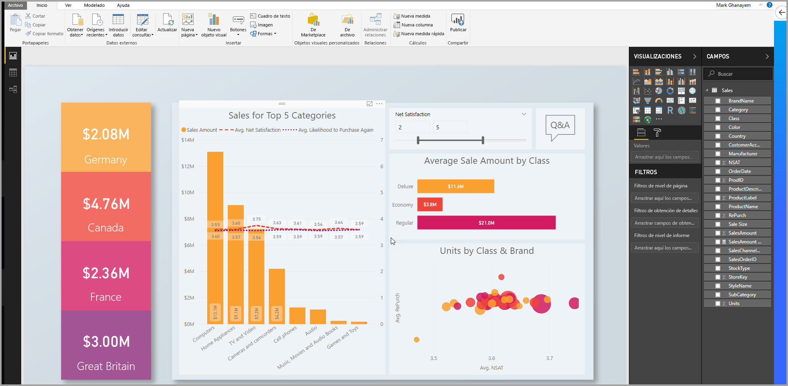
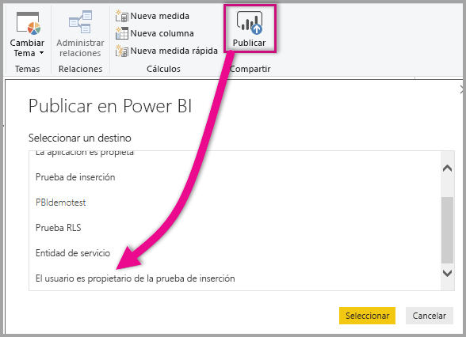
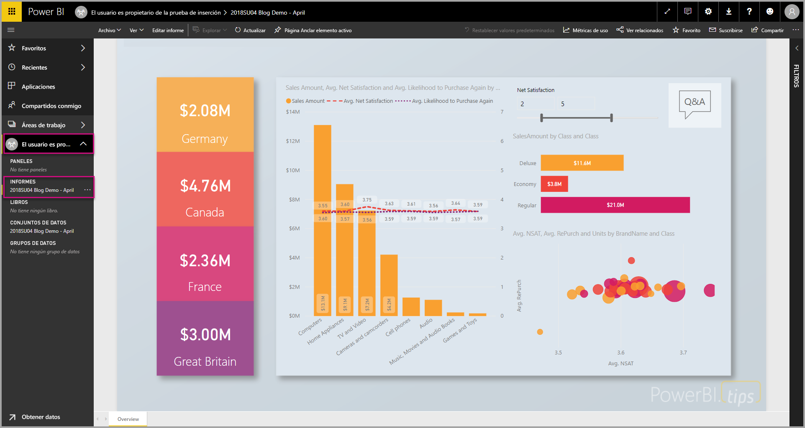
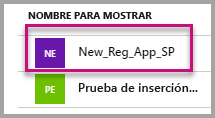
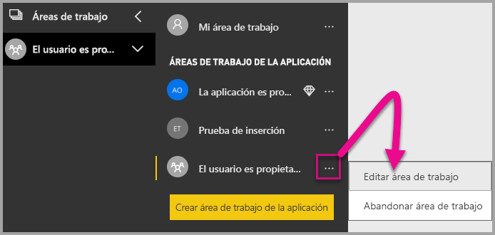
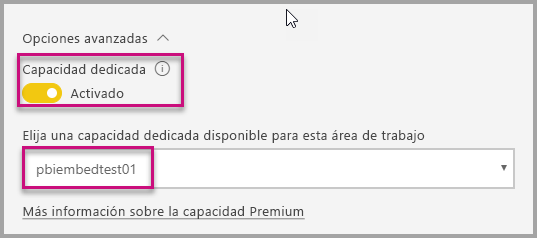
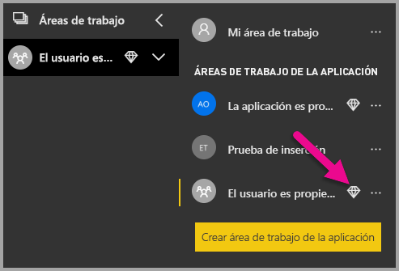

# <a name="tutorial-embed-power-bi-content-into-an-application-for-your-organization"></a>Tutorial: Insertar contenido de Power BI en una aplicación para la organización

En **Power BI**, puede insertar informes (Power BI o paginados), paneles o iconos en una aplicación mediante User owns data. **User owns data** permite a la aplicación ampliar el servicio Power BI para usar análisis integrados. En este tutorial se muestra cómo integrar un informe (Power BI o paginado) en una aplicación. Puede usar .NET SDK de Power BI, junto con la API JavaScript de Power BI para insertar Power BI en una aplicación para la organización.


En este tutorial, aprenderá las tareas siguientes:
> [!div class="checklist"]
> * Registrar una aplicación en Azure.
> * Insertar un informe de Power BI o paginado en una aplicación mediante el inquilino de Power BI.

## <a name="prerequisites"></a>Requisitos previos

Para empezar, es necesario que tenga:

* Una [cuenta de Power BI Pro](../../fundamentals/service-self-service-signup-for-power-bi.md).
* Una suscripción a [Microsoft Azure](https://azure.microsoft.com/).
* Debe tener configurado un [inquilino de Azure Active Directory](create-an-azure-active-directory-tenant.md) propio.
* Para insertar informes paginados, necesita al menos una capacidad P1. Vea [¿Qué tamaño de capacidad Premium se necesita para los informes paginados?](../../paginated-reports/paginated-reports-faq.md#what-size-premium-capacity-do-i-need-for-paginated-reports)

Si no está registrado en **Power BI Pro**, [regístrese para obtener una evaluación gratuita](https://powerbi.microsoft.com/pricing/) antes de empezar.

Si no tiene ninguna suscripción a Azure, cree una [cuenta gratuita](https://azure.microsoft.com/free/?WT.mc_id=A261C142F) antes de empezar.

## <a name="set-up-your-embedded-analytics-development-environment"></a>Configuración del entorno de desarrollo de análisis integrados

Antes de empezar a insertar informes, paneles o iconos en la aplicación, debe asegurarse de que su entorno permita la inserción con Power BI.

Puede seguir los pasos de la [herramienta de configuración de integración](https://aka.ms/embedsetup/UserOwnsData) para empezar a trabajar rápidamente y descargar una aplicación de ejemplo que sirve para crear un entorno e insertar un informe. En el caso de insertar un informe paginado, debe asignar al menos una capacidad P1 al área de trabajo creada.

Si prefiere configurar el entorno manualmente, siga los pasos que se indican más adelante.

### <a name="register-an-application-in-azure-active-directory"></a>Registro de una aplicación en Azure Active Directory

[Registre la aplicación](register-app.md) con Azure Active Directory para permitir que acceda a las [API REST de Power BI](https://docs.microsoft.com/rest/api/power-bi/). El hecho de registrar su aplicación permite establecer una identidad para esta y especificar los permisos para los recursos de REST de Power BI.

Tiene que continuar con el registro de una **aplicación web del lado servidor**. Una aplicación web del lado servidor se registra para crear un secreto de aplicación.

Después de crear la aplicación en Azure, ábrala en Azure, vaya a *Autenticación* y en *URI de redirección*, agregue **/Redirect** a *URI de redirección*.

## <a name="set-up-your-power-bi-environment"></a>Configuración del entorno de Power BI

### <a name="create-a-workspace"></a>Creación de un área de trabajo

Si va a insertar informes, paneles o iconos para los clientes, tiene que colocar el contenido en un área de trabajo. Existen distintos tipos de áreas de trabajo que se pueden configurar: las [áreas de trabajo tradicionales](../../collaborate-share/service-create-workspaces.md) o las [áreas de trabajo nuevas](../../collaborate-share/service-create-the-new-workspaces.md).

### <a name="create-and-publish-your-power-bi-reports"></a>Creación y publicación de informes de Power BI

Con Power BI Desktop puede crear informes y conjuntos de datos propios. Después, puede publicar esos informes en un área de trabajo. El usuario final que publique los informes deberá tener una licencia de Power BI Pro para publicar en un área de trabajo.

1. Descargue la [demostración](https://github.com/Microsoft/powerbi-desktop-samples) de ejemplo de GitHub.

    

2. Abra el informe .pbix de ejemplo en Power BI Desktop.

   

3. Publíquelo en el área de trabajo.

   

    Ahora puede ver el informe en el servicio Power BI en línea.

   
   
### <a name="create-and-publish-your-paginated-reports"></a>Creación y publicación de informes paginados

Puede crear los informes paginados con el [Generador de informes de Power BI](../../paginated-reports/paginated-reports-report-builder-power-bi.md#create-reports-in-power-bi-report-builder). Después, puede [cargar el informe](../../paginated-reports/paginated-reports-quickstart-aw.md#upload-the-report-to-the-service) a un área de trabajo asignada al menos a una capacidad P1. El usuario final que cargue el informe necesita tener una licencia de Power BI Pro para publicar en un área de trabajo.
   
## <a name="embed-your-content-by-using-the-sample-application"></a>Inserción del contenido mediante la aplicación de ejemplo

Este ejemplo se mantiene deliberadamente sencillo para fines de demostración.

Siga estos pasos para empezar a insertar contenido mediante la aplicación de ejemplo.

1. Descargue [Visual Studio](https://www.visualstudio.com/) (versión 2013 o posterior). Asegúrese de descargar el [paquete NuGet](https://www.nuget.org/profiles/powerbi) más reciente.

2. Descargue el [ejemplo User Owns Data](https://github.com/Microsoft/PowerBI-Developer-Samples) de GitHub para comenzar.

    

3. Abra el archivo **Cloud.config** de la aplicación de ejemplo.

    Hay campos que debe rellenar para ejecutar la aplicación.

    | Campo |
    |--------------------|
    | **[Id. de aplicación](#application-id)** |
    | **[Id. del área de trabajo](#workspace-id)** |
    | **[Id. de informe](#report-id)** |
    | **[AADAuthorityUrl](#aadauthorityurl)** |

    

### <a name="application-id"></a>Id. de aplicación

Rellene la información de **applicationId** con el **identificador de aplicación** de **Azure**. La aplicación usa **applicationId** para identificarse ante los usuarios a los que solicita permisos.

Para obtener **applicationId**, siga estos pasos:

1. Inicie sesión en [Azure Portal](https://portal.azure.com).

2. En el panel de navegación izquierdo, seleccione **Todos los servicios** y seleccione **Registros de aplicaciones**.

3. Seleccione la aplicación que necesite el valor **applicationId**.

    

4. Hay un **identificador de la aplicación** que se muestra como un GUID. Use este **identificador de aplicación** como **applicationId** de la aplicación.

    

### <a name="workspace-id"></a>Id. del área de trabajo

Rellene la información del valor **workspaceId** con el GUID del área de trabajo (grupo) de Power BI. Puede obtener esta información de la dirección URL cuando inicie sesión en el servicio Power BI o mediante PowerShell.

URL <br>


PowerShell <br>

```powershell
Get-PowerBIworkspace -name "User Owns Embed Test"
```

   

### <a name="report-id"></a>Report ID (Id. de informe)

Rellene la información de **reportId** con el GUID de informe de Power BI. Puede obtener esta información de la dirección URL cuando inicie sesión en el servicio Power BI o mediante PowerShell.

URL del informe de Power BI <br>


URL del informe paginado<br>


PowerShell <br>

```powershell
Get-PowerBIworkspace -name "User Owns Embed Test" | Get-PowerBIReport
```


### <a name="aadauthorityurl"></a>AADAuthorityUrl

Rellene la información **AADAuthorityUrl** con la dirección URL que le permite insertar en el inquilino organizativo o hacerlo con un usuario invitado.

Para insertar con el inquilino organizativo, use la dirección URL: *https://login.microsoftonline.com/common/oauth2/authorize* .

Para insertar con un invitado, use la dirección URL - `https://login.microsoftonline.com/report-owner-tenant-id` -, donde se agrega el id. de inquilino del propietario del informe en sustitución de *report-owner-tenant-id*.

### <a name="run-the-application"></a>Ejecutar la aplicación

1. Seleccione **Ejecutar** en **Visual Studio**.

    

2. Luego seleccione **Insertar informe**. En función del contenido con el que desee realizar las pruebas, es decir, informes, paneles o iconos, seleccione la opción correspondiente en la aplicación.

    

3. Ahora puede ver el informe en la aplicación de ejemplo.

    

## <a name="embed-your-content-within-your-application"></a>Inserción de contenido en la aplicación

Aunque los pasos para insertar el contenido se pueden realizar con las [API REST de Power BI](https://docs.microsoft.com/rest/api/power-bi/), la inserción de los códigos de ejemplo descritos en este artículo se ha realizado con el SDK de .NET.

Para integrar un informe en una aplicación web, use la API REST de Power BI o el SDK de C# de Power BI. También puede usar un token de acceso de autorización de Azure Active Directory para obtener un informe. Luego, cargue el informe con el mismo token de acceso. La API REST de Power BI proporciona acceso mediante programación a recursos concretos de Power BI. Para obtener más información, vea [Power BI REST APIs](https://docs.microsoft.com/rest/api/power-bi/) (API REST de Power BI) y la [API de JavaScript de Power BI](https://github.com/Microsoft/PowerBI-JavaScript).

### <a name="get-an-access-token-from-azure-ad"></a>Obtener un token de acceso de Azure AD

En la aplicación, debe obtener un token de acceso de Azure AD para poder realizar llamadas a la API REST de Power BI. Para más información, consulte [Authenticate users and get an Azure AD access token for your Power BI app](get-azuread-access-token.md) (Autenticación de usuarios y obtención de un token de acceso de Azure AD para su aplicación de Power BI).

### <a name="get-a-report"></a>Obtener un informe

Para obtener un informe de Power BI o paginado, use la operación [Obtener informes](https://docs.microsoft.com/rest/api/power-bi/reports/getreports), que obtiene una lista de informes de Power BI y paginados. En la lista de informes, puede obtener un identificador de informe.

### <a name="get-reports-by-using-an-access-token"></a>Obtención de informes mediante un token de acceso

La operación [Obtener informes](https://docs.microsoft.com/rest/api/power-bi/reports/getreports) devuelve una lista de informes. Puede obtener un informe de la lista de informes.

Para realizar la llamada de API de REST, debe incluir un encabezado *Autorización* con el formato de *Portador {token de acceso}* .

#### <a name="get-reports-with-the-rest-api"></a>Obtención de informes con la API de REST

En el ejemplo de código siguiente se muestra cómo recuperar informes con la API de REST:

> [!Note]
> En el archivo Default.aspx.cs de la [aplicación de ejemplo](https://github.com/Microsoft/PowerBI-Developer-Samples) hay un ejemplo de cómo obtener un elemento de contenido que se quiere insertar. Los ejemplos son un informe, panel o icono.

```csharp
using Newtonsoft.Json;

//Get a Report. In this sample, you get the first Report.
protected void GetReport(int index)
{
    //Configure Reports request
    System.Net.WebRequest request = System.Net.WebRequest.Create(
        String.Format("{0}/Reports",
        baseUri)) as System.Net.HttpWebRequest;

    request.Method = "GET";
    request.ContentLength = 0;
    request.Headers.Add("Authorization", String.Format("Bearer {0}", accessToken.Value));

    //Get Reports response from request.GetResponse()
    using (var response = request.GetResponse() as System.Net.HttpWebResponse)
    {
        //Get reader from response stream
        using (var reader = new System.IO.StreamReader(response.GetResponseStream()))
        {
            //Deserialize JSON string
            PBIReports Reports = JsonConvert.DeserializeObject<PBIReports>(reader.ReadToEnd());

            //Sample assumes at least one Report.
            //You could write an app that lists all Reports
            if (Reports.value.Length > 0)
            {
                var report = Reports.value[index];

                txtEmbedUrl.Text = report.embedUrl;
                txtReportId.Text = report.id;
                txtReportName.Text = report.name;
            }
        }
    }
}

//Power BI Reports used to deserialize the Get Reports response.
public class PBIReports
{
    public PBIReport[] value { get; set; }
}
public class PBIReport
{
    public string id { get; set; }
    public string reportType { get; set }
    public string name { get; set; }
    public string webUrl { get; set; }
    public string embedUrl { get; set; }
}
```

#### <a name="get-reports-by-using-the-net-sdk"></a>Obtención de informes mediante el SDK de .NET

Puede usar el SDK de .NET para recuperar una lista de informes, en lugar de llamar directamente a la API de REST. En el ejemplo de código siguiente se muestra cómo enumerar los informes:

```csharp
using Microsoft.IdentityModel.Clients.ActiveDirectory;
using Microsoft.PowerBI.Api.V2;
using Microsoft.PowerBI.Api.V2.Models;

var tokenCredentials = new TokenCredentials(<ACCESS TOKEN>, "Bearer");

// Create a Power BI Client object. It is used to call Power BI APIs.
using (var client = new PowerBIClient(new Uri(ApiUrl), tokenCredentials))
{
    // Get the first report all reports in that workspace
    ODataResponseListReport reports = client.Reports.GetReports();

    Report report = reports.Value.FirstOrDefault();

    var embedUrl = report.EmbedUrl;
}
```

### <a name="load-a-report-by-using-javascript"></a>Carga de un informe mediante JavaScript

Puede usar JavaScript para cargar un informe en un elemento div en su página web. En el ejemplo de código siguiente se muestra cómo recuperar un informe de un área de trabajo determinada:

> [!NOTE]  
> En el archivo **Default.aspx** de la [aplicación de ejemplo](https://github.com/Microsoft/PowerBI-Developer-Samples) hay disponible un ejemplo de cómo cargar un elemento de contenido que se quiera insertar.

```javascript
<!-- Embed Report-->
<div> 
    <asp:Panel ID="PanelEmbed" runat="server" Visible="true">
        <div>
            <div><b class="step">Step 3</b>: Embed a report</div>

            <div>Enter an embed url for a report from Step 2 (starts with https://):</div>
            <input type="text" id="tb_EmbedURL" style="width: 1024px;" />
            <br />
            <input type="button" id="bEmbedReportAction" value="Embed Report" />
        </div>

        <div id="reportContainer"></div>
    </asp:Panel>
</div>
```

#### <a name="sitemaster"></a>Site.master

```javascript
window.onload = function () {
    // client side click to embed a selected report.
    var el = document.getElementById("bEmbedReportAction");
    if (el.addEventListener) {
        el.addEventListener("click", updateEmbedReport, false);
    } else {
        el.attachEvent('onclick', updateEmbedReport);
    }

    // handle server side post backs, optimize for reload scenarios
    // show embedded report if all fields were filled in.
    var accessTokenElement = document.getElementById('MainContent_accessTokenTextbox');
    if (accessTokenElement !== null) {
        var accessToken = accessTokenElement.value;
        if (accessToken !== "")
            updateEmbedReport();
    }
};

// update embed report
function updateEmbedReport() {

    // check if the embed url was selected
    var embedUrl = document.getElementById('tb_EmbedURL').value;
    if (embedUrl === "")
        return;

    // get the access token.
    accessToken = document.getElementById('MainContent_accessTokenTextbox').value;

    // Embed configuration used to describe the what and how to embed.
    // This object is used when calling powerbi.embed.
    // You can find more information at https://github.com/Microsoft/PowerBI-JavaScript/wiki/Embed-Configuration-Details.
    var config = {
        type: 'report',
        accessToken: accessToken,
        embedUrl: embedUrl
    };

    // Grab the reference to the div HTML element that will host the report.
    var reportContainer = document.getElementById('reportContainer');

    // Embed the report and display it within the div container.
    var report = powerbi.embed(reportContainer, config);

    // report.on will add an event handler which prints to Log window.
    report.on("error", function (event) {
        var logView = document.getElementById('logView');
        logView.innerHTML = logView.innerHTML + "Error<br/>";
        logView.innerHTML = logView.innerHTML + JSON.stringify(event.detail, null, "  ") + "<br/>";
        logView.innerHTML = logView.innerHTML + "---------<br/>";
    }
  );
}
```

## <a name="using-a-power-bi-premium-dedicated-capacity"></a>Uso de una capacidad dedicada de Power BI Premium

Ahora que ya ha terminado de desarrollar la aplicación, es el momento de proporcionar una capacidad dedicada al área de trabajo.

### <a name="create-a-dedicated-capacity"></a>Crear una capacidad dedicada

Al crear una capacidad dedicada, puede aprovechar las ventajas de disponer de un recurso dedicado para el contenido del área de trabajo. En el caso de los informes paginados, debe asignar al área de trabajo al menos una capacidad P1. Puede crear una capacidad dedicada mediante [Power BI Premium](../../admin/service-premium-what-is.md).

En la tabla siguiente se enumeran las SKU de Power BI Premium disponibles en [Microsoft Office 365](../../admin/service-admin-premium-purchase.md):

| Nodo de capacidad | Núcleos virtuales totales<br/>(back-end y front-end) | Núcleos virtuales de back-end | Núcleos virtuales de front-end | Límites de conexiones dinámicas/DirectQuery |
| --- | --- | --- | --- | --- | --- |
| EM1 |1 núcleo virtual |0,5 núcleos virtuales, 10 GB de RAM |0,5 núcleos virtuales |3,75 por segundo |
| EM2 |2 núcleos virtuales |1 núcleo virtual, 10 GB de RAM |1 núcleo virtual |7,5 por segundo |
| EM3 |4 núcleos virtuales |2 núcleos virtuales, 10 GB de RAM |2 núcleos virtuales |15 por segundo |
| P1 |8 núcleos virtuales |4 núcleos virtuales, 25 GB de RAM |4 núcleos virtuales |30 por segundo |
| P2 |16 núcleos virtuales |8 núcleos virtuales, 50 GB de RAM |8 núcleos virtuales |60 por segundo |
| P3 |32 núcleos virtuales |16 núcleos virtuales, 100 GB de RAM |16 núcleos virtuales |120 por segundo |
| P4 |64 núcleos virtuales |32 núcleos virtuales, 200 GB de RAM |32 núcleos virtuales |240 por segundo |
| P5 |128 núcleos virtuales |64 núcleos virtuales, 400 GB de RAM |64 núcleos virtuales |480 por segundo |

> [!NOTE]
> - Cuando intente la inserción con aplicaciones de Microsoft Office, puede usar las SKU EM para acceder a contenido con una licencia gratuita de Power BI. Pero no puede acceder al contenido con una licencia gratuita de Power BI cuando se usa Powerbi.com o Power BI Mobile.
> - Cuando intente realizar la inserción con aplicaciones de Microsoft Office mediante Powerbi.com o Power BI Mobile, puede acceder al contenido con una licencia gratuita de Power BI.

### <a name="assign-a-workspace-to-a-dedicated-capacity"></a>Asignación de un área de trabajo a una capacidad dedicada

Después de crear una capacidad dedicada, puede asignar el área de trabajo a esa capacidad dedicada. Para completar este proceso, siga estos pasos:

1. En el servicio Power BI, expanda las áreas de trabajo y haga clic en el botón de puntos suspensivos del área de trabajo en la que quiera insertar el contenido. A continuación, seleccione **Editar áreas de trabajo**.

    

2. Expanda **Avanzadas** y habilite **Capacidad dedicada**. Seleccione la capacidad dedicada que ha creado. Luego seleccione **Guardar**.

    

3. Después de seleccionar **Guardar**, debería ver un rombo junto al nombre del área de trabajo.

    

## <a name="admin-settings"></a>Configuración de administrador

Los administradores globales o los administradores de servicios de Power BI pueden activar o desactivar la capacidad para usar las API REST de un inquilino. Los administradores de Power BI pueden establecer esta opción para toda la organización o para grupos de seguridad individuales. De forma predeterminada, está habilitada para toda la organización. Puede realizar estos cambios en el [portal de administración de Power BI](../../admin/service-admin-portal.md).

## <a name="next-steps"></a>Pasos siguientes

En este tutorial, ha obtenido información sobre cómo insertar contenido de Power BI en una aplicación mediante la cuenta de la organización de Power BI. Ahora puede intentar insertar contenido de Power BI en una aplicación mediante aplicaciones. También puede intentar insertar contenido de Power BI para los clientes (todavía no se admite para insertar informes paginados):

> [!div class="nextstepaction"]
> [Insertar desde aplicaciones](embed-from-apps.md)

> [!div class="nextstepaction"]
>[Insertar para los clientes](embed-sample-for-customers.md)

Si tiene más preguntas, [pruebe a preguntar a la comunidad de Power BI](https://community.powerbi.com/).
