# <a name="row-level-security-with-power-bi-embedded"></a>Seguridad de nivel de fila con Power BI Embedded

La **seguridad de nivel de fila (RLS)** se puede usar para restringir el acceso de los usuarios a los datos de paneles, iconos, informes y conjuntos de datos. Varios usuarios diferentes pueden trabajar con esos mismos artefactos mientras ven otros datos distintos. La inserción admite RLS.

Si va a realizar una inserción para usuarios que no son de Power BI (la aplicación posee los datos), que es normalmente un escenario de ISV, este es el artículo que necesita. Configure el token de inserción para tener en cuenta el usuario y el rol.

Si va a realizar la inserción para usuarios de Power BI (el usuario posee los datos), dentro de su organización, RLS funciona igual que dentro del servicio Power BI directamente. No tiene que hacer nada más en la aplicación. Para más información, vea [Seguridad de nivel de fila (RLS) con Power BI](../../service-admin-rls.md).


Para aprovechar las ventajas de RLS, es importante que comprenda tres conceptos principales: usuarios, roles y reglas. Ahora se analizarán estos conceptos más detenidamente:

**Usuarios**: los usuarios finales que ven el artefacto (panel, icono, informe o conjunto de datos). En Power BI Embedded, los usuarios se identifican por la propiedad de nombre de usuario de un token de inserción.

**Roles**: los usuarios pertenecen a roles. Un rol es un contenedor de reglas y se puede designar algo como *Representante de ventas* o *Rep. de ventas*. Los roles se crean en Power BI Desktop. Para más información, consulte [Seguridad de nivel de fila (RLS) con Power BI Desktop](../../desktop-rls.md).

**Reglas**: los roles tienen reglas y esas reglas son los filtros reales que se van a aplicar a los datos. Las reglas podrían ser algo tan sencillo como "País = EE. UU." o algo mucho más dinámico.
En el resto de este artículo, se incluye un ejemplo de la creación de RLS y su uso dentro de una aplicación insertada. En nuestro ejemplo se usa el archivo PBIX de [ejemplo de análisis de minoristas](https://go.microsoft.com/fwlink/?LinkID=780547).


## <a name="adding-roles-with-power-bi-desktop"></a>Adición de roles con Power BI Desktop

El **ejemplo de análisis de minoristas** muestra las ventas de todas las tiendas de una cadena de minoristas. Sin RLS, no importa qué jefe de distrito inicie la sesión y vea el informe, ya que los datos que vea serán los mismos. La administración senior ha determinado que cada jefe de distrito solo debe ver las ventas de las tiendas que dirige. El uso de RLS permite a la administración senior restringir los datos según un jefe de distrito.

RLS se crea en Power BI Desktop. Cuando se abren el conjunto de datos y el informe, se puede cambiar a una vista de diagrama para ver el esquema:


Estos son algunos aspectos que debe observar con este esquema:

* Todas las medidas, como **Total Sales**, se almacenan en la tabla de hechos **Sales**.
* Hay cuatro tablas de dimensiones relacionadas adicionales: **Item**, **Time**, **Store** y **District**.
* Las flechas de las líneas de relación indican de qué forma los filtros pueden fluir de una tabla a otra. Por ejemplo, si se coloca un filtro en **Time[Date]** , en el esquema actual solo se filtrarían los valores de la tabla **Sales**. Ninguna otra tabla se ve afectada por este filtro ya que todas las flechas de las líneas de relación apuntan a la tabla de ventas y no fuera.
* La tabla **District** indica quién es el jefe de cada distrito:
  
    

Según este esquema, si se aplica un filtro a la columna **District Manager** de la tabla **District**, y si ese filtro coincide con el usuario que ve el informe, ese filtro también filtra las tablas **Store** y **Sales** para mostrar los datos de ese jefe de distrito.

Le mostramos cómo:

1. En la ficha **Modelado**, seleccione **Administrar roles**.

    
2. Cree un nuevo rol llamado **Manager**.

    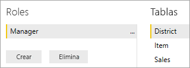
3. En la tabla **District**, escriba esta expresión DAX: **[District Manager] = USERNAME()** .

    
4. Para asegurarse de que las reglas funcionen, en la pestaña **Modelado**, seleccione **Ver como roles** y, luego, el rol **Administrador** que acaba de crear, junto con **Otros usuarios**. Escriba **AndrewMa** como usuario.

    

    Los informes muestran los datos como si hubiera iniciado sesión como **AndrewMa**.

Al aplicar el filtro como se ha hecho aquí, se filtran todos los registros de las tablas **District**, **Store** y **Sales**. Pero, debido a la dirección del filtro en las relaciones entre las tablas **Sales** y **Time**, no se filtrarán las tablas **Sales** e **Item** e **Item** y **Time**. Para aprender más sobre filtrado cruzado bidireccional, descargue el documento técnico sobre el [filtrado cruzado bidireccional en SQL Server Analysis Services 2016 y Power BI Desktop](https://download.microsoft.com/download/2/7/8/2782DF95-3E0D-40CD-BFC8-749A2882E109/Bidirectional%20cross-filtering%20in%20Analysis%20Services%202016%20and%20Power%20BI.docx).

## <a name="applying-user-and-role-to-an-embed-token"></a>Aplicación de usuarios y roles a un token de inserción

Ahora que tiene configurados los roles de Power BI Desktop, es necesario hacer algunas cosas en la aplicación para aprovechar sus ventajas.

La aplicación autentica y autoriza a los usuarios y los tokens de inserción se usan para conceder a ese usuario acceso a un informe específico de Power BI Embedded. Power BI Embedded no tiene ninguna información específica sobre quién es el usuario. Para que RLS funcione, es necesario pasar un poco más de contexto como parte del token de inserción en forma de identidades. Puede pasar las identidades mediante la API [Embed Token](https://docs.microsoft.com/rest/api/power-bi/embedtoken).

La API acepta una lista de identidades con la indicación de los conjuntos de datos pertinentes. Para que RLS funcione, debe pasar los siguientes elementos como parte de la identidad.

* **nombre de usuario (obligatorio)** : una cadena que se puede usar para ayudar a identificar el usuario al aplicar reglas de RLS. Se puede mostrar un único usuario. El nombre de usuario se puede crear con caracteres *ASCII*.
* **roles (obligatorio)** : una cadena que contiene los roles que se seleccionarán al aplicar reglas de seguridad de nivel de fila. Si se pasa más de un rol, se deben pasar como una matriz de cadenas.
* **conjunto de datos (obligatorio)** : el conjunto de datos que es aplicable al artefacto que se va a insertar.

Puede crear el token de inserción mediante el método **GenerateTokenInGroup** de **PowerBIClient.Reports**.

Por ejemplo, podría cambiar el ejemplo [PowerBIEmbedded_AppOwnsData](https://github.com/Microsoft/PowerBI-Developer-Samples/tree/master/App%20Owns%20Data). Las *líneas 76 y 77 de Home\HomeController.cs* se podrían actualizar de:

```csharp
// Generate Embed Token.
var generateTokenRequestParameters = new GenerateTokenRequest(accessLevel: "view");

var tokenResponse = await client.Reports.GenerateTokenInGroupAsync(GroupId, report.Id, generateTokenRequestParameters);
```

a

```csharp
var generateTokenRequestParameters = new GenerateTokenRequest("View", null, identities: new List<EffectiveIdentity> { new EffectiveIdentity(username: "username", roles: new List<string> { "roleA", "roleB" }, datasets: new List<string> { "datasetId" }) });

var tokenResponse = await client.Reports.GenerateTokenInGroupAsync("groupId", "reportId", generateTokenRequestParameters);
```

Si llama a la API REST, la API actualizada acepta ahora una matriz JSON adicional, llamada **identities**, que contiene un nombre de usuario, una lista de roles de cadena y una lista de conjuntos de datos de cadena. 

Por ejemplo, use el código siguiente:

```json
{
    "accessLevel": "View",
    "identities": [
        {
            "username": "EffectiveIdentity",
            "roles": [ "Role1", "Role2" ],
            "datasets": [ "fe0a1aeb-f6a4-4b27-a2d3-b5df3bb28bdc" ]
        }
    ]
}
```

Ahora, una vez encajadas todas las piezas, cuando alguien inicie sesión en la aplicación para ver este artefacto, solo podrá ver los datos para los que tiene permiso, como se define en la seguridad de nivel de fila.

## <a name="working-with-analysis-services-live-connections"></a>Trabajo con conexiones activas de Analysis Services

La seguridad de nivel de fila se puede usar con conexiones dinámicas de Analysis Services para servidores locales. Hay algunos conceptos específicos que debe conocer al usar este tipo de conexión.

La identidad efectiva que se proporciona para la propiedad username debe ser la de un usuario de Windows con permisos en el servidor de Analysis Services.

>[!NOTE]
> Al usar una entidad de servicio con un origen de datos de [Azure Analysis Services](https://docs.microsoft.com/azure/analysis-services/analysis-services-overview), la propia entidad de servicio debe tener permisos de una instancia de Azure Analysis Services. El uso de un grupo de seguridad que contiene la entidad de servicio para este propósito no funciona.

### <a name="on-premises-data-gateway-configuration"></a>Configuración de una puerta de enlace de datos local

Se usa una [puerta de enlace de datos local](../../service-gateway-onprem.md) cuando se trabaja con conexiones activas de Analysis Services. Cuando se genera un token de inserción, con una identidad mostrada, la cuenta maestra debe aparecer como administrador de la puerta de enlace. Si no aparece la cuenta maestra, la seguridad de nivel de fila no se aplica a la propiedad de los datos. Un usuario de la puerta de enlace distinto del administrador puede proporcionar roles, pero deberá especificar su propio nombre de usuario para la identidad efectiva.

### <a name="use-of-roles"></a>Uso de roles

Los roles se pueden proporcionar con la identidad en un token de inserción. Si no se proporciona ningún rol, se puede usar el nombre de usuario que se proporcionó para resolver los roles asociados.

### <a name="using-the-customdata-feature"></a>Uso de la característica CustomData

La característica CustomData solo funciona con modelos que residen en **Azure Analysis Services** y únicamente en modo de **conexión en directo**. A diferencia de los usuarios y los roles, la característica Datos personalizados no se puede establecer en un archivo .pbix. Al generar un token con la característica Customdata, es necesario tener un nombre de usuario.

La característica CustomData permite agregar un filtro de fila al visualizar datos de Power BI en su aplicación cuando se usa **Azure Analysis Services** como origen de datos (visualización de datos de Power BI conectados a Azure Analysis Services en la aplicación).

La característica CustomData permite pasar texto sin formato (cadena) mediante la propiedad de cadena de conexión CustomData. Analysis Services usa este valor mediante la función *CUSTOMDATA()* .

La única manera de tener RLS dinámica (que usa valores dinámicos para la evaluación del filtro) en **Azure Analysis Services** es usar la función *CUSTOMDATA()* .

Se puede usar dentro de la consulta DAX de rol y también sin ningún rol en una consulta DAX de medida.
La característica CustomData forma parte de la funcionalidad de generación de tokens para los siguientes artefactos: panel, informe e icono. Los paneles pueden tener varias identidades CustomData (una por icono o modelo).

#### <a name="customdata-sdk-additions"></a>Adiciones del SDK de CustomData

La propiedad de cadena CustomData se ha agregado a la identidad efectiva en el escenario de generación de tokens.

```json
[JsonProperty(PropertyName = "customData")]
public string CustomData { get; set; }
```

La identidad se puede crear con CustomData mediante la siguiente llamada:

```csharp
public EffectiveIdentity(string username, IList<string> datasets, IList<string> roles = null, string customData = null);
```

#### <a name="customdata-sdk-usage"></a>Uso del SDK de CustomData

Si llama a la API REST, puede agregar datos personalizados dentro de cada identidad, por ejemplo:

```json
{
    "accessLevel": "View",
    "identities": [
        {
            "username": "EffectiveIdentity",
            "roles": [ "Role1", "Role2" ],
            "customData": "MyCustomData",
            "datasets": [ "fe0a1aeb-f6a4-4b27-a2d3-b5df3bb28bdc" ]
        }
    ]
}
```

Estos son los pasos para comenzar a configurar la característica CustomData() con la aplicación Power BI Embedded.

1. Cree su base de datos de Azure Analysis Services. A continuación, inicie sesión en el servidor de Azure Analysis Services mediante [SQL Server Management Studio](https://docs.microsoft.com/sql/ssms/download-sql-server-management-studio-ssms?view=sql-server-2017).

    

    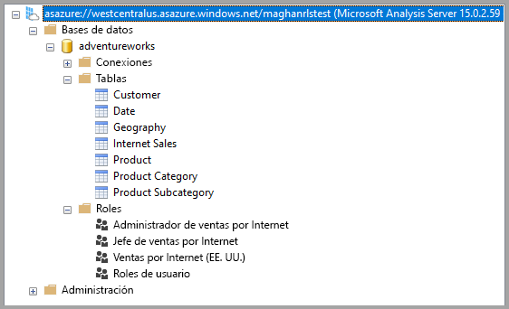

2. Cree un rol en el servidor de Analysis Services.

    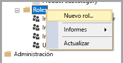

3. Establezca su configuración **General**.  Aquí se proporciona el **nombre del rol** y se establecen los permisos de base de datos como de **solo lectura**.

    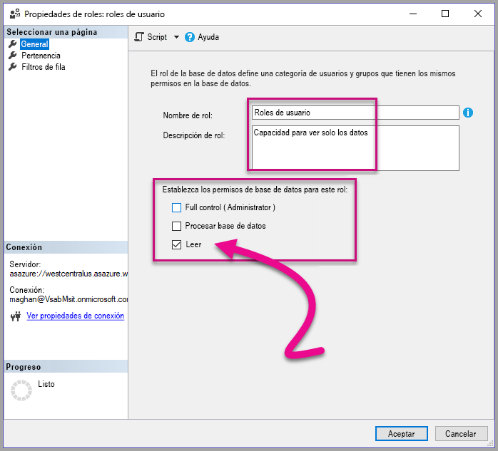

4. Establezca la configuración de **pertenencia**. Aquí agregará los usuarios afectados por este rol.

    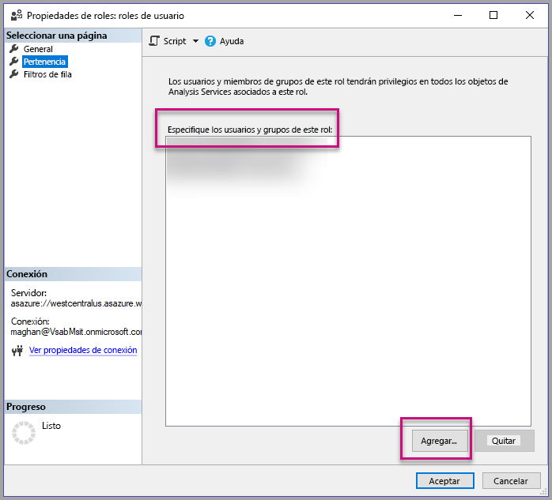

5. Establezca la consulta DAK de **filtros de fila** mediante la función *CUSTOMDATA()* .

    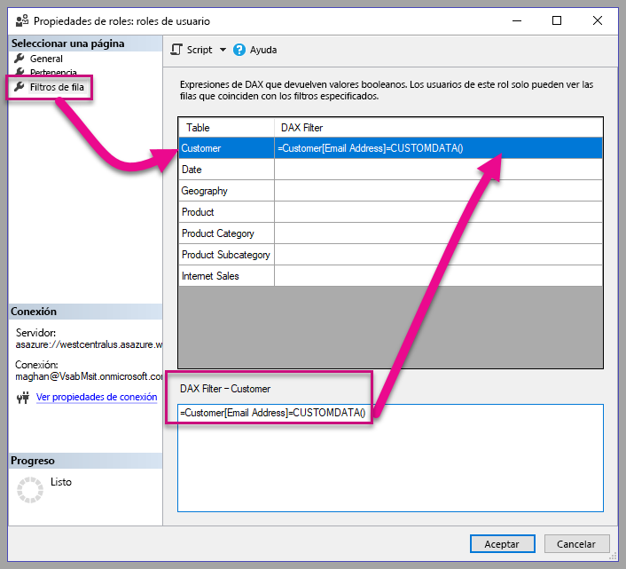

6. Cree un informe de PBI y publíquelo en un área de trabajo con capacidad dedicada.

    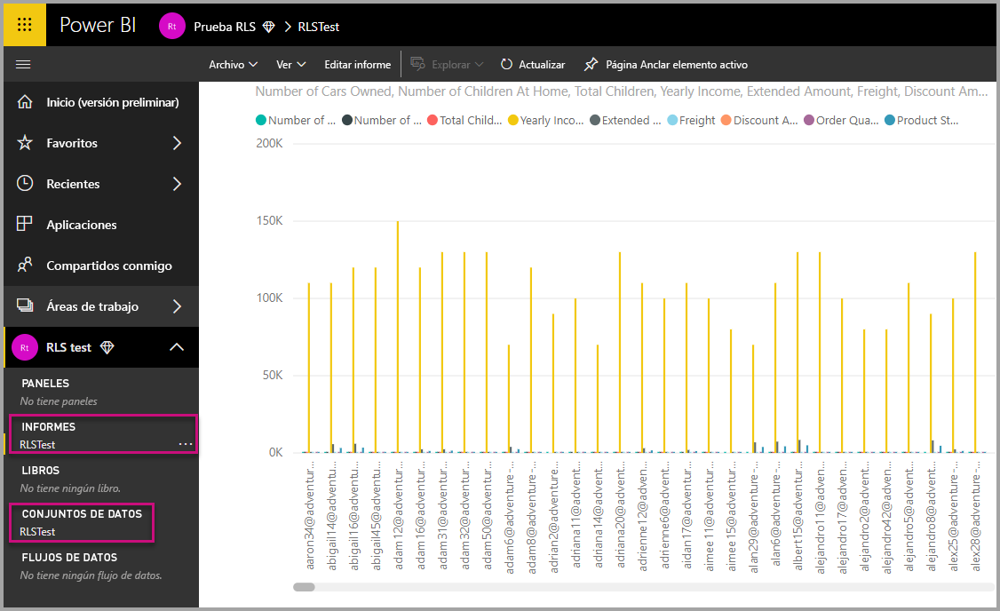

7. Use las API de Power BI para utilizar la característica CustomData en su aplicación.  Al generar un token con la característica Customdata, es necesario tener un nombre de usuario. El nombre de usuario debe ser igual que el UPN del usuario maestro. El usuario maestro debe ser miembro de los roles que ha creado. Si no se especifica ningún rol, todos los roles de los que es miembro el usuario maestro se usan para la evaluación de RLS.

    Cuando trabaje con una [entidad de servicio](embed-service-principal.md) también deberá seguir los pasos anteriores en lugar de usar una cuenta maestra. Al generar el token de inserción, use el [identificador de objeto de la entidad de servicio](embed-service-principal.md#how-to-get-the-service-principal-object-id) como el nombre de usuario.

    > [!Note]
    > Cuando esté listo para implementar la aplicación en producción, la opción o el campo de la cuenta de usuario maestro no deben ser visible para el usuario final.

    Vea el [código](#customdata-sdk-additions) para agregar la característica CustomData.

8. Ahora puede visualizar el informe en la aplicación antes de aplicar los valores de Datos personalizados para ver todos los datos que contiene el informe.

    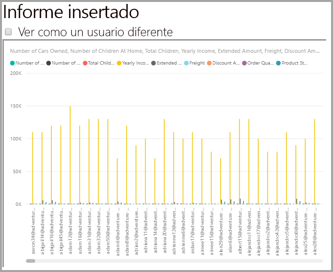

    A continuación, aplique los valores Datos personalizados para ver cómo el informe muestra un conjunto de datos diferente.
    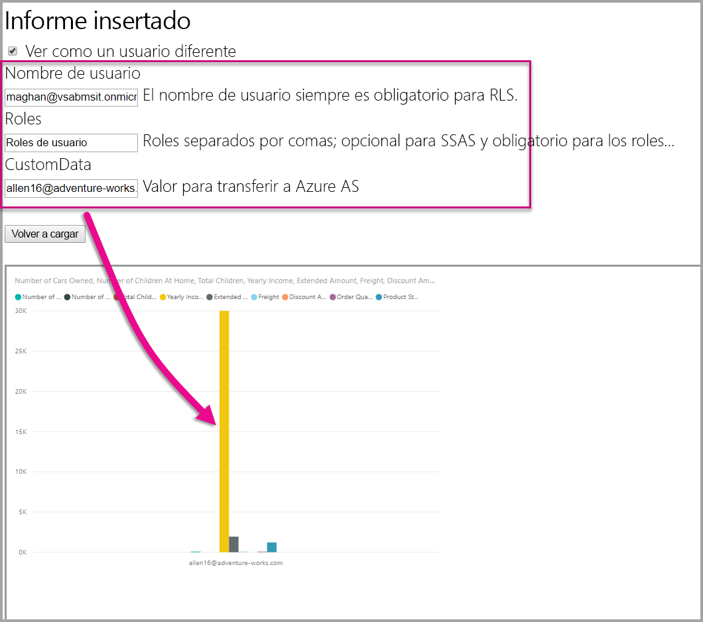

## <a name="using-rls-vs-javascript-filters"></a>Uso de RLS frente a filtros de JavaScript

A la hora de decidir sobre el filtrado de los datos en un informe, puede usar **seguridad de nivel de fila (RLS)** o **filtros de JavaScript**.

[Seguridad de nivel de fila](../../service-admin-rls.md) es una característica que filtra los datos en el nivel de modelo de datos. El origen de datos back-end controla la configuración de RLS. Según el modelo de datos, la generación de tokens de inserción establece el nombre de usuario y los roles de la sesión. No se puede reemplazar, eliminar o controlar mediante el código del lado cliente y por eso se considera segura. Se recomienda usar RLS para filtrar los datos de forma segura. Puede filtrar datos con RLS mediante una de las opciones siguientes.

* [Configuración de roles en un informe de Power BI](../../desktop-rls.md).
* Configuración de roles en el nivel de origen de datos (solo conexión dinámica de Analysis Services).
* Mediante programación con un [token de inserción](https://docs.microsoft.com/rest/api/power-bi/embedtoken/datasets_generatetokeningroup) con `EffectiveIdentity`. Cuando se usa un token de inserción, el filtro real pasa por el token de inserción en una sesión específica.

Los [filtros de JavaScript](https://github.com/Microsoft/PowerBI-JavaScript/wiki/Filters#page-level-and-visual-level-filters) se usan para permitir que el usuario consuma una vista de los datos con ámbito, reducida o filtrada. Sin embargo, el usuario todavía tiene acceso al esquema, las tablas, las columnas y las medidas del modelo y potencialmente puede acceder a cualquier dato que ahí exista. El acceso restringido a los datos solo se puede aplicar con RLS y no mediante las API de filtrado del lado cliente.

## <a name="token-based-identity-with-azure-sql-database"></a>Identidad basada en token con Azure SQL Database

La **identidad basada en token** le permite especificar la identidad efectiva para un token de inserción mediante un token de acceso de **Azure Active Directory (AAD)** para una instancia de **Azure SQL Database**.

Los clientes que mantienen sus datos en **Azure SQL Database** ahora pueden disfrutar de una nueva funcionalidad para administrar los usuarios y su acceso a los datos en SQL Azure cuando se integran con **Power BI Embedded**.

Al generar el token de inserción, puede especificar la identidad efectiva de un usuario en Azure SQL. Puede especificar la identidad efectiva de un usuario pasando el token de acceso de AAD al servidor. El token de acceso se usa para extraer solo los datos pertinentes para ese usuario de Azure SQL, para esa sesión específica.

Se puede usar para administrar la vista de cada usuario en Azure SQL, o bien para iniciar sesión en Azure SQL como un cliente específico de una base de datos de varios inquilinos. También puede aplicar la seguridad de nivel de fila en esa sesión en Azure SQL y recuperar solo los datos pertinentes para esa sesión, eliminando la necesidad de administrar RLS en Power BI.

Estos problemas de identidad efectiva se aplican a las reglas RLS directamente en Azure SQL Server. Power BI Embedded usa el token de acceso proporcionado al consultar datos desde Azure SQL Server. El UPN del usuario (para el que se proporcionó el token de acceso) es accesible como resultado de la función SQL USER_NAME ().

La identidad basada en token solo funciona para los modelos DirectQuery en capacidad dedicada —conectada a una instancia de Azure SQL Database— configurada para permitir la autenticación de AAD ([obtenga más información sobre la autenticación de AAD para Azure SQL Database](https://docs.microsoft.com/azure/sql-database/sql-database-manage-logins)). El origen de datos del conjunto de datos se debe configurar para usar las credenciales de OAuth2 de los usuarios finales, a fin de usar una identidad basada en token.

   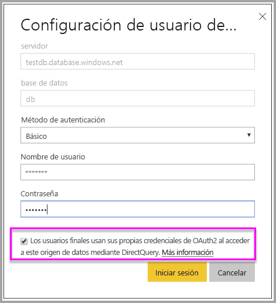

### <a name="token-based-identity-sdk-additions"></a>Adiciones de SDK de la identidad basada en token

La propiedad de del blob de identidad se ha agregado a la identidad efectiva en el escenario de generación de tokens.

```JSON
[JsonProperty(PropertyName = "identityBlob")]
public IdentityBlob IdentityBlob { get; set; }
```

El tipo IdentityBlob es una estructura JSON simple que contiene una propiedad de cadena del valor

```JSON
[JsonProperty(PropertyName = "value")]
public string value { get; set; }
```

EffectiveIdentity se puede crear con el blob de identidad mediante la siguiente llamada:

```C#
public EffectiveIdentity(string username, IList<string> datasets, IList<string> roles = null, string customData = null, IdentityBlob identityBlob = null);
```

El blob de identidad se puede crear mediante la siguiente llamada.

```C#
public IdentityBlob(string value);
```

### <a name="token-based-identity-rest-api-usage"></a>Uso de API REST de identidad basada en token

Si llama a la [API REST](/rest/api/power-bi/embedtoken/reports_generatetokeningroup#definitions), puede agregar un blob de identidad dentro de cada identidad.

```JSON
{
    "accessLevel": "View",
    "identities": [
        {
            "datasets": ["fe0a1aeb-f6a4-4b27-a2d3-b5df3bb28bdc"],
        "identityBlob": {
            "value": "eyJ0eXAiOiJKV1QiLCJh…."
         }
        }
    ]
}
```

El valor proporcionado en el blob de identidad debe ser un token de acceso válido en Azure SQL Server (con una dirección URL de recursos de <https://database.windows.net/>).

   > [!Note]
   > Para poder crear un token de acceso para Azure SQL, la aplicación debe tener permiso delegado de **acceso a Azure SQL Database y Data Warehouse** a la API **Azure SQL Database** en la configuración de registro de la aplicación AAD en Azure Portal.

   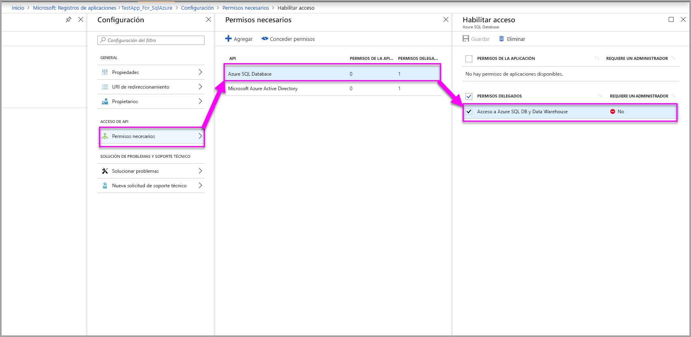

## <a name="on-premises-data-gateway-with-service-principal"></a>Puerta de enlace de datos local con entidad de servicio

Los clientes que configuran la seguridad de nivel de fila (RLS) con un origen de datos de conexión dinámica local de SQL Server Analysis Services (SSAS) pueden disfrutar de la nueva funcionalidad de [entidad de servicio](embed-service-principal.md) para administrar usuarios y su acceso a los datos de SSAS cuando se integra con **Power BI Embedded**.

Mediante las [API REST de Power BI](https://docs.microsoft.com/rest/api/power-bi/), puede especificar la identidad efectiva para las conexiones dinámicas locales de SSAS para un token de inserción con un [objeto de entidad de servicio](https://docs.microsoft.com/azure/active-directory/develop/app-objects-and-service-principals#service-principal-object).

Hasta ahora, para poder especificar la identidad efectiva para conexiones dinámicas locales de SSAS, el usuario maestro que generaba el token de inserción tenía que ser un administrador de puerta de enlace. Ahora, en lugar de requerir que el usuario sea un administrador de puerta de enlace, el administrador de puerta de enlace puede asignar permiso dedicado al usuario para ese origen de datos, lo que le permite reemplazar la identidad efectiva al generar el token de inserción. Esta nueva funcionalidad permite realizar la inserción con la entidad de servicio para una conexión activa de SSAS.

Para habilitar este escenario, el administrador de puerta de enlace usa la [API REST Add Datasource User](https://docs.microsoft.com/rest/api/power-bi/gateways/adddatasourceuser) para asignar a la entidad de servicio el permiso *ReadOverrideEffectiveIdentity* para Power BI Embedded.

No se puede establecer este permiso mediante el portal de administración. Este permiso solo se establece con la API. En el portal de administración, verá una indicación para los usuarios y los SPN con esos permisos.

## <a name="considerations-and-limitations"></a>Consideraciones y limitaciones

* La asignación de usuarios a roles dentro del servicio Power BI no afecta a RLS cuando se usa un token de inserción.
* Aunque el servicio Power BI no aplica valores de RLS a administradores o miembros con permisos de edición, cuando se suministre una identidad con un token de inserción, se aplica a todos los datos.
* Se admiten las conexiones activas de Analysis Services para los servidores locales.
* Las conexiones activas de Azure Analysis Services admiten el filtrado por rol. El filtrado dinámico se puede llevar a cabo mediante CustomData.
* Si el conjunto de datos subyacente no requiere RLS, la solicitud GenerateToken **no** debe contener una identidad efectiva.
* Si el conjunto de datos subyacente es un modelo de nube (modelo en caché o DirectQuery), la identidad efectiva debe incluir al menos un rol ya que, de lo contrario, la asignación de roles no se produce.
* Una lista de identidades habilita varios tokens de identidad para la inserción del panel. Para todos los demás artefactos, la lista contiene una sola identidad.

### <a name="token-based-identity-limitations"></a>Limitaciones de identidad basada en token

* Solo puede usar RLS si tiene una capacidad dedicada.
* RLS no funciona con SQL Server local.

¿Tiene más preguntas? [Pruebe a preguntar a la comunidad de Power BI](https://community.powerbi.com/)
