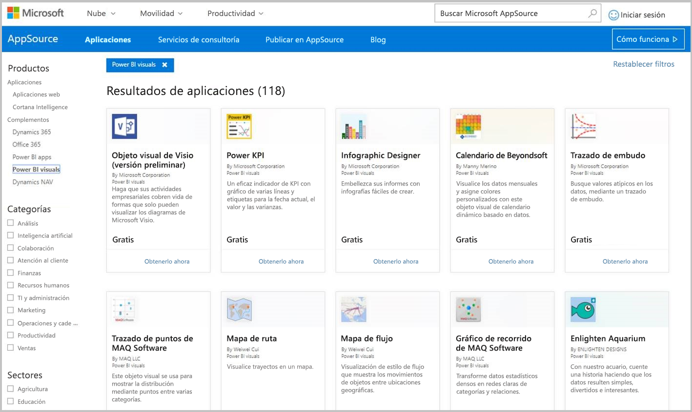
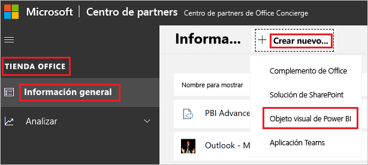

# Publicación de objetos visuales de Power BI en el Centro de partners

Una vez que haya creado un objeto visual de Power BI, puede publicarlo en AppSource para que otros usuarios lo detecten y lo usen. Para más información sobre cómo crear un objeto visual de Power BI, consulte [Tutorial: Desarrollar un objeto visual de Power BI](custom-visual-develop-tutorial.md).

## ¿Qué es AppSource?

[AppSource](https://appsource.microsoft.com/marketplace/apps?product=power-bi-visuals) es el lugar donde podrá encontrar aplicaciones SaaS y complementos para sus productos y servicios de Microsoft.

## Preparación para enviar el objeto visual de Power BI

Antes de enviar un objeto visual de Power BI a AppSource, asegúrese de que ha leído las [directrices de objetos visuales de Power BI](guidelines-powerbi-visuals.md) y ha [probado el objeto visual](https://github.com/Microsoft/PowerBI-visuals/blob/master/Tutorial/SubmissionTesting.md).

Cuando esté listo para enviar el objeto visual de Power BI, compruebe que cumple con todos los requisitos que se enumeran a continuación.

| Artículo | Requerido | Descripción |
| --- | --- | --- |
| Paquete Pbiviz |Sí |Empaquete el objeto visual de Power BI en un paquete Pbiviz que contenga todos los metadatos necesarios. Nombre de objeto visual Nombre para mostrar GUID Versión Descripción Nombre y correo electrónico del autor |
| Archivo de informe .pbix de ejemplo |Sí |Para presentar el objeto visual, debe ayudar a los usuarios a familiarizarse con él. Resalte el valor que el objeto visual aporta al usuario y ofrezca ejemplos de uso y opciones de formato. También puede agregar una página de *"sugerencias"* al final que contenga trucos y sugerencias y acciones que conviene evitar. El archivo de informe .pbix de ejemplo debe funcionar sin conexión, sin ninguna conexión externa. |
| Icono |Sí |Debe incluir el logotipo del objeto visual personalizado que aparecerá en el escaparate. Su formato puede ser .png, .jpg, .jpeg o .gif. Debe ser exactamente de 300 px (ancho) x 300 px (alto). **Importante** Revise cuidadosamente la [guía de imágenes de la tienda AppSource](https://docs.microsoft.com/office/dev/store/craft-effective-appsource-store-images) antes de enviar el icono. |
| Capturas de pantalla |Sí |Proporcione al menos una captura de pantalla. Su formato puede ser .png, .jpg, .jpeg o .gif. Las dimensiones deben ser exactamente 1366 px (ancho) por 768 px (alto). El tamaño del archivo no puede superar los 1024 KB. Si el uso va a ser mayor, agregue burbujas de texto para articular la propuesta de valor de las características clave que se muestran en cada captura. |
| Vínculo de descarga de soporte técnico |Sí |Proporcione una dirección URL de soporte técnico para sus clientes. Este vínculo se especifica como parte de su lista del Centro de partners y es visible para los usuarios cuando acceden a la lista de objetos visuales en AppSource. El formato de la dirección URL debe incluir https:// o http://. |
| Vínculo de documento de privacidad |Sí |Proporcione un vínculo a la directiva de privacidad del objeto visual. Este vínculo se especifica como parte de su lista del Centro de partners y es visible para los usuarios cuando acceden a la lista de objetos visuales en AppSource. El formato del vínculo debe incluir https:// o http://. |
| Contrato de licencia para el usuario final (CLUF) |Sí |Debe proporcionar un archivo del CLUF para el objeto visual de Power BI. Puede usar el [contrato estándar](https://go.microsoft.com/fwlink/?linkid=2041178), el [contrato de objetos visuales de Power BI](https://visuals.azureedge.net/app-store/Power%20BI%20-%20Default%20Custom%20Visual%20EULA.pdf), o bien un CLUF propio. |
| Enlace de vídeo |No |Para aumentar el interés de los usuarios por el objeto visual personalizado, proporcione un vínculo a un vídeo sobre dicho objeto. El formato de la dirección URL debe incluir https:// o http://. |
| Repositorio de GitHub |No |Comparta un vínculo público a un repositorio de [GitHub](https://www.github.com) con orígenes de datos de ejemplo y de objetos visuales de Power BI. Esto permite que otros desarrolladores tengan la oportunidad de proporcionar comentarios y proponer mejoras en el código. |

## Obtención de un archivo XML del paquete de la aplicación

Para enviar un objeto visual de Power BI, necesita un archivo XML del paquete de la aplicación desde el equipo de Power BI. Para obtener el XML del paquete de la aplicación, envíe un correo electrónico al equipo de envío de los objetos visuales de Power BI ([pbivizsubmit@microsoft.com](mailto:pbivizsubmit@microsoft.com)).

Antes de crear el paquete **pbiviz**, debe rellenar estos campos del archivo **pbiviz.json**:
* description
* supportUrl
* autor
* name
* correo electrónico

Adjunte tanto el **archivo pbiviz** como el **archivo pbix del informe de ejemplo**. El equipo de Power BI responderá con instrucciones y un archivo XML del paquete de la aplicación que se debe cargar. Dicho paquete se requiere para enviar cualquier objeto visual a través del Centro para desarrolladores de Office.

> [!NOTE]
> Para mejorar la calidad y garantizar que los informes existentes no se interrumpan, las actualizaciones de los objetos visuales existentes tardará un dos semanas más en llegar al entorno de producción tras su aprobación en la tienda.

## Envío a AppSource

Para enviar el objeto visual de Power BI a AppSource, debe obtener un paquete de la aplicación desde el equipo de Power BI y, luego, enviarlo al Centro de partners. 

### Obtención del paquete de la aplicación

Debe enviar un correo electrónico con los archivos **pbiviz** y **pbix** al equipo de Power BI antes de realizar el envío a AppSource. Esto permite al equipo de Power BI cargar los archivos en el servidor de recursos compartidos público. De lo contrario, la tienda no podrá recuperar los archivos. 

El equipo de Power BI tiene que comprobar en los archivos si hay envíos de nuevos objetos visuales de Power BI, actualizaciones de los objetos visuales de Power BI existentes y correcciones de los envíos rechazados.

### Envío al Centro de partners

Para enviar el objeto visual de Power BI al Centro de partners, debe estar registrado en dicho centro. Si todavía no está registrado, [abra una cuenta de desarrollador en el Centro de partners](https://docs.microsoft.com/office/dev/store/open-a-developer-account).

Siga los pasos que aparecen a continuación para enviar el objeto visual de Power BI al Centro de partners. Para más información sobre el proceso de envío, consulte [Enviar la solución de Office a AppSource con el Centro de partners](https://docs.microsoft.com/office/dev/store/use-partner-center-to-submit-to-appsource).

1. Inicie sesión en el **Centro de partners**.

2. En el panel de la izquierda, seleccione **TIENDA OFFICE**.

3. Seleccione **Información general**.

4. Seleccione **Crear** y, en el menú desplegable, seleccione **Objeto visual de Power BI**.

    

5. En la ventana **Crear un objeto visual de Power BI**, escriba un nombre para el objeto visual de Power BI y seleccione **Crear**.

6. Seleccione **Paquetes** y cargue el paquete de la aplicación de XML del objeto visual de Power BI.

7. Seleccione **Propiedades** y proporcione la información necesaria.

8. Si el producto requiere una compra adicional, seleccione **Configuración del producto** y active la casilla **Associated service purchase** (Adquisición del servicio asociado).

9. (Opcional) Si quiere [certificar](power-bi-custom-visuals-certified.md) su objeto visual, seleccione **Configuración del producto** y active la casilla **Certificación de Power BI**.
    >[!TIP]
    >El proceso de certificación de Power BI puede tardar un tiempo. Si va a crear un objeto visual de Power BI, se recomienda publicarlo a través del Centro de partners antes de solicitar la certificación de Power BI. Esto garantiza que la publicación del objeto visual no se retrase.

10. Seleccione **Configuración del producto** y haga clic en **Revisar y publicar**.

## Seguimiento del uso y estado del envío

* Puede revisar las [directivas de validación](https://docs.microsoft.com/legal/marketplace/certification-policies#1180-power-bi-visuals).

* Después del envío, el estado del envío se puede ver en el [panel de la aplicación](https://sellerdashboard.microsoft.com/Application/Summary/).

* Para saber cuándo estará disponible el objeto visual de Power BI para descargarlo de AppSource, revise el [plazo de publicación](power-bi-custom-visuals-certified.md#publication-timeline) de objetos visuales de Power BI.

## Certificación del objeto visual

Una vez creado el objeto visual, si lo desea, puede obtener su [certificación](power-bi-custom-visuals-certified.md).

## Pasos siguientes

* [Desarrollo de objetos visuales personalizados de Power BI](custom-visual-develop-tutorial.md)

* [Visualizaciones en Power BI](../../visuals/power-bi-report-visualizations.md)  

* [Objetos visuales en Power BI](power-bi-custom-visuals.md)  

* [Obtención de un objeto visual de Power BI certificado](power-bi-custom-visuals-certified.md)

* ¿Tiene más preguntas? [Pruebe a preguntar a la comunidad de Power BI](https://community.powerbi.com/)
