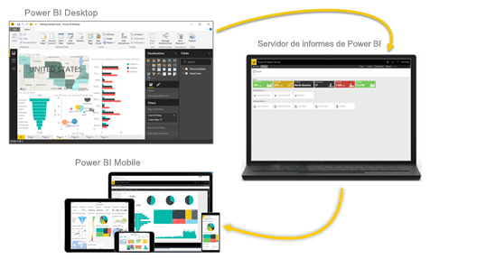

# ¿Qué es Power BI?
**Power BI** es una colección de servicios de software, aplicaciones y conectores que funcionan conjuntamente para convertir orígenes de datos sin relación entre sí en información coherente, interactiva y atractiva visualmente. Sus datos pueden ser una hoja de cálculo de Excel o una colección de almacenes de datos híbridos locales y basados en la nube. Power BI permite conectarse con facilidad a los orígenes de datos, visualizar y descubrir qué es importante y compartirlo con cualquiera o con todos los usuarios que desee.

## Las partes de Power BI
Power BI consta de: 
- Aplicación de escritorio de Windows llamada **Power BI Desktop**.
- Servicio SaaS (*software como servicio*) en línea denominado **servicio Power BI**. 
- **Aplicaciones móviles** de Power BI para dispositivos Windows, iOS y Android.

Estos tres elementos, &mdash;Power BI Desktop, el servicio y las aplicaciones móviles&mdash;, están diseñados para permitirle crear, compartir y usar información empresarial de la forma que le resulte más eficaz para usted y para su rol.

Un cuarto elemento, **Power BI Report Server**, le permite publicar informes de Power BI en un servidor de informes local, tras crearlos en Power BI Desktop. Obtenga más información sobre el [servidor de informes de Power BI](#on-premises-reporting-with-power-bi-report-server).

## Adaptación de Power BI a su rol
Es posible que la forma en que utilice Power BI dependa de su rol en un proyecto o equipo. Es posible que otros usuarios con otros roles usen Power BI de forma diferente.

Por ejemplo, podría utilizar principalmente el **servicio Power BI** para ver informes y paneles. Su compañero de trabajo, dedicado a procesar los números y crear informes empresariales, podría usar ampliamente **Power BI Desktop** para crear informes y, después, publicarlos en el servicio Power BI, donde puede verlos. Otro compañero de trabajo, del departamento de ventas, podría usar principalmente la **aplicación Power BI para móviles** con el fin de supervisar el progreso de las cuotas de venta y profundizar en los detalles de nuevos clientes potenciales.

Si es un desarrollador, puede usar las API de Power BI para insertar datos en conjuntos de datos o para insertar informes y paneles en sus propias aplicaciones personalizadas. ¿Tiene alguna idea de un nuevo objeto visual? Compílelo usted mismo y compártalo con los demás.  

También podría usar cada elemento de Power BI en distintos momentos, en función de los objetivos o de su rol en un proyecto determinado.

Su modo de usar Power BI puede basarse en la característica o servicio de Power BI que es la mejor herramienta para su situación. Por ejemplo, puede usar Power BI Desktop para crear informes para el equipo sobre estadísticas de involucración de los clientes y ver el progreso de inventario y fabricación en un panel en tiempo real en el servicio Power BI. Cada una de las partes de Power BI está a su disposición, razón por la cual es tan flexible e interesante.

Examine los documentos que pertenecen al rol:
- Power BI Desktop para [*diseñadores*](desktop-what-is-desktop.md)
- Power BI para [*consumidores*](../consumer/end-user-consumer.md)
- Power BI para [*administradores*](../admin/service-admin-administering-power-bi-in-your-organization.md)
- Power BI para *desarrolladores*
    * [Análisis integrado con Power BI](../developer/embedded/embedding.md)
    * [¿Qué es Power BI Embedded de Azure?](../developer/embedded/azure-pbie-what-is-power-bi-embedded.md)
    * [Objetos visuales en Power BI](../developer/visuals/power-bi-custom-visuals.md)
    * [¿Qué pueden hacer los desarrolladores con la API de Power BI?](../developer/automation/overview-of-power-bi-rest-api.md)

## El flujo de trabajo en Power BI
Un flujo de trabajo habitual en Power BI comienza con la conexión a orígenes de datos y la creación de un informe en Power BI Desktop. Después, ese informe se publica desde Power BI Desktop en el servicio Power BI y se comparte para que los usuarios finales del servicio Power BI y los dispositivos móviles puedan verlo e interactuar con él.
Este flujo de trabajo es habitual y muestra cómo los tres elementos principales de Power BI se complementan entre sí.

Esta es una [comparación de Power BI Desktop y el servicio Power BI](../fundamentals/service-service-vs-desktop.md) detallada.

## Elaboración de informes en el entorno local con Power BI Report Server

¿Pero qué ocurre si no está listo para pasarse a la nube y necesita conservar los informes protegidos por un firewall corporativo?  Siga leyendo.

Puede crear, implementar y administrar informes paginados y para dispositivos móviles de Power BI en el entorno local con la gama de herramientas y servicios listos para usar que proporciona Power BI Report Server.

Power BI Report Server es una solución que se implementa detrás del firewall y entrega informes a los usuarios correspondientes de diferentes maneras, que pueden ser para visualizarlos en un explorador web, en un dispositivo móvil o como correo electrónico. Además, como Power BI Report Server es compatible con Power BI en la nube, puede pasarse a la nube cuando esté listo. 

Obtenga más información sobre el [servidor de informes de Power BI](../report-server/get-started.md).

## Pasos siguientes
- [Inicio rápido: Moverse por el servicio Power BI](../consumer/end-user-experience.md)   
- [Tutorial: Introducción al servicio Power BI](service-get-started.md)
- [Inicio rápido: Conectarse a los datos en Power BI Desktop](../connect-data/desktop-quickstart-connect-to-data.md)
