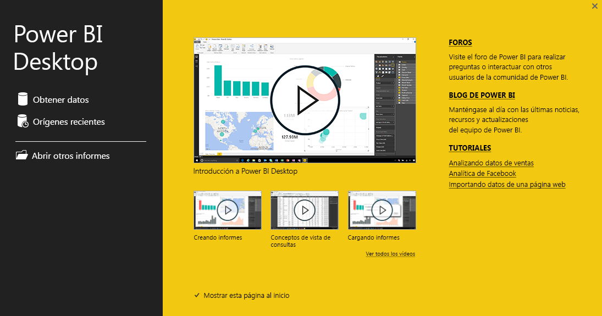

Esta es la segunda sección del curso **Aprendizaje guiado** de Power BI, **Obtención de datos**. En esta sección se examinan las herramientas y características basadas en los datos de Power BI, con especial hincapié en Power BI Desktop. Muchas de estas herramientas también se aplican al servicio Power BI, por lo que esta sección tiene una doble función.

Cuando se obtienen los datos, a veces estos no presentan el formato correcto o no están tan *limpios* como desea. Por este motivo, en esta sección se indica cómo obtener los datos y cómo limpiarlos (a veces se denomina *limpieza* o *transformación* de datos), y se ofrecen algunos trucos avanzados que pueden facilitar las tareas de obtención de estos.

Como es habitual en este curso, su aprendizaje sigue la misma ruta que el flujo de trabajo de Power BI. Por tanto, vamos a echar un vistazo a **Power BI Desktop**, donde suele comenzar el flujo.

## Información general sobre Power BI Desktop
Power BI Desktop es una herramienta que permite conectarse a los datos, limpiarlos y visualizarlos. Con Power BI Desktop, puede conectarse a los datos y, después, modelarlos y visualizarlos de distintas formas. La mayoría de los usuarios que trabajan en proyectos de inteligencia empresarial dedican la mayor parte de su tiempo a usar Power BI Desktop.

Power BI Desktop se descarga [de la Web](http://go.microsoft.com/fwlink/?LinkID=521662). También puede instalar **Power BI Desktop** como una aplicación de la [**Tienda Windows**](http://aka.ms/pbidesktopstore), o puede descargarla desde el servicio Power BI. Para obtener **Power BI Desktop** desde el servicio, solo tiene que seleccionar el botón de flecha abajo situado en la parte superior derecha de Power BI y seleccionar Power BI Desktop.

Power BI Desktop se instala como una aplicación en su equipo de Windows.

Por tanto, una vez que se haya descargado, deberá instalar Power BI Desktop y ejecutarlo al igual que otras aplicaciones en Windows. En la siguiente imagen se muestra la pantalla Inicio de Power BI Desktop, que aparece cuando se inicia la aplicación.

Power BI Desktop se conecta a una amplia variedad de orígenes de datos, desde bases de datos locales hasta hojas de cálculo de Excel y servicios en la nube. Esta herramienta lo ayuda a limpiar los datos y aplicarles formato a fin de que resulten más útiles. Por ejemplo, puede dividir las columnas y cambiarles el nombre, cambiar los tipos de datos y trabajar con fechas. También puede crear relaciones entre las columnas para que resulte más sencillo modelar y analizar los datos.

