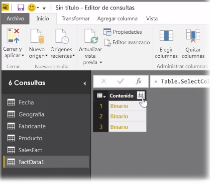
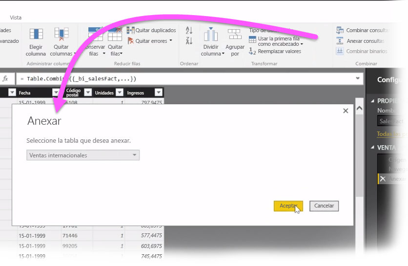
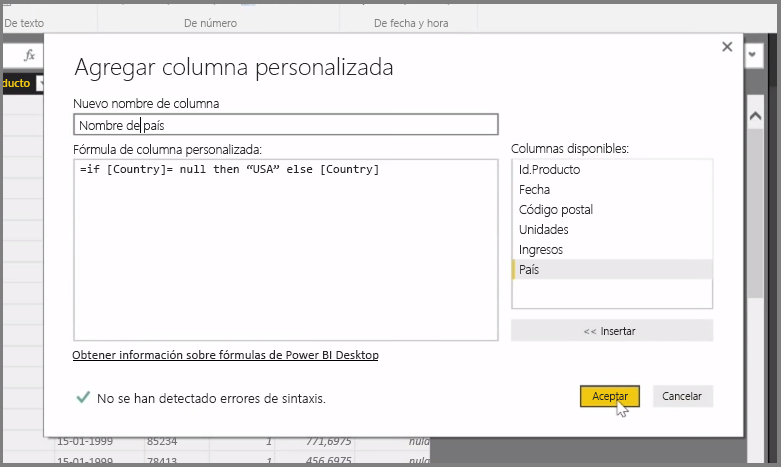

En este artículo, analizaremos algunas técnicas avanzadas de importación y limpieza de datos para **Power BI Desktop**. Una vez que haya dado forma a los datos en el **Editor de consultas** y los haya agregado a **Power BI Desktop**, podrá consultarlos de distintas maneras. Hay tres vistas en Power BI Desktop: la vista **Informe**, la vista **Datos** y la vista **Relaciones**. Puede ver cada una de ellas seleccionando su icono en el lado superior izquierdo del lienzo. En la siguiente imagen, está seleccionada la vista **Informe**. La barra amarilla situada junto al icono indica qué vista está activa.

Para cambiar la vista, seleccione cualquiera de los otros dos iconos. La barra amarilla situada junto al icono indica qué vista está activa.

Power BI Desktop puede combinar datos de varios orígenes en un único informe en cualquier momento durante el proceso de modelado. Para agregar orígenes adicionales a un informe existente, seleccione **Editar consultas** en la cinta **Inicio** y, después, seleccione **Nuevo origen** en el **Editor de consultas**.

Puede utilizar muchos orígenes de datos distintos en **Power BI Desktop**, incluidas carpetas. Al conectarse a una carpeta, podrá importar datos de varios archivos a la vez, como una serie de archivos de Excel o CSV. Los archivos contenidos en la carpeta seleccionada aparecen en el **Editor de consultas** como contenido binario y, al hacer clic en el icono de flecha doble en la parte superior de la columna **Contenido**, se cargan sus valores.

Una de las herramientas más útiles de Power BI son sus *filtros*. Por ejemplo, al seleccionar la flecha desplegable que aparece junto a una columna, se abre una lista de comprobación de filtros de texto que puede utilizar para quitar valores del modelo.

También puede combinar y anexar consultas, y convertir varias tablas (o datos de varios archivos, en carpetas) en una única tabla que contenga solo los datos que le interesen. Puede usar la herramienta **Anexar consultas** para agregar los datos de una nueva tabla a una consulta existente. Power BI Desktop intenta hacer coincidir las columnas de las consultas, que luego puede ajustar según sea necesario en el **Editor de consultas**.

Por último, la herramienta **Agregar columna personalizada** ofrece a los usuarios avanzados la opción de escribir expresiones de consulta desde cero mediante el eficaz lenguaje M. Puede agregar una columna personalizada basándose en las instrucciones del lenguaje de consulta M y obtener los datos de la forma que desee.

