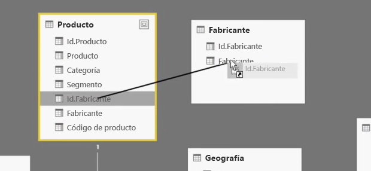
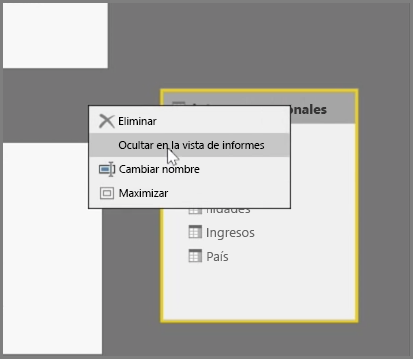
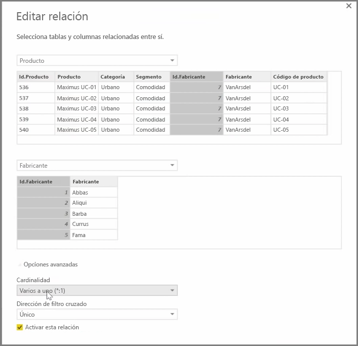

Power BI permite definir visualmente la relación entre tablas o elementos. Para obtener una vista esquemática de los datos, use la **vista de relaciones**, que se encuentra en el extremo izquierdo de la pantalla, junto al lienzo del informe.

En la vista de **relaciones**, puede ver bloques que representan cada tabla y sus columnas, y las líneas entre ellos ilustran las relaciones.

Puede agregar y quitar relaciones con facilidad. Para quitar una relación, haga clic en ella con el botón derecho y seleccione **Eliminar**. Para crear una relación, arrastre y coloque los campos que quiera vincular entre tablas.

Para ocultar una tabla o columna individual de un informe, haga clic con el botón derecho en ella en la vista de relaciones y seleccione **Ocultar en la Vista de informes**.

Para obtener una vista más detallada de las relaciones de datos, seleccione **Administrar relaciones** en la pestaña **Inicio**. Se abrirá el cuadro de diálogo **Administrar relaciones**, donde se muestran las relaciones como una lista en lugar de un diagrama visual. Desde aquí puede seleccionar **Detección automática** para buscar relaciones en los datos nuevos o actualizados. Seleccione **Editar** en el cuadro de diálogo **Administrar relaciones** para editar manualmente las relaciones. Aquí también encontrará opciones avanzadas para establecer valores de *Cardinalidad* y *Dirección de filtro cruzado* de sus relaciones.

Los valores posibles de Cardinalidad son *Varios a uno (:1)* y *Uno a uno (1:1)* . *Varios a uno (:1)* indica que se trata de una relación del tipo "dato a dimensión"; por ejemplo, una tabla de ventas con varias filas por producto que se están asociando a una tabla en la que se enumeran los productos con una fila para cada uno. *Uno a uno (1:1)* se utiliza habitualmente para vincular entradas individuales de las tablas de referencia.

De manera predeterminada, las relaciones se establecerán con el filtro cruzado en ambas direcciones. Si se establece el filtro cruzado en una sola dirección, se limitarán algunas de las funciones de modelado de la relación.

Al establecer relaciones precisas entre sus datos, podrá crear cálculos complejos con diversos elementos de datos.

