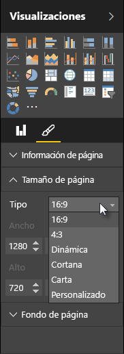

Power BI Desktop permite controlar el diseño y el formato de las páginas de sus informes, como el tamaño y la orientación.

Utilice el menú **Vista de página** de la pestaña Inicio para cambiar el modo en el que las páginas de sus informes se escalan. Entre las opciones disponibles se incluyen **Ajustar a la página** (valor predeterminado), **Ajustar al ancho** y **Tamaño real**.

También puede cambiar el propio tamaño de las páginas. De manera predeterminada, las páginas de informe tienen una relación de aspecto de 16:9. Para cambiar el tamaño de página, asegúrese de no haber seleccionado ningún visual, seleccione el icono del pincel en el panel Visualizaciones y, después, elija **Tamaño de página** para expandir la sección.

Entre las opciones de tamaño de página se incluyen 4:3 (una relación de aspecto más cuadrada) y Dinámica (la página se adaptará al espacio disponible). También hay un tamaño de carta estándar para los informes. Tenga en cuenta que puede que necesite cambiar el tamaño de los objetos visuales tras modificar el tamaño de página para asegurarse de que no sobresalen del lienzo.

También puede especificar un tamaño de página personalizado, establecer el tamaño en pulgadas o píxeles, y cambiar el color de fondo de todo el informe.

Otra opción consiste en seleccionar Cortana, que cambia el tamaño del informe para que pueda usarse como resultado de búsquedas con Cortana.

