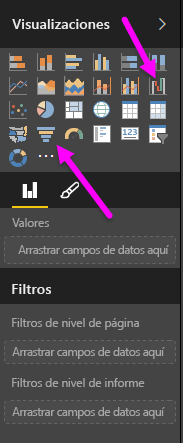
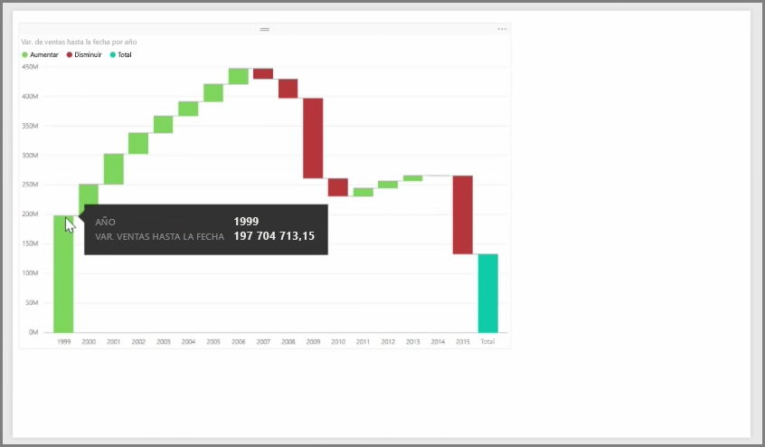
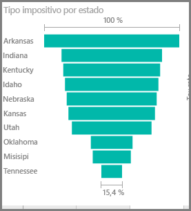

Los gráficos de cascada y embudo son dos de las visualizaciones estándares más interesantes (y, quizás, poco habituales) de las que se incluyen en Power BI. Para crear un gráfico en blanco de cualquiera de los dos tipos, seleccione el icono pertinente en el panel **Visualizaciones**.

Normalmente, los **gráficos de cascada** se utilizan para mostrar los cambios de un valor concreto a lo largo del tiempo.

Las cascadas solo tienen dos opciones de cubo: *Categoría* y *Eje*. Arrastre un campo de tiempo, como *Año*, al cubo *Categoría* y el valor del que desee realizar un seguimiento al cubo *Eje Y*. Los intervalos de tiempo en los que haya habido un aumento del valor se muestran en verde de manera predeterminada, mientras que los períodos en los que se haya producido una reducción en él se representan en rojo.

Por su parte, los **gráficos de embudo** se utilizan habitualmente para mostrar los cambios durante un proceso concreto, como una canalización de ventas o las medidas de retención de un sitio web.

Ambos **cascada** y **embudo** gráficos se pueden segmentar y personalizar visualmente.

