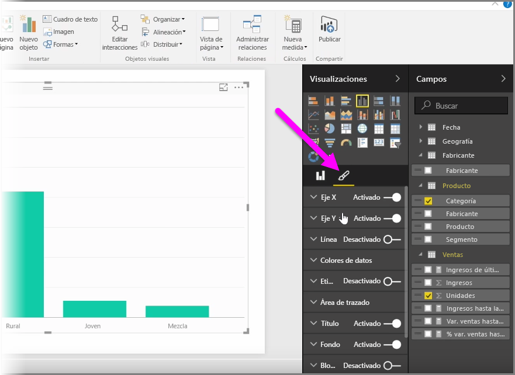
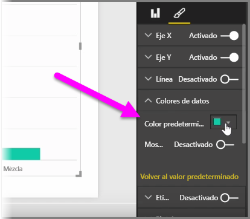
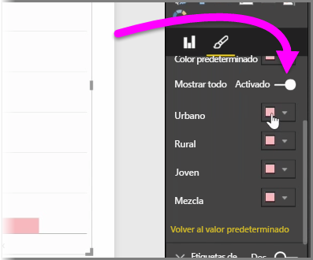
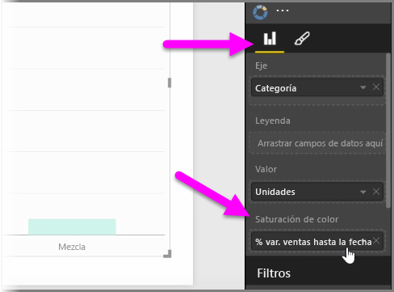
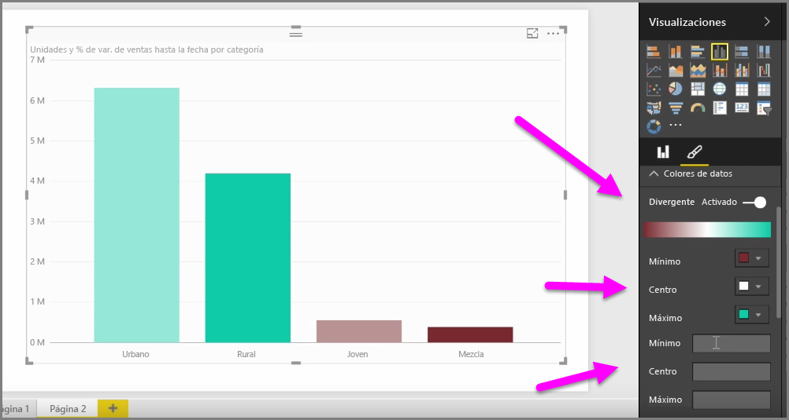
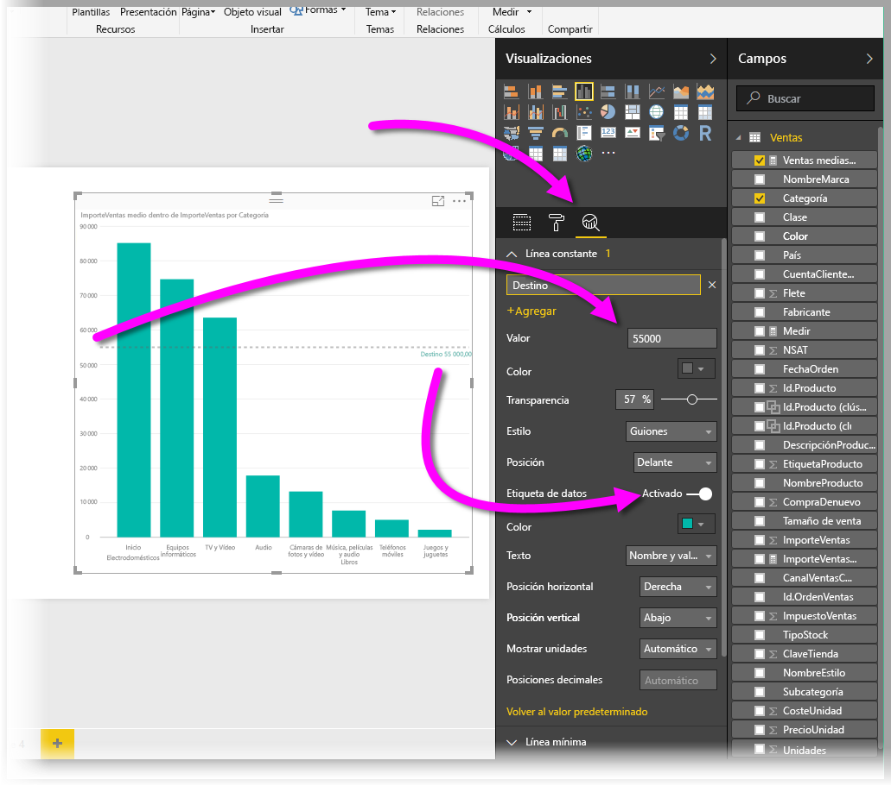
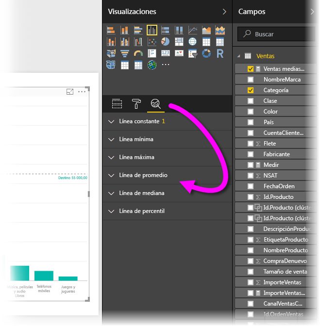

Habrá muchas ocasiones en las que posiblemente desee modificar los colores utilizados en los gráficos u objetos visuales. Power BI le ofrece un control enorme sobre la forma en que se muestran los colores. Para empezar, seleccione un objeto visual y, en el panel **Visualizaciones**, haga clic en el icono del **pincel**.

Dispone de muchas opciones para cambiar los colores o el formato de los objetos visuales. Puede cambiar el color de todas las barras de un objeto visual seleccionando el selector de colores junto a **Color predeterminado** y seleccionando el color de su elección.

También puede cambiar el color de cada barra (u otro elemento, en función del tipo de objeto visual seleccionado) activando el control deslizante **Mostrar todo**. Al hacerlo, aparecerá un selector de colores por cada elemento.

También puede cambiar el color a partir de un valor o una medida. Para ello, arrastre un campo al cubo **Saturación de color** de panel Visualizaciones (tenga en cuenta que esto está disponible en la sección de **Campos**, no en la sección **Pincel**).

Además, puede cambiar la escala de colores y los colores utilizados al rellenar los colores de los elementos de datos. También puede seleccionar una escala de colores divergente activando el control deslizante Divergente, lo que le permitirá crear una escala de colores entre tres colores. Y también puede establecer los valores *Mínimo*, *Centro* y *Máximo* que se muestran en el gráfico.

También puede utilizar estos valores para crear reglas que le permitirán, por ejemplo, establecer los valores de un color concreto por encima de cero y los valores de otro color, por debajo.

Otra herramienta útil para el uso de colores es establecer una *línea constante*, a veces denominada también una *línea de referencia*. Puede establecer el valor de la línea constante, su color e incluso que la línea de referencia contenga una etiqueta. Para crear una línea constante (y otras líneas interesantes), seleccione el **panel de análisis** (aparece como una lupa) y expanda luego la sección **Línea de referencia**.

Hay muchas otras líneas que puede crear para un objeto visual, que se encuentran también en el **panel de análisis**, como líneas Mínima, Máxima, Media, Mediana y Percentil.

Por último, puede crear un borde alrededor de una visualización individual y, como en otros controles, especificar también el color de dicho borde.

