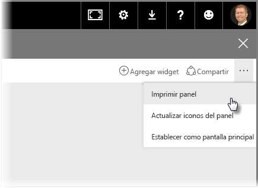
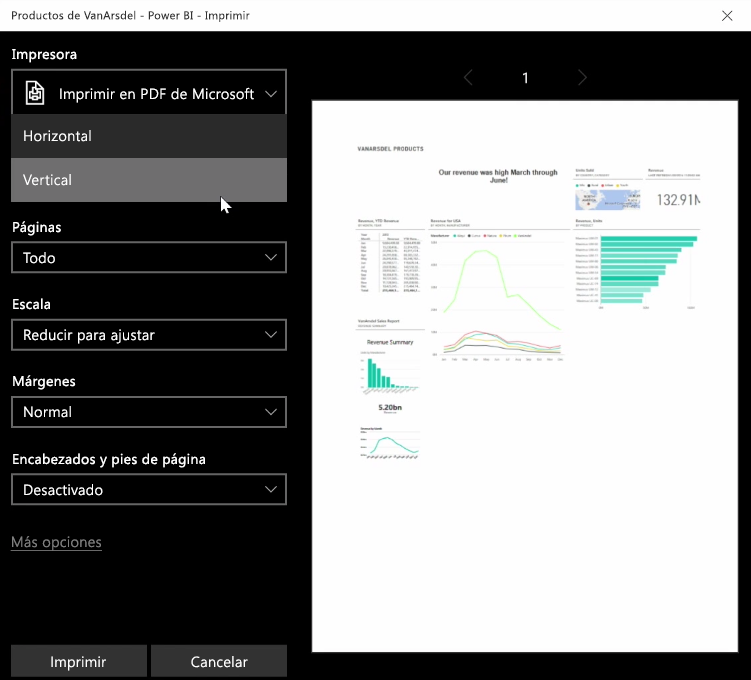
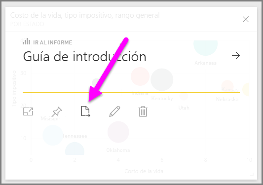
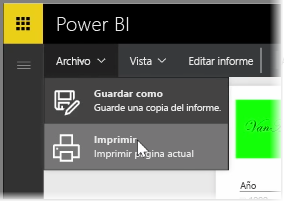

En ocasiones, es posible que tenga que llevar un informe o un panel impresos a una reunión para compartirlos con los demás asistentes. Con Power BI, dispone de varios métodos para crear copias impresas de los objetos visuales.

En el servicio Power BI, seleccione el menú de los puntos suspensivos de la parte superior derecha del servicio y seleccione **Imprimir panel**.

Aparecerá el cuadro de diálogo **Imprimir**, donde podrá seleccionar la impresora a la que desea enviar el panel, así como las opciones de impresión estándar como, por ejemplo, la orientación *Vertical* u *Horizontal*.

## Exportación de datos de un objeto visual
También puede exportar los datos de cualquier objeto visual en el servicio Power BI. Solo tiene que seleccionar el menú de los puntos suspensivos en cualquier objeto visual y, a continuación, seleccionar el botón **Exportar datos** (el botón del medio). Al hacerlo, se creará y se descargará un archivo .csv en el equipo local y aparecerá un mensaje en el explorador (al igual que con cualquier otra descarga iniciada en el explorador) que le informará de que la descarga se ha completado.

También puede imprimir o exportar directamente desde un informe. Para ver un informe en el servicio Power BI, seleccione **Archivo > Imprimir** para abrir el cuadro de diálogo de impresión.

Al igual que con los paneles, también puede exportar los datos de los objetos visuales de un informe seleccionando el botón Exportar en un objeto visual.

