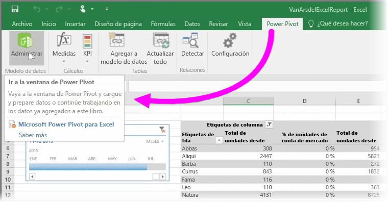

Si utiliza alguna de las características avanzadas de BI de Excel como **Power Query** (llamado **Get & Transform** [Obtener y transformar] en Excel 2016) para consultar y cargar datos, **Power Pivot** para crear modelos de datos eficaces y **Power View** para generar informes dinámicos, también puede importar este tipo de datos en Power BI.

Si utiliza **Power Pivot** para crear modelos de datos avanzados como, por ejemplo, con varias tablas relacionadas, medidas, columnas calculadas y jerarquías, Power BI también los importará.

Si el libro contiene **hojas de Power View**, no hay ningún problema. Power BI volverá a crearlos como **informes** nuevos en Power BI. Podrá empezar a anclar visualizaciones a los paneles en seguida.

Y aquí es una de las excelentes características de Power BI: Si usa Power Query o Power Pivot para conectarse, consultar y cargar datos desde un origen de datos externo, una vez que haya importado el libro en Power BI, puede configurar **actualización programada**. Mediante las actualizaciones programadas, Power BI usará la información de la conexión del libro para conectarse directamente al origen de datos, consultar y cargar todos los datos que haya cambiado. Las visualizaciones de los informes también se actualizarán automáticamente.

