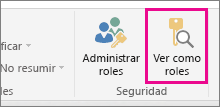

## Validar los roles en Power BI Desktop
Después de haber creado los roles, pruebe sus resultados en Power BI Desktop.

1. En la pestaña **Modelado**, seleccione **Ver como roles**. 

    

    Se abre la ventana **Ver como roles**, en la que se muestran los roles que ha creado.

    

3. Seleccione un rol que haya creado y después **Aceptar** para aplicarlo. 

   Los informes representan los datos pertinentes para ese rol.

4. También puede seleccionar **Otro usuario** y proporcionar un usuario determinado. 

    

   Es mejor proporcionar el nombre principal de usuario (UPN), ya que es el que usarán el servicio Power BI y Power BI Report Server.

   En Power BI Desktop, **Otro usuario** solo muestra otros resultados si usa la seguridad dinámica basada en las expresiones DAX. 

5. Haga clic en **Aceptar**. 

   El informe se representará en función de lo que pueda ver ese usuario.

