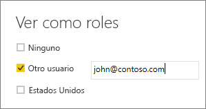

## Validación del rol en Power BI Desktop
Después de haber creado el rol, puede probar el resultado del rol en Power BI Desktop. Para ello, seleccione **Ver como roles**.

El cuadro de diálogo **Ver como roles** permite cambiar la vista de lo que aparece para ese rol o usuario específico. Puede ver los roles que ha creado.

Seleccione el rol que ha creado y, después, seleccione **Aceptar** para aplicar ese rol a lo que está viendo. Los informes solo representan los datos pertinentes para ese rol.

También puede seleccionar **Otro usuario** y proporcionar un usuario determinado. Es mejor proporcionar el nombre principal de usuario (UPN), ya que es el que usa el servicio Power BI. Seleccione **Aceptar** y los informes se representarán según lo que pueda ver ese usuario. 

> [!NOTE]
> En Power BI Desktop, este procedimiento solo muestra resultados diferentes si usa la seguridad dinámica basada en las expresiones DAX.
> 
> 

