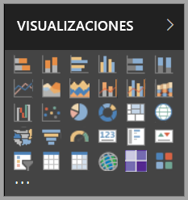
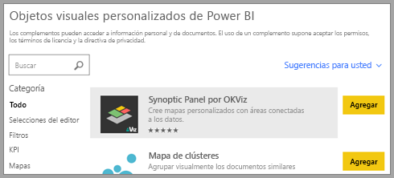

# Elementos visuales personalizados en Power BI

Al crear o editar un informe de Power BI, puede usar muchos tipos diferentes de objetos visuales. Aparecen los iconos para estos objetos visuales en el **visualizaciones** panel. Estos objetos visuales están empaquetados previamente al descargar [Power BI Desktop](https://powerbi.microsoft.com/desktop/) o abra el [servicio Power BI](https://app.powerbi.com).

Sin embargo, no está limitado a este conjunto de objetos visuales. Si selecciona el botón de puntos suspensivos (...) en la parte inferior, otra fuente de objetos visuales de informes, se convierte en disponible -*objetos visuales personalizados*.

Los desarrolladores crear elementos visuales personalizados con el SDK de los objetos visuales personalizados. Estos objetos visuales permiten a los usuarios verán que sus datos de forma que mejor se adapte a su negocio. Los autores de informes, a continuación, pueden importar los archivos visuales personalizados en sus informes y utilizarlos como lo harían los demás objetos visuales de Power BI. Los objetos visuales personalizados son ciudadanos de primera clase en Power BI y se pueden filtrar, resaltado, editado, compartidos y así sucesivamente.

Los objetos visuales personalizados se implementan de tres maneras:

* Archivos de objetos visuales personalizados
* Objetos visuales de la organización
* Objetos visuales de Marketplace

## Archivos de objetos visuales personalizados

Los objetos visuales personalizados son paquetes que contienen código para representar los datos que se reciben. Cualquier persona puede crear un objeto visual personalizado y empaquetarlo como un único `.pbiviz` archivo, que puede importarse en un informe de Power BI.

> [!WARNING]
> Un objeto visual personalizado podría contener código con riesgos de privacidad o seguridad. Asegúrese de que confía en el autor y el origen del objeto visual personalizado antes de importarla a un informe.

## Objetos visuales de la organización

Administradores de Power BI aprobación e implementación los objetos visuales personalizados en su organización, lo que los autores de informes fácilmente pueden detectar, actualizar y usar. Los administradores pueden administrar fácilmente (por ejemplo, versión de actualización, habilitar o deshabilitar) estos objetos visuales.

 [Obtenga más información sobre objetos visuales de organización](power-bi-custom-visuals-organization.md).

## Objetos visuales de Marketplace

Miembros de la Comunidad y Microsoft han aportado sus objetos visuales personalizados para beneficio pública y los han publicado los [AppSource](https://appsource.microsoft.com/marketplace/apps?product=power-bi-visuals) marketplace. Puede descargar estos objetos visuales de agregan a los informes de Power BI. Microsoft ha probado y aprobado estos objetos visuales personalizados para la funcionalidad y calidad.

¿Qué es [AppSource](developer/office-store.md)? Es el lugar donde puede encontrar las aplicaciones, complementos y extensiones para el software de Microsoft. [AppSource](https://appsource.microsoft.com/) conecta millones de usuarios de productos como Office 365, Azure, Dynamics 365, Cortana y Power BI, con soluciones que les ayudan a realizar el trabajo más eficazmente, insightfully y atractiva que antes.

### Objetos visuales certificados

Los objetos visuales son objetos visuales de marketplace que han superado las pruebas de calidad rigurosa adicionales y se admiten en escenarios adicionales, como certificados por Power BI [suscripciones de correo electrónico](https://docs.microsoft.com/power-bi/service-report-subscribe), y [exportar a PowerPoint](https://docs.microsoft.com/power-bi/service-publish-to-powerpoint).
Para ver la lista de objetos visuales personalizados certificados o para enviar su propia lista, consulte [Certified custom visuals](https://docs.microsoft.com/power-bi/power-bi-custom-visuals-certified) (Objetos visuales personalizados certificados).

¿Es un desarrollador web interesado en crear sus propias visualizaciones y agregarlas a AppSource? Consulte [desarrollar un objeto visual personalizado de Power BI](developer/custom-visual-develop-tutorial.md) y aprenda cómo [publicar objetos visuales personalizados en AppSource](https://docs.microsoft.com/power-bi/developer/office-store).

### Importar un objeto visual personalizado de un archivo

1. Seleccione el botón de puntos suspensivos en la parte inferior de la **visualizaciones** panel.

    

2. En la lista desplegable, seleccione **Importar desde archivo**.

    

3. En el menú Abrir archivo, seleccione el `.pbiviz` archivo que desea importar y, a continuación, seleccione **abierto**. Icono del objeto visual personalizado se agrega a la parte inferior de la **visualizaciones** panel y ahora está disponible para su uso en el informe.

    

### Importación de objetos visuales de la organización

1. Seleccione el botón de puntos suspensivos en la parte inferior de la **visualizaciones** panel.

    

2. En el menú desplegable, seleccione **Importar de Marketplace**.

    

3. Seleccione **MI ORGANIZACIÓN** en el menú de la pestaña superior.

    

4. Desplácese por la lista hasta que encuentre el objeto visual que desea importar.

    

5. Seleccione **agregar** para importar el objeto visual personalizado. El icono se agrega a la parte inferior de la **visualizaciones** panel y ahora está disponible para su uso en el informe.

    

## Descargar o importar objetos visuales personalizados desde Microsoft AppSource

Tiene dos opciones para descargar e importar objetos visuales personalizados: desde dentro de Power BI y de la [sitio Web de AppSource](https://appsource.microsoft.com/).

### Importar objetos visuales personalizados desde Power BI

1. Seleccione el botón de puntos suspensivos en la parte inferior de la **visualizaciones** panel.

    

2. En el menú desplegable, seleccione **Importar de Marketplace**.

    

3. Desplácese por la lista hasta que encuentre el objeto visual que desea importar.

    

4. Para obtener más información sobre uno de los objetos visuales, resáltelo y selecciónelo.

    

5. En dicha página puede ver capturas de pantalla, vídeos, descripción detallada, etc.

    

6. Desplácese hacia abajo para ver las opiniones.

    

7. Seleccione **agregar** para importar el objeto visual personalizado. El icono se agrega a la parte inferior de la **visualizaciones** panel y ahora está disponible para su uso en el informe.

    

### Descargar e importar objetos visuales personalizados desde Microsoft AppSource

1. Vaya a [Microsoft AppSource](https://appsource.microsoft.com) y seleccione la pestaña **Aplicaciones**.

    

2. Vaya a la [página de resultados de aplicaciones](https://appsource.microsoft.com/marketplace/apps), donde puede ver las aplicaciones principales de cada categoría, entre ellas *Power BI apps* (Aplicaciones de Power BI). Estamos buscando objetos visuales personalizados, así que vamos a seleccionar **objetos visuales de Power BI** en la lista de navegación izquierdo para limitar los resultados.

    

3. AppSource muestra un icono para cada objeto visual personalizado.  Cada icono tiene una instantánea visual personalizada con una breve descripción y un vínculo de descarga. Para ver información más detallada, seleccione el icono.

    

4. En dicha página puede ver capturas de pantalla, vídeos, descripción detallada, etc. Seleccione **obtenerla ahora** para descargar el objeto visual personalizado y, a continuación, acepte los términos de uso.

    

5. Seleccione el vínculo para descargar el objeto visual personalizado.

    

    La página de descarga también incluye instrucciones sobre cómo importar el objeto visual personalizado en Power BI Desktop y el servicio Power BI.

    También puede descargar un informe de ejemplo que incluye el objeto visual personalizado y muestra sus funcionalidades.

    

6. Guardar el `.pbiviz` de archivo y, a continuación, abra Power BI.

7. Importar el `.pbiviz` archivo en el informe. (consulte la sección [Importar un objeto visual personalizado de un archivo](#import-a-custom-visual-from-a-file) anterior).

## Consideraciones y limitaciones

* Un objeto visual personalizado se agrega a un informe específico cuando se importa. Si desea usar el objeto visual en otro informe, debe importarlo también en dicho informe. Cuando se guarda un informe con un objeto visual personalizado mediante la opción **Guardar como** , se guarda una copia del objeto visual personalizado con el nuevo informe.

* Si no ve una **visualizaciones** panel, lo que significa que no tiene informes permisos de edición.  Solo se pueden agregar objetos visuales personalizados a los informes que puede editar, no a los informes que se han compartido con usted.

## Solucionar problemas

Para solucionar problemas, consulte [solución de problemas de los objetos visuales personalizados de Power BI](power-bi-custom-visuals-troubleshoot.md).

## PREGUNTAS MÁS FRECUENTES

Para obtener más información y respuestas a las preguntas, visite las [preguntas más frecuentes sobre objetos visuales personalizados de Power BI](power-bi-custom-visuals-faq.md#organizational-custom-visuals).

## Pasos siguientes

* [Visualizaciones en informes de Power BI](visuals/power-bi-report-visualizations.md)

¿Tiene más preguntas? [Pruebe la comunidad de Power BI](http://community.powerbi.com/).
