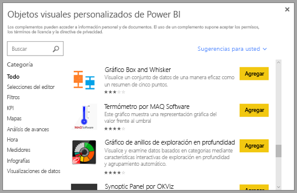
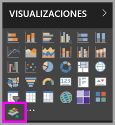
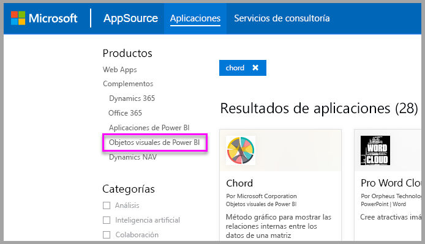
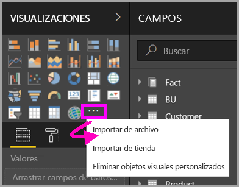

# Elementos visuales personalizados en Power BI
Al crear o editar un informe de Power BI, puede usar muchos tipos diferentes de objetos visuales. Estos objetos visuales se muestran en el panel **Visualizaciones**. Al descargar Power BI Desktop o abrir el servicio Power BI (app.powerbi.com), este conjunto de objetos visuales ya está incluido. 

Pero no solo puede usar este conjunto de objetos visuales; seleccione el botón de puntos suspensivos y se abrirá otro origen de objetos visuales de informe, los *objetos visuales personalizados*.

Los objetos visuales personalizados han sido creados por miembros de la comunidad y por Microsoft, y se hospedan en [AppSource](https://appsource.microsoft.com/marketplace/apps?product=power-bi-visuals). Estos objetos visuales pueden descargarse y agregarse a los informes de Power BI. Microsoft ha aprobado todos estos objetos visuales personalizados y se comportan de manera similar a las visualizaciones incluidas con Power BI: se pueden filtrar, resaltar, editar, compartir, etc. 

¿Qué es AppSource? En pocas palabras, es el lugar donde podrá encontrar aplicaciones, complementos y extensiones para su software de Microsoft. [AppSource](https://appsource.microsoft.com) conecta millones de usuarios de productos como Office 365, Azure, Dynamics 365, Cortana y Power BI con soluciones que les ayudan a realizar su trabajo de forma más eficaz, minuciosa o atractiva que antes.

## Dos tipos de objetos visuales personalizados

Los objetos visuales personalizados de Power BI disponibles en AppSource se dividen en 2 categorías: **aprobados** y **certificados**. Los objetos visuales *aprobados por AppSource* se pueden ejecutar en exploradores, informes y paneles.  Los objetos visuales *certificados por Power BI* han superado pruebas rigurosas y se admiten en escenarios adicionales, como [suscripciones de correo electrónico](service-report-subscribe.md) y [exportación a PowerPoint](service-publish-to-powerpoint.md).

Para ver la lista de objetos visuales personalizados certificados o para enviar su propia lista, consulte [Certified custom visuals](power-bi-custom-visuals-certified.md) (Objetos visuales personalizados certificados).

¿Es un desarrollador web interesado en crear sus propias visualizaciones y agregarlas a AppSource?  Consulte la [introducción a las herramientas de desarrollo](service-custom-visuals-getting-started-with-developer-tools.md) y vea cómo [publicar objetos visuales personalizados en AppSource](https://appsource.microsoft.com/marketplace/apps?product=power-bi-visuals).

## Descargar o importar objetos visuales personalizados desde Microsoft AppSource
Tiene dos opciones para descargar e importar objetos visuales personalizados; desde Power BI y desde el sitio web de AppSource. 

###    Importar objetos visuales personalizados desde Power BI
1. En la parte inferior del panel Visualizaciones, seleccione los puntos suspensivos. 

    

2. En la lista desplegable, seleccione **Importar del almacén**.

    

3. Desplácese por la lista hasta que encuentre el objeto visual que desea importar. 

    

4.  Para obtener más información sobre uno de los objetos visuales, resáltelo y selecciónelo.

    

5.  En dicha página puede ver capturas de pantalla, vídeos, descripción detallada, etc. 

    

6. Desplácese hacia abajo para ver las opiniones.

    

7.    Para importar el objeto visual personalizado, seleccione **Agregar**. El icono del objeto visual personalizado se agrega a la parte inferior del panel de visualizaciones y ya se puede usar en el informe.

       

###    Descargar e importar objetos visuales personalizados desde Microsoft AppSource

1. Vaya a [Microsoft AppSource](https://appsource.microsoft.com) y seleccione la pestaña **Aplicaciones**. 

    

2. Esto le llevará a la [página de resultados de aplicaciones](https://appsource.microsoft.com/en-us/marketplace/apps), donde puede ver las aplicaciones principales de cada categoría, entre ellas *Power BI apps* (Aplicaciones de Power BI). Pero estamos buscando objetos visuales personalizados, así que vamos a restringir los resultados. Seleccione **Power BI visuals** (Objetos visuales de Power BI) en la lista de navegación izquierda.

    

3. AppSource muestra un icono para cada objeto visual personalizado.  Cada mosaico tiene una instantánea del objeto visual personalizado y proporciona una breve descripción y un vínculo de descarga. Para ver información más detallada, seleccione el icono. 

    

4. En dicha página puede ver capturas de pantalla, vídeos, descripción detallada, etc. Para descargar el objeto visual personalizado, seleccione **Obtenerla ahora** y acepte los términos de uso. 

    

5. Seleccione el vínculo para descargar el objeto visual personalizado.

    

    La página de descarga también incluye instrucciones para importar el objeto visual personalizado en Power BI Desktop y el servicio Power BI.

    También puede descargar un informe de ejemplo que incluye el objeto visual personalizado y muestra sus funcionalidades.

    

6. Guarde el archivo .pbiviz y, a continuación, abra Power BI.    
7. Abra el informe al que desea agregar el objeto visual personalizado y, en la parte inferior del panel **Visualizaciones**, seleccione el botón de puntos suspensivos > **Importar desde archivo**.  

      

8. Seleccione el archivo del objeto visual personalizado para agregar el icono de ese objeto visual personalizado a la parte inferior del panel **Visualizaciones**. Ya puede usar el objeto visual personalizado en el informe.

    
    
##    Consideraciones y solución de problemas

- Un objeto visual personalizado se agrega a un informe específico cuando se importa. Si desea usar el objeto visual en otro informe, debe importarlo también en dicho informe. Cuando se guarda un informe con un objeto visual personalizado mediante la opción **Guardar como** , se guarda una copia del objeto visual personalizado con el nuevo informe.

- Si no ve el panel **Visualizaciones**, significa que no tiene permisos de edición para el informe.  Solo se pueden agregar objetos visuales personalizados a los informes que puede editar, no a los informes que se han compartido con usted.

¿Tiene más preguntas? [Pruebe la comunidad de Power BI](http://community.powerbi.com/)

