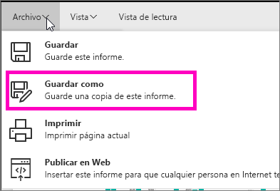

# Creación de un nuevo informe a partir de uno ya existente
Puede que tenga un informe que ya se conecta al conjunto de datos y tiene algunos objetos visuales que le gustaría volver a usar o modificar.  ¿Por qué no copia ese informe como base para un nuevo informe?  Para hacerlo:

1. [Abra un informe](service-report-open-in-reading-view.md).
2. En el menú **Archivo** , seleccione **Guardar como**.
   
   
3. Escriba un nombre para el nuevo informe y seleccione **Guardar**.
   
   
   
   Un mensaje de confirmación le comunica que el informe se guardó en el área de trabajo actual de Power BI.
   
   
4. Abra la pestaña **Informes** del área de trabajo y seleccione el nuevo informe para abrirlo. Opcionalmente, elimine objetos visuales que no quiera mantener, modifique otros objetos visuales y agregue nuevos.
   
   
5. Diviértase actualizando y editando el nuevo informe.

## Pasos siguientes:
[Creación de nuevas visualizaciones](power-bi-report-add-visualizations-ii.md)

[Eliminación de las visualizaciones](service-delete.md) que no necesita
