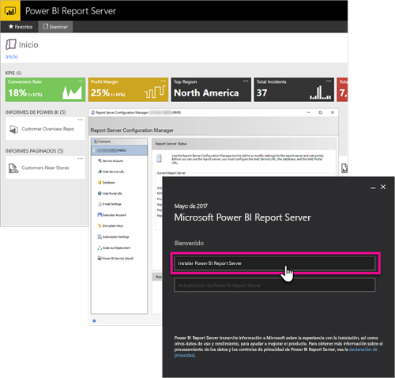

# Información general para administradores, Power BI Report Server
Este artículo contiene información general de administración de Power BI Report Server, una ubicación local para almacenar y administrar informes paginados, móviles o de Power BI. En este artículo se presentan los conceptos de planeamiento, implementación y administración de Power BI Report Server, con vínculos a información adicional.

## Instalación y migración
Para empezar a usar Power BI Report Server, es preciso instalarlo. Disponemos de artículos que explican cómo controlar esta tarea.

Antes de empezar a instalar, actualizar o migrar a Power BI Report Server, eche un vistazo a los [requisitos del sistema](system-requirements.md) para el servidor de informes.

### Instalación
Si va a implementar una instancia nueva de Power BI Report Server, utilice los siguientes documentos, ya que le servirán de ayuda. 

[Instalar un servidor de informes de Power BI](install-report-server.md)

### Migración
No hay ninguna actualización vigente para SQL Server Reporting Services. Si ya tiene una instancia de SQL Server Reporting Services que quiere que se convierta en una de Power BI Report Server, debe migrarla. Hay otras razones por las que es preferible realizar una migración. Para más información, consulte el documento de migración.

[Migrar la instalación de un servidor de informes](migrate-report-server.md)

## Configurar un servidor de informes
Al configurar un servidor de informes dispone de muchas opciones. ¿Va a usar SSL? ¿Va a configurar un servidor de correo electrónico? ¿Desea integrarlo con el servicio Power BI para anclar visualizaciones?

La mayoría de la configuración se producirá en el Administrador de configuración del servidor de informes. Para más información, consulte la documentación del [administración de configuración](https://docs.microsoft.com/sql/reporting-services/install-windows/reporting-services-configuration-manager-native-mode).

## Seguridad
La seguridad y la protección son dos aspectos importantes para todas las organizaciones. Para obtener información acerca de la autenticación, la autorización, los roles y los permisos, consulte la documentación de la [seguridad](https://docs.microsoft.com/sql/reporting-services/security/reporting-services-security-and-protection).

## Pasos siguientes
[Instalar un servidor de informes de Power BI](install-report-server.md)  
[Buscar la clave de producto del servidor de informes](find-product-key.md)  
[Instalar Power BI Desktop optimizado para el servidor de informes de Power BI](install-powerbi-desktop.md)  
[Instalación del Generador de informes](https://docs.microsoft.com/sql/reporting-services/install-windows/install-report-builder)  
[Descargar SQL Server Data Tools (SSDT)](http://go.microsoft.com/fwlink/?LinkID=616714)

¿Tiene más preguntas? [Pruebe a preguntar a la comunidad de Power BI](https://community.powerbi.com/)

