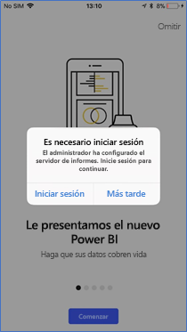
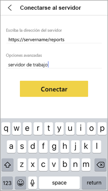

# Configurar el acceso de la aplicación móvil de iOS de Power BI a un servidor de informes de forma remota

En este artículo se explica cómo usar la herramienta MDM de su organización para configurar el acceso de la aplicación móvil de iOS de Power BI a un servidor de informes de forma remota. Para configurarlo, los administradores de TI deben crear una directiva de configuración de aplicaciones con la información necesaria para que se envíe a la aplicación. 

 Con la conexión del servidor de informes configurada, los usuarios de la aplicación móvil de iOS de Power BI pueden conectarse al servidor de informes de la organización más fácilmente. 

## Crear la directiva de configuración de aplicaciones en la herramienta MDM 

Como administrador, estos son los pasos que debe seguir en Microsoft Intune para crear la directiva de configuración de aplicaciones. Estos pasos y la experiencia de crear la directiva de configuración de aplicaciones pueden variar en otras herramientas MDM. 

1. Conecte la herramienta MDM. 
2. Cree una nueva directiva de configuración de aplicaciones y asígnele un nombre. 
3. Elija los usuarios a los que quiere distribuir esta directiva de configuración de aplicación. 
4. Crear pares de clave-valor. 

En la tabla de abajo se detallan los pares.

|Clave  |Tipo  |Descripción  |
|---------|---------|---------|
| com.microsoft.powerbi.mobile.ServerURL | Cadena | URL del servidor de informes   Debe empezar por http/https |
| com.microsoft.powerbi.mobile.ServerUsername | Cadena | (opcional)   El nombre de usuario que se usará para conectar el servidor.   Si no existe, la aplicación pide al usuario que escriba el nombre de usuario para la conexión.| 
| com.microsoft.powerbi.mobile.ServerDisplayName | Cadena | (opcional)   El valor predeterminado es “Servidor de informes”   Nombre descriptivo que se usa en la aplicación para representar el servidor | 
| com.microsoft.powerbi.mobile.OverrideServerDetails | Booleano | El valor predeterminado es True  Si se establece en "true", invalida cualquier definición de servidor de informes que ya esté disponible en el dispositivo móvil. Los servidores existentes ya configurados se eliminan.   Al establecer Reemplazar en True también se evita que el usuario quite esa configuración.   Si se establece en “False”, se agregan los valores insertados, dejando cualquier configuración existente.   Si la misma dirección URL del servidor ya está configurada en la aplicación móvil, esta deja dicha configuración tal cual. La aplicación no pide al usuario que vuelva a autenticarse para el mismo servidor. |

Este es un ejemplo de configuración de la directiva de configuración mediante Intune.

## Los usuarios finales se conectan a un servidor de informes

 Supongamos que publica la directiva de configuración de aplicaciones para una lista de distribución. Cuando los usuarios y los dispositivos de dicha lista de distribución inicien la aplicación móvil de iOS, tendrán la siguiente experiencia. 

1. Se muestra un mensaje que indica que su aplicación móvil está configurada con un servidor de informes y deben pulsar en **Iniciar sesión**.

    

2.  En la página **Conectar al servidor**, los detalles del servidor de informes ya están rellenados. Pulsan en **Conectar**.

    

3. Escriben una contraseña para autenticarse y luego pulsan en **Iniciar sesión**. 

    

Ya pueden ver e interactuar con los KPI y los informes de Power BI almacenados en el servidor de informes.

## Pasos siguientes

- [Habilitación del acceso remoto a Power BI Mobile con Azure Active Directory Application Proxy](https://docs.microsoft.com/azure/active-directory/manage-apps/application-proxy-integrate-with-power-bi)
- [Información general de administrador](admin-handbook-overview.md)  
- [Instalar un servidor de informes de Power BI](install-report-server.md)  

¿Tiene más preguntas? [Pruebe a preguntar a la comunidad de Power BI](https://community.powerbi.com/)

