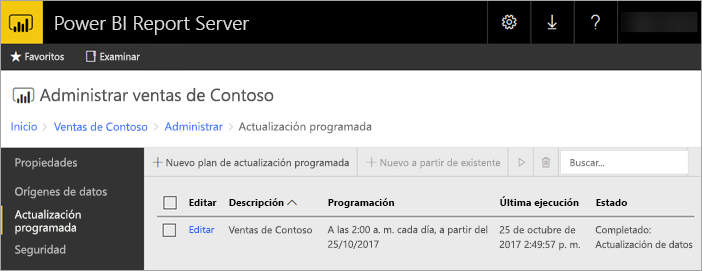
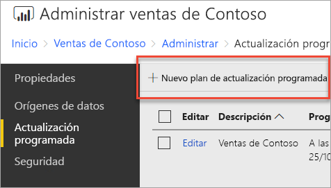
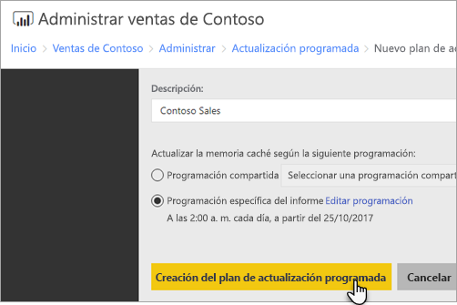
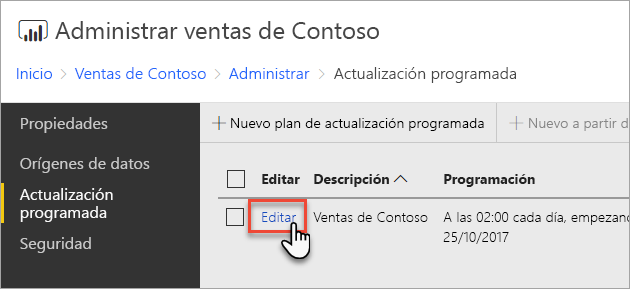
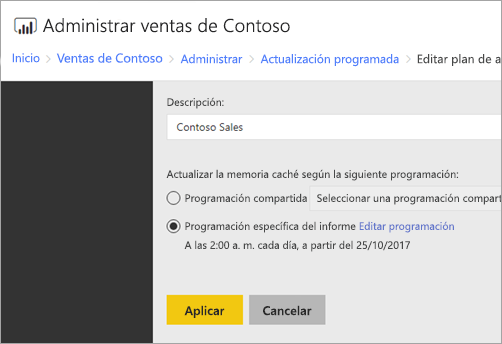

# Configuración de la actualización programada de informes de Power BI
Para actualizar los datos en el informe de Power BI, debe crear un plan de actualización programada. Esto se realiza en el área *Administrar* de un informe de Power BI.

## Configuración de las credenciales del origen de datos
Antes de crear un plan de actualización programada de datos, debe establecer las credenciales para **cada origen de datos** usado en el informe de Power BI.

1. En el portal web, haga clic con el botón derecho en el informe de Power BI y seleccione **Administrar**.
   
    
2. En el menú de la izquierda, seleccione la pestaña **Orígenes de datos**.
3. Para cada origen de datos que aparece, elija el tipo de autenticación que se utilizará al conectarse a ese origen de datos. Escriba las credenciales adecuadas.
   
    

## Creación de un plan de actualización programada
Siga estos pasos para crear un plan de actualización programada.

1. En el portal web, haga clic con el botón derecho en el informe de Power BI y seleccione **Administrar**.
   
    
2. En el menú de la izquierda, seleccione la pestaña **Actualización programada**.
3. En la página **Actualización programada**, seleccione **Nuevo plan de actualización programada**.
   
    
4. En la página **Nuevo plan de actualización programada**, escriba una descripción y establezca una programación con la que desea que se actualice el modelo de datos.
5. Seleccione **Crear plan de actualización programada** cuando haya finalizado.
   
    

## Modificación de un plan de actualización programada
Modificar un plan de actualización programada es similar a crear uno.

1. En el portal web, haga clic con el botón derecho en el informe de Power BI y seleccione **Administrar**.
   
    
2. En el menú de la izquierda, seleccione la pestaña **Actualización programada**.
3. En la página **Actualización programada**, seleccione **Editar** junto al plan de actualización que desea administrar.
   
    
4. En la página **Editar plan de actualización programada**, escriba una descripción y establezca una programación con la que desea que se actualice el modelo de datos.
5. Seleccione **Aplicar** cuando haya terminado.
   
    

## Visualización del estado del plan de actualización programada
Puede ver el estado de un plan de actualización programada en el portal web.

1. En el portal web, haga clic con el botón derecho en el informe de Power BI y seleccione **Administrar**.
   
    
2. En el menú de la izquierda, seleccione la pestaña **Actualización programada**.
3. En la página **Actualización programada**, la columna del extremo derecho muestra el estado de un plan.
   
   | **Estado** | **Descripción** |
   | --- | --- |
   | Nuevo plan de actualización programada |El plan se ha creado pero no se ejecutó. |
   | Actualizando |Se ha iniciado el proceso de actualización. |
   | Transmitiendo el modelo a Analysis Server |Copiando el modelo desde la base de datos del catálogo del servidor de informes a la instancia de Analysis Services hospedada. |
   | Actualizando datos |Actualizando los datos del modelo. |
   | Eliminando las credenciales del modelo |Eliminadas las credenciales utilizadas para conectar al origen de datos desde el modelo. |
   | Guardando el modelo en el catálogo |La actualización de datos ha finalizado y se guarda el modelo actualizado en la base de datos del catálogo del servidor de informes. |
   | Completado: Actualización de datos |La actualización se ha realizado. |
   | Error: |Un error se produjo durante la actualización y se muestra. |

Es necesario actualizar la página web para ver el estado actual. El estado no cambiará automáticamente.

## Pasos siguientes
Para más información sobre la creación y modificación de programaciones, consulte [Creación, modificación y eliminación de programaciones](https://docs.microsoft.com/sql/reporting-services/subscriptions/create-modify-and-delete-schedules).

Para obtener información acerca de cómo solucionar problemas de actualización programada, consulte [Solución de problemas de actualización programada en Power BI Report Server](scheduled-refresh-troubleshoot.md).

¿Tiene más preguntas? [Pruebe a preguntar a la comunidad de Power BI](https://community.powerbi.com/)

