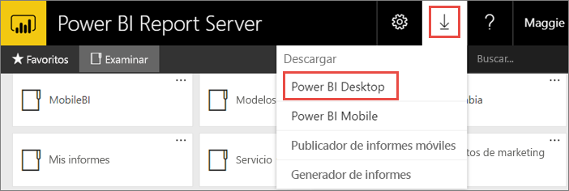

# Instalar Power BI Desktop optimizado para el servidor de informes de Power BI
Aprenda a instalar Power BI Desktop optimizado para el servidor de informes de Power BI.

Para crear informes de Power BI para Power BI Report Server, debe descargar e instalar Power BI Desktop optimizado para Power BI Report Server. Esta es una versión de Power BI Desktop distinta de la que se usa con el servicio Power BI. Por ejemplo, la versión de Power BI Desktop para el servicio Power BI incluye características en versión preliminar que no estarán disponibles en la versión Power BI Report Server hasta que se hayan publicado. Es necesario usar esta versión para asegurarse de que el servidor de informes puede interactuar con una versión conocida de los informes y el modelo. 

La buena noticia es que Power BI Desktop y Power BI Desktop optimizado para Power BI Report Server se pueden instalar en paralelo en el mismo equipo.

## Descarga e instalación de Power BI Desktop

La mejor manera de asegurarse de que tiene la versión más actualizada de Power BI Desktop optimizado para Power BI Report Server es iniciarlo desde el portal web de su servidor de informes.

1. En el portal web de Report Server, seleccione la flecha **Descargar** > **Power BI Desktop**.

    

    O bien, puede ir directamente a [Microsoft Power BI Desktop](https://www.microsoft.com/download/details.aspx?id=56723) (optimizado para Power BI Report Server, marzo de 2018) en el Centro de descarga de Microsoft.

2. En la página del Centro de descarga, seleccione **Descargar**.

3. En función de su equipo, seleccione: 

    - **PBIDesktopRS.msi** (versión de 32 bits).

    - **PBIDesktopRS_x64.msi** (versión de 64 bits).

1. Después de descargar el instalador, ejecute el Asistente para la instalación de Power BI Desktop (octubre de 2017).
2. Al final del proceso de instalación, seleccione **Iniciar Power BI Desktop ahora**.
   
    Se inicia automáticamente y está listo para funcionar.

## Compruebe que usa la versión correcta
Para ello, examine la pantalla de inicio o la barra de títulos de Power BI Desktop. En la barra de título se indican el mes y el año de la versión.

La versión de Power BI Desktop para el servicio Power BI no indica el mes y el año en la barra de título.

## Asociación de extensión de archivo
Si ha instalado Power BI Desktop y Power BI Desktop optimizado para el servidor de informes de Power BI en el mismo equipo, la última instalación de Power BI Desktop tendrá la asociación de archivos con .pbix. Esto significa que al hacer doble clic en un archivo pbix, se iniciará la última instancia de Power BI Desktop que se instaló.

Si tenía Power BI Desktop y, después, ha instalado Power BI Desktop optimizado para el servidor de informes de Power BI, todos los archivos pbix se abrirán en Power BI Desktop optimizado para el servidor de informes de Power BI de manera predeterminada. Si prefiere que sea Power BI Desktop el que se ejecute de manera predeterminada al abrir un archivo pbix, vuelva a instalarlo desde el servicio Power BI.

Siempre puede abrir la versión de Power BI Desktop que desea usar en primer lugar. Y, después, abra el archivo desde Power BI Desktop.

La edición de un informe de Power BI desde el servidor de informes de Power BI o la creación de un nuevo informe de Power BI desde el portal web, siempre abrirá siempre la versión correcta de Power BI Desktop.

## Consideraciones y limitaciones
Los informes de Power BI Report Server y del servicio Power BI (http://powerbi.com)) actúan prácticamente igual, pero hay algunas características diferentes.

### En un explorador
Los informes del servidor de informes de Power BI admiten todas las visualizaciones, entre las que se incluyen:

* Objetos visuales personalizados

Los informes del servidor de informes de Power BI no admiten:

* Objetos visuales de R
* Mapas de ArcGIS
* Rutas de navegación
* Características de la versión preliminar de Power BI Desktop

### En las aplicaciones móviles de Power BI
Los informes del servidor de informes de Power BI admiten toda la funcionalidad básica en las [aplicaciones móviles de Power BI](../consumer/mobile/mobile-apps-for-mobile-devices.md), lo que incluye:

* [Diseño del informe en el teléfono](../desktop-create-phone-report.md): puede optimizar un informe para las aplicaciones móviles de Power BI. En el teléfono móvil, los informes optimizados tienen un icono  y un diseño especiales.
  
    

Los informes del servidor de informes de Power BI no admiten estas características en las aplicaciones móviles de Power BI:

* Objetos visuales de R
* Mapas de ArcGIS
* Objetos visuales personalizados
* Rutas de navegación
* Geofiltrado o códigos de barras

## Power BI Desktop para versiones anteriores de Power BI Report Server

Si la versión de Power BI Report Server es anterior, se necesita la versión correspondiente de Power BI Desktop. Estas son las dos versiones anteriores.

- Microsoft Power BI Desktop ([optimizado para Power BI Report Server - octubre de 2017](https://www.microsoft.com/download/details.aspx?id=56136))
- Microsoft Power BI Desktop ([optimizado para Power BI Report Server - junio de 2017](https://www.microsoft.com/download/details.aspx?id=55330))

## Pasos siguientes
Una vez que Power BI Desktop se ha instalado, puede empezar a crear informes de Power BI.

[Creación de un informe de Power BI para Power BI Report Server](quickstart-create-powerbi-report.md)  
[¿Qué es Power BI Report Server?](get-started.md)

¿Tiene más preguntas? [Pruebe a preguntar a la comunidad de Power BI](https://community.powerbi.com/)

