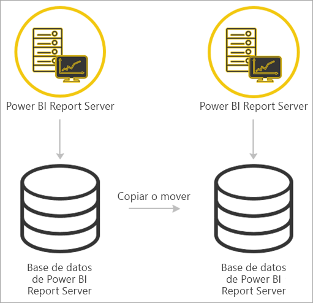

# <a name="migrate-a-report-server-installation"></a>Migrar la instalación de un servidor de informes
Aprenda a migrar una instancia de SQL Server Reporting Services (SSRS) existente a una instancia del servidor de informes de Power BI.

La migración se define como mover los archivos de datos de una aplicación a una nueva instancia del servidor de informes de Power BI. Éstos son los motivos más comunes para migrar una instalación:

* Desea pasar de SQL Server Reporting Services al servidor de informes de Power BI
  
  > [!NOTE]
  > No hay una actualización activa de SQL Server Reporting Services al servidor de informes de Power BI. Una migración es necesaria.
  > 
  > 
* Tiene requisitos de actualización o implementación a gran escala
* Va a cambiar el hardware o la topología de la instalación
* Se produce un problema que bloquea la actualización

## <a name="migrating-to-power-bi-report-server-from-ssrs-native-mode"></a>Migrar al servidor de informes de Power BI desde SSRS (modo nativo)
La migración desde una instancia de SSRS (modo nativo) al servidor de informes de Power BI es un proceso que consta de varios pasos.


> [!NOTE]
> SQL Server 2008 Reporting Services, y las versiones posteriores, son compatibles con la migración.
> 
> 

* Realizar una copia de seguridad de los archivos de base de datos, aplicación y configuración
* Realizar una copia de seguridad de la clave de cifrado
* Clonar la base de datos del servidor de informes que hospeda los informes
* Instalar un servidor de informes de Power BI. Si usa el mismo hardware, puede instalar el servidor de informes de Power BI en el mismo servidor que la instancia de SSRS. Para información más detallada acerca de cómo instalar un servidor de informes de Power BI, consulte [Instalar un servidor de informes de Power BI](install-report-server.md).

> [!NOTE]
> El nombre de instancia del servidor de informes de Power BI será *PBIRS*.
> 
> 

* Configurar el servidor de informes mediante el Administrador de configuración del servidor de informes y conectarse a la base de datos clonada.
* Realizar la limpieza que necesite la instancia de SSRS (modo nativo)

## <a name="migration-to-power-bi-report-server-from-ssrs-sharepoint-integrated-mode"></a>Migración al servidor de informes de Power BI desde SSRS (modo integrado de SharePoint)
La migración desde SSRS (modo integrado de SharePoint) al servidor de informes de Power BI no es tan sencilla como en modo nativo. Aunque estos pasos ofrecen cierta guía, en SharePoint puede haber otros archivos y recursos que tengan que administrarse sin seguir estos pasos.


Será preciso que migre el contenido específico del servidor de informes de SharePoint a un servidor de informes de Power BI. Se asume que ya ha instalado el servidor de informes de Power BI en su entorno. Para información más detallada acerca de cómo instalar un servidor de informes de Power BI, consulte [Instalar un servidor de informes de Power BI](install-report-server.md).

Para copiar el contenido del servidor de informes desde su entorno de SharePoint al servidor de informes de Power BI, tendrá que usar herramientas como **rs.exe**. A continuación se muestra un ejemplo de cuál sería el script para copiar el contenido del servidor de informes de SharePoint al servidor de informes de Power BI.

> [!NOTE]
> El script de ejemplo funcionaría con SharePoint 2010, y las versiones posteriores, y con SQL Server 2008 Reporting Services, y las versiones posteriores.
> 
> 

### <a name="sample-script"></a>Script de ejemplo
```
Sample Script
rs.exe
-i ssrs_migration.rss -e Mgmt2010
-s http://SourceServer/_vti_bin/reportserver
-v st="sites/bi" -v f="Shared Documents“
-u Domain\User1 -p Password
-v ts=http://TargetServer/reportserver
-v tu="Domain\User" -v tp="Password"
```

## <a name="migrateing-from-one-power-bi-report-server-to-another"></a>Migrar desde un servidor de informes de Power BI a otro
La migración desde un servidor de informes de Power BI es el mismo proceso que la migración desde SSRS (modo nativo).



* Realizar una copia de seguridad de los archivos de base de datos, aplicación y configuración
* Realizar una copia de seguridad de la clave de cifrado
* Clonar la base de datos del servidor de informes que hospeda los informes
* Instalar un servidor de informes de Power BI. El servidor de informes de Power BI *no se puede* instalar en el mismo servidor que desde el que se va a realizar la migración. Para información más detallada acerca de cómo instalar un servidor de informes de Power BI, consulte [Instalar un servidor de informes de Power BI](install-report-server.md).

> [!NOTE]
> El nombre de instancia del servidor de informes de Power BI será *PBIRS*.
> 
> 

* Configurar el servidor de informes mediante el Administrador de configuración del servidor de informes y conectarse a la base de datos clonada.
* Realizar la limpieza necesaria en la instalación del servidor de informes de Power BI anterior.

## <a name="next-steps"></a>Pasos siguientes
[Manual del administrador](admin-handbook-overview.md)  
[Inicio rápido: instalar un servidor de informes de Power BI](quickstart-install-report-server.md)  
[Script with the rs.exe Utility and the Web Service](https://docs.microsoft.com/sql/reporting-services/tools/script-with-the-rs-exe-utility-and-the-web-service) (Crear un script con la utilidad rs.exe y el servicio web)

¿Tiene más preguntas? [Pruebe a preguntar a la comunidad de Power BI](https://community.powerbi.com/)

