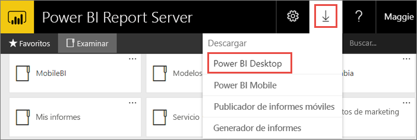
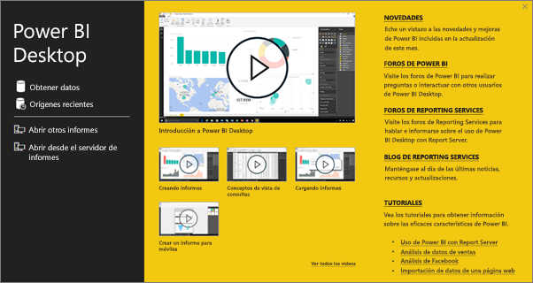
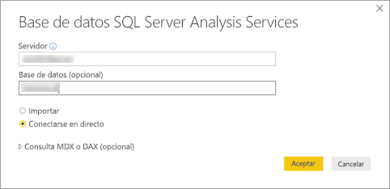
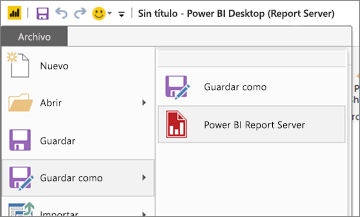

# Creación de un informe de Power BI para Power BI Report Server
Puede almacenar y administrar informes de Power BI en el portal web de Power BI Report Server, así como también puede almacenarlos en la nube del servicio Power BI (https://powerbi.com) ). Cree y edite informes en Power BI Desktop y publíquelos en el portal web. Luego, los lectores de informes de su organización pueden verlos en un explorador o en una aplicación móvil de Power BI de un dispositivo móvil.

Aquí tiene cuatro pasos para ayudarle a comenzar.

## Paso 1: Instalar Power BI Desktop optimizado para el servidor de informes de Power BI

Si ya ha creado informes de Power BI en Power BI Desktop, estará casi listo para crearlos en Power BI Report Server. Se recomienda instalar la versión de Power BI Desktop optimizada para el servidor de informes de Power BI, ya que así se tendrá la certeza de que el servidor y la aplicación siempre están sincronizados. Ambas versiones de Power BI Desktop pueden estar en el mismo equipo.

1. En el portal web de Report Server, seleccione la flecha **Descargar** > **Power BI Desktop**.

    

    O bien, vaya a la página principal de [Power BI Report Server](https://powerbi.microsoft.com/report-server/) y seleccione **Opciones avanzadas de descarga**.

2. En la página del Centro de descarga, seleccione **Descargar**.

3. En función de su equipo, seleccione:

    - **PBIDesktopRS.msi** (versión de 32 bits).

    - **PBIDesktopRS_x64.msi** (versión de 64 bits).

4. Después de descargar el instalador, ejecute el Asistente para la instalación de Power BI Desktop (septiembre de 2019).

2. Al final del proceso de instalación, seleccione **Iniciar Power BI Desktop ahora**.
   
    Se inicia automáticamente y está listo para funcionar. Sabrá que tiene la versión correcta porque aparece **Power BI Desktop (septiembre de 2019)** en la barra de título.

    

3. Si no conoce Power BI Desktop, considere la posibilidad de ver los vídeos de la pantalla de inicio de sesión.
   
    

## Paso 2: Seleccionar origen de datos
Puede conectarse a una gran variedad de orígenes de datos. Más información acerca de cómo [conectarse a orígenes de datos](connect-data-sources.md).

1. En la pantalla de inicio de sesión, seleccione **Obtener datos**.
   
    En la pestaña **Inicio**, seleccione **Obtener datos**.
2. Seleccione el origen de datos: en este ejemplo, **Analysis Services**.
   
    
3. Rellene el campo **Servidor** y, opcionalmente, **Base de datos**. Asegúrese de que **Conectar en directo** está seleccionado > **Aceptar**.
   
    
4. Elija el servidor de informes en el que guardará los informes.
   
    

## Paso 3: Diseño del informe
Esta es la parte divertida: va a crear los objetos visuales que ilustran los datos.

Por ejemplo, puede crear un gráfico de embudo de clientes y los valores de grupo por ingresos anuales.

1. En **Visualizaciones**, seleccione **Gráfico de embudo**.
2. Arrastre el campo de recuento a **Valores**. Si no es un campo numérico, Power BI Desktop lo convierte automáticamente en un *recuento* del valor.
3. Arrastre el campo al grupo de **Grupo**.

Más información acerca del [diseño de un informe de Power BI](../desktop-report-view.md).

## Paso 4: Guardado del informe en el servidor de informes
Cuando el informe esté listo, guárdelo en la instancia de Power BI Report Server que eligió en el paso 2.

1. En el menú **Archivo**, seleccione **Guardar como** > **servidor de informes de Power BI**.
   
    
2. Ahora puede verlo en el portal web.
   
    

## Pasos siguientes
### Power BI Desktop
Hay muchos recursos excelentes para crear informes en Power BI Desktop. Este vínculo es un buen punto de partida.

* [Introducción a Power BI Desktop](../desktop-getting-started.md)
* Aprendizaje guiado: [Exploración de Power BI Desktop](/learn/modules/get-data-power-bi/2-getting-started-power-bi-desktop)

### Power BI Report Server
* [Instalar Power BI Desktop optimizado para el servidor de informes de Power BI](install-powerbi-desktop.md)  
* [¿Qué es Power BI Report Server?](get-started.md)  

¿Tiene más preguntas? [Pruebe a preguntar a la comunidad de Power BI](https://community.powerbi.com/)
