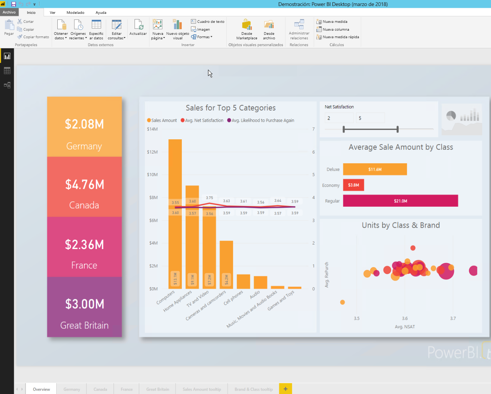
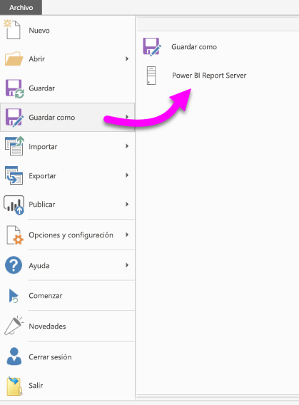
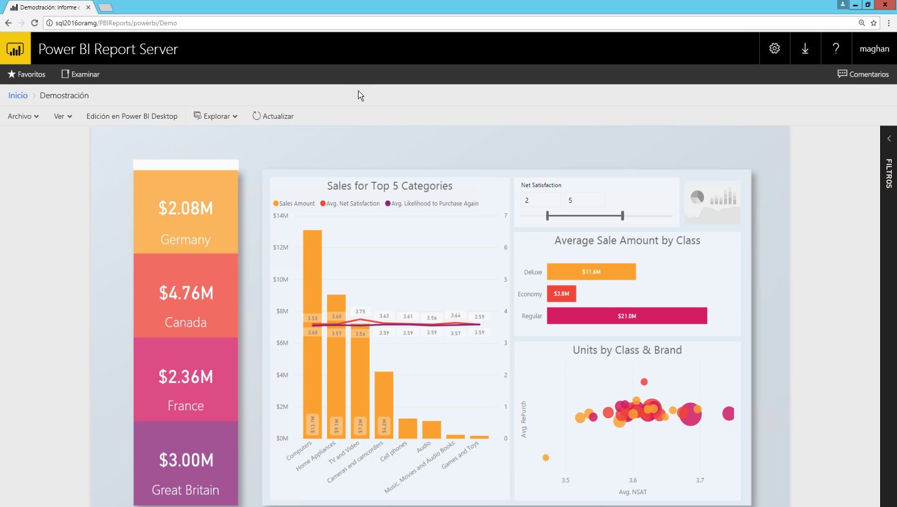
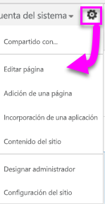
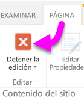

# <a name="embed-a-power-bi-report-server-report-using-an-iframe-in-sharepoint-server"></a>Inserción de un informe de Power BI Report Server con un elemento iFrame en SharePoint Server

En este artículo, obtendrá información sobre cómo insertar un informe de Power BI Report Server mediante un elemento iFrame en una página de SharePoint. Si trabaja con SharePoint Online, Power BI Report Server debe ser de acceso público. En SharePoint Online, el elemento web de Power BI que funciona con el servicio Power BI no funcionará con Power BI Report Server.  


## <a name="prerequisites"></a>Requisitos previos
* [Power BI Report Server](https://powerbi.microsoft.com/report-server/) instalado y configurado.
* [Power BI Desktop optimizado para Power BI Report Server](install-powerbi-desktop.md) instalado.
* Un entorno de [SharePoint](https://docs.microsoft.com/sharepoint/install/install) instalado y configurado.
* Internet Explorer 11 solo se admite si el modo de documento está establecido en el modo IE11 (Microsoft Edge) o cuando se usa SharePoint Online. Puede usar otros exploradores compatibles con SharePoint local y SharePoint Online.

## <a name="create-the-power-bi-report-url"></a>Creación de la dirección URL del informe de Power BI

1. Descargue el ejemplo de GitHub: [Blog Demo](https://github.com/Microsoft/powerbi-desktop-samples) (Demostración de blog). Seleccione **Clonar o descargar** y, después **Descargar ZIP**.

    

2. Descomprima el archivo y abra el archivo .pbix de ejemplo en Power BI Desktop optimizado para Power BI Report Server.

    

3. Guarde el informe en **Power BI Report Server**. 

    

4. Vea el informe en el portal web de Power BI Report Server.

    

### <a name="capture-the-url-parameter"></a>Captura del parámetro de dirección URL

Cuando tenga la dirección URL, puede crear un elemento iFrame en una página de SharePoint para hospedar el informe. Para cualquier dirección URL de informe de Power BI Report Server, agregue el parámetro de cadena de consulta siguiente para insertar el informe en un elemento iFrame de SharePoint: `?rs:embed=true`.

   Por ejemplo:
    ``` 
    https://myserver/reports/powerbi/Sales?rs:embed=true
    ```
## <a name="embed-the-report-in-a-sharepoint-iframe"></a>Inserción del informe en un elemento iFrame de SharePoint

1. Vaya a la página **Contenidos del sitio** de SharePoint.

    

2. Elija la página donde desea agregar el informe.

    

3. Seleccione el icono de engranaje en la parte superior derecha y, después, seleccione **Editar página**.

    

4. Seleccione **Agregar un elemento web**.

5. En **Categorías**, seleccione **Multimedia y contenido**. En **Elementos**, seleccione **Editor de contenido** y después **Agregar**.

    

6. Seleccione **Click here to add new content** (Haga clic aquí para agregar contenido nuevo).

7. En el menú superior, seleccione **Formato de texto** y después **Editar origen**.

     

8. En la ventana **Editar origen**, pegue el código del elemento iFrame en **Código fuente HTML** y, después, seleccione **Aceptar**.

    

     Por ejemplo:
     ```html
     <iframe width="800" height="600" src="https://myserver/reports/powerbi/Sales?rs:embed=true" frameborder="0" allowFullScreen="true"></iframe>
     ```

9. En el menú superior, seleccione **Página** y después **Detener la edición**.

    

    El informe aparece en la página.

    

## <a name="next-steps"></a>Pasos siguientes

- [Creación de un informe de Power BI para Power BI Report Server](quickstart-create-powerbi-report.md).  
- [Creación de un informe paginado para Power BI Report Server](quickstart-create-paginated-report.md).  

¿Tiene más preguntas? [Pruebe la comunidad de Power BI](https://community.powerbi.com/). 
