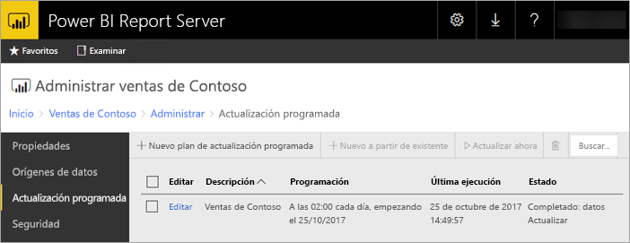

# Solución de problemas de la actualización programada en Power BI Report Server
La actualización programada de los informes de Power BI permite que los datos de un informe estén al día.

La actualización programada es específica de los informes de Power BI con un modelo insertado. Lo que significa que importa datos en el informe en lugar de usar una conexión dinámica o DirectQuery. Al importar los datos, se desconecta del origen de datos original y debe actualizarse para mantener los datos actualizados. La actualización programada es la manera de mantener actualizados los datos.

La actualización programada se configura en la sección de administración de un informe. Para más información acerca de cómo configurar la actualización programada, consulte [Configuración de la actualización programada de un informe de Power BI](configure-scheduled-refresh.md).

## Cómo funciona
Cuando se usa la actualización programada para los informes de Power BI, están implicados varios componentes.

* El Agente SQL Server como temporizador para generar eventos programados.
* Los trabajos programados se agregan a una cola de eventos y notificaciones en la base de datos del servidor de informes. En una implementación escalada, la cola se comparte con todos los servidores de informes de la implementación.
* Todo el procesamiento de informes que se produce como resultado de un evento de programación se realiza como un proceso en segundo plano.
* El modelo de datos se carga en una instancia de Analysis Services.
* Para algunos orígenes de datos, el motor de mashup de Power Query se utiliza para conectarse a orígenes de datos y transformar los datos. Otros orígenes de datos pueden estar conectados a directamente desde un servicio de Analysis Services que se utiliza para hospedar los modelos de datos para Power BI Report Server.
* Los nuevos datos se cargan en el modelo de datos de Analysis Services.
* Analysis Services procesa los datos y ejecuta cualquier cálculo necesario.

Power BI Report Server mantiene una cola de eventos para todas las operaciones programadas. Sondea la cola a intervalos regulares para detectar nuevos eventos. De forma predeterminada, la cola se examina a intervalos de 10 segundos. Puede cambiar el intervalo modificando las opciones de configuración **PollingInterval**, **IsNotificationService** y **IsEventService** en el Archivo RSReportServer.config. **IsDataModelRefreshService** también se puede usar para establecer si un servidor de informes procesa eventos programados.

### Analysis Services
Representar un informe de Power BI, así como realizar una actualización programada, requiere cargar el modelo de datos del informe de Power BI en Analysis Services. Un proceso de Analysis Services se ejecutará con Power BI Report Server.

## Consideraciones y limitaciones
### Cuándo no utilizar la actualización programada
No todos los informes de Power BI puede tener un plan de actualización programada creado. La siguiente es una lista de informes de Power BI en los que no se puede crear un plan de actualización programada.

* El informe contiene uno o varios orígenes de datos de Analysis Services que utilizan una conexión activa.
* El informe contiene uno o varios orígenes de datos que utilizan DirectQuery.
* El informe no contiene ningún origen de datos. Por ejemplo, los datos se escriben manualmente a través de *Introducir datos* o un informe contiene solo contenido estático, como imágenes, texto, etc.

Además de la lista anterior, hay escenarios específicos con orígenes de datos en modo *importar* para los que no se pueden crear planes de actualización.

* Si se utiliza un origen de datos *Archivo* o *Carpeta* y la ruta de acceso del archivo es una ruta de acceso local (por ejemplo, C:\Users\user\Documents), no se puede crear un plan de actualización. La ruta de acceso debe ser una ruta de acceso a la que el servidor de informes pueda conectarse como un recurso compartido de red. Por ejemplo, *\\myshare\Documents*.
* Si solo puede conectarse al origen de datos con OAuth (por ejemplo, Facebook, Google Analytics, Salesforce, etc.), no se puede crear el plan de actualización de caché. En este momento, RS no admite autenticación de OAuth para un origen de datos si este es paginado, móvil o informes de Power BI.

### Límites de memoria
La carga de trabajo tradicional de un servidor de informes ha sido similar a la de una aplicación web. La posibilidad de cargar informes con datos importados o DirectQuery y de realizar la actualización programada se basan en una instancia de Analysis Services hospedada por el servidor de informes. Como resultado, esto podría dar lugar a presión de memoria inesperada en el servidor. Planee la implementación del servidor teniendo en cuenta que Analysis Services podría estar consumiendo memoria junto con el servidor de informes.

Para obtener información sobre cómo supervisar una instancia de Analysis Services, consulte [Supervisión de una instancia de Analysis Services](https://docs.microsoft.com/sql/analysis-services/instances/monitor-an-analysis-services-instance).

Para obtener información acerca de la configuración de memoria en Analysis Services, consulte [Propiedades de memoria](https://docs.microsoft.com/sql/analysis-services/server-properties/memory-properties).

## Pasos siguientes
Configuración de la [actualización programada](configure-scheduled-refresh.md) en un informe de Power BI.

¿Tiene más preguntas? [Pruebe a preguntar a la comunidad de Power BI](https://community.powerbi.com/)

