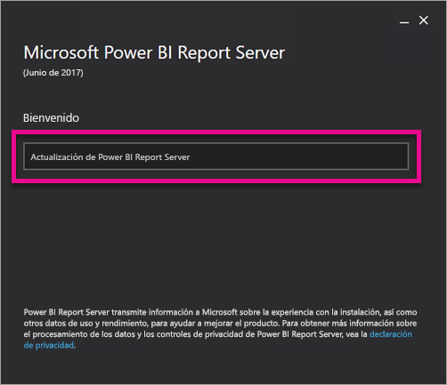
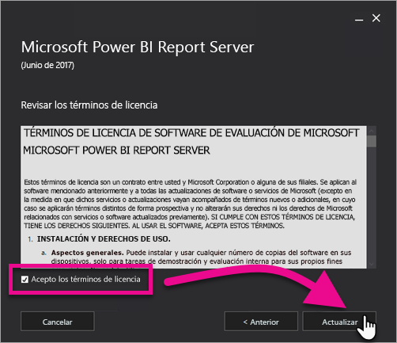
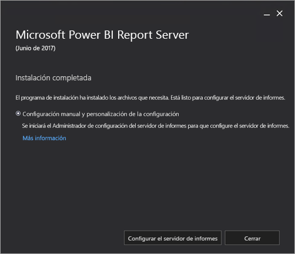

# Actualización de Power BI Report Server

Aprenda a actualizar un servidor de informes de Power BI.

 **Descargar** 

Para descargar el servidor de informes de Power BI y Power BI Desktop optimizado para el servidor de informes de Power BI, vaya a [Publicar informes en almacenamiento local con el servidor de informes de Power BI](https://powerbi.microsoft.com/report-server/).

## Antes de empezar

Antes de actualizar un servidor de informes, se recomienda que realice los pasos siguientes para hacer copia de seguridad del servidor de informes.

### Copia de seguridad de las claves de cifrado

Debe realizar una copia de seguridad de las claves de cifrado cuando configura la instalación de un servidor de informes por primera vez. También debe realizar una copia de seguridad de las claves cada vez que cambie la identidad de las cuentas de servicio o cambie el nombre del equipo. Para más información, vea [Copia de seguridad y restauración de las claves de cifrado de Reporting Services](https://docs.microsoft.com/sql/reporting-services/install-windows/ssrs-encryption-keys-back-up-and-restore-encryption-keys).

### Copia de seguridad de las bases de datos del servidor de informes

Dado que un servidor de informes es un servidor sin estado, todos los datos de aplicación se almacenan en las bases de datos **reportserver** y **reportservertempdb** que se ejecutan en una instancia del Motor de base de datos de SQL Server. Puede hacer una copia de seguridad de las bases de datos **reportserver** y **reportservertempdb** con alguno de los métodos admitidos para copias de seguridad de bases de datos de SQL Server. Como recomendaciones específicas para las bases de datos del servidor de informes se incluyen las siguientes:

* Utilice el modelo de recuperación completa para realizar una copia de seguridad de la base de datos **reportserver**.
* Utilice el modelo de recuperación simple para realizar una copia de seguridad de la base de datos **reportservertempdb**.
* Puede utilizar distintas programaciones de copia de seguridad para cada base de datos. La única razón por la que debe realizar una copia de seguridad de **reportservertempdb** es para evitar tener que volver a crearla en caso de que se produzca algún error de hardware. Si se diera el caso, no es necesario recuperar los datos de **reportservertempdb**, pero sí necesita la estructura de tabla. Si pierde **reportservertempdb**, la única manera de recuperarla es volver a crear la base de datos del servidor de informes. Si vuelve a crear **reportservertempdb**, es importante que tenga el mismo nombre que la base de datos del servidor de informes principal.

Para obtener más información sobre copia de seguridad y recuperación de bases de datos relacionales de SQL Server, vea [Realizar copias de seguridad y restaurar bases de datos de SQL Server](https://docs.microsoft.com/sql/relational-databases/backup-restore/back-up-and-restore-of-sql-server-databases).

### Copia de seguridad de los archivos de configuración

El servidor de informes de Power BI usa archivos de configuración para almacenar la configuración de la aplicación. Debe realizar una copia de seguridad de los archivos la primera vez que configure el servidor y después de implementar cualquier extensión personalizada. Debe realizar una copia de los siguientes archivos:

* config.json
* RSHostingService.exe.config
* Rsreportserver.config
* Rssvrpolicy.config
* Reportingservicesservice.exe.config
* Web.config para las aplicaciones ASP.NET del servidor de informes
* Machine.config para ASP.NET

## Actualización del servidor de informes

Es sencillo actualizar el servidor de informes de Power BI. Solo hay que seguir unos pocos pasos para instalar los archivos.

1. Busque la ubicación de PowerBIReportServer.exe e inicie el instalador.

2. Seleccione **Upgrade Power BI Report Server** (Actualizar servidor de informes de Power BI).

    

3. Lea y acepte los términos y condiciones de la licencia y después seleccione **Actualizar**.

    

4. Después de una actualización correcta, seleccione **Configure Report Server** (Configurar servidor de informes) para iniciar el Administrador de configuración de Reporting Services o seleccione **Cerrar** para salir del instalador.

    

## Actualización de Power BI Desktop

Después de actualizar el servidor de informes, deseará asegurarse de que los autores de informes de Power BI actualicen a la versión de Power BI Desktop optimizado para el servidor de informes de Power BI que coincida con el servidor.

## Pasos siguientes

* [Información general de administrador](admin-handbook-overview.md)  
* [Instalar Power BI Desktop optimizado para el servidor de informes de Power BI](install-powerbi-desktop.md)  
* [Verify a Reporting Services Installation](https://docs.microsoft.com/sql/reporting-services/install-windows/verify-a-reporting-services-installation) (Comprobar una instalación de Reporting Services)  
* [Configure the report server service account](https://docs.microsoft.com/sql/reporting-services/install-windows/configure-the-report-server-service-account-ssrs-configuration-manager) (Configurar la cuenta de servicio del servidor de informes)  
* [Configure report server URLs](https://docs.microsoft.com/sql/reporting-services/install-windows/configure-report-server-urls-ssrs-configuration-manager) (Configurar direcciones URL del servidor de informes)  
* [Configure a report server database connection](https://docs.microsoft.com/sql/reporting-services/install-windows/configure-a-report-server-database-connection-ssrs-configuration-manager) (Configurar una conexión de base de datos del servidor de informes)  
* [Inicializar un servidor de informes](https://docs.microsoft.com/sql/reporting-services/install-windows/ssrs-encryption-keys-initialize-a-report-server)  
* [Configurar conexiones SSL en un servidor de informes](https://docs.microsoft.com/sql/reporting-services/security/configure-ssl-connections-on-a-native-mode-report-server)  
* [Configure windows service accounts and permissions](https://docs.microsoft.com/sql/database-engine/configure-windows/configure-windows-service-accounts-and-permissions) (Configurar permisos y cuentas del servicio de Windows)  
* [Compatibilidad del explorador con el servidor de informes de Power BI](browser-support.md)

¿Tiene más preguntas? [Pruebe a preguntar a la comunidad de Power BI](https://community.powerbi.com/)