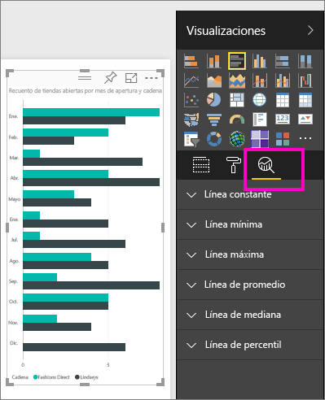
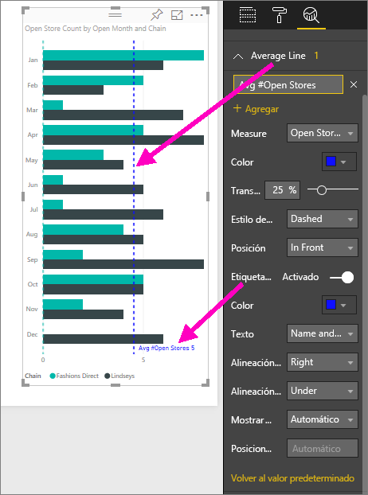
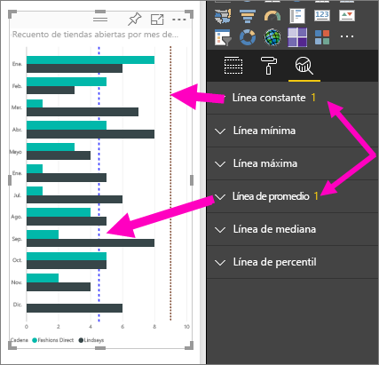
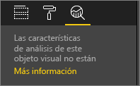

# Panel de análisis del servicio Power BI
Con el panel **Análisis** en **Servicio Power BI**, puede agregar *líneas de referencia* dinámicas a visualizaciones y destacar las tendencias o detalles importantes.

> [!NOTE]
> El panel **Análisis** solo se muestra cuando se selecciona un objeto visual en el lienzo del informe.
> 
> 

## Usar el panel Analytics
Con el panel **Analytics**, puede crear los siguientes tipos de líneas de referencia dinámicas (no todas las líneas están disponibles para todos los tipos visuales):

* Línea constante del eje X
* Línea constante del eje Y
* Línea mínima
* Línea máxima
* Línea promedio
* Línea mediana
* Línea de percentil

Para ver las líneas de referencia dinámicas disponibles para un objeto visual, siga estos pasos:

1. Seleccione o cree un objeto visual y, después, seleccione el icono **Análisis** desde el panel **Visualizaciones**.

2. Seleccione la flecha hacia abajo para el tipo de línea que desea crear para expandir sus opciones. En este caso, seleccionaremos **Línea promedio**.
   
   

3. Para crear una nueva línea, seleccione **+ Agregar** y decida la medida que se usará para crear la línea.  La lista desplegable **Medida** se rellena automáticamente con los datos disponibles de la visualización seleccionada. Vamos a usar **Abrir recuento de tiendas**.

5. Tiene todo tipo de opciones para la línea, como el color, la transparencia, el estilo y la posición (con respecto a los elementos de datos del objeto visual). Si desea etiquetar la línea, asígnele un título y, a continuación, mueva el control deslizante **Etiqueta de datos** a **Activado**.  En este caso, asignaremos el título *Avg # Open Stores* (Nº de almacenes abiertos promedio) a la línea y personalizaremos algunas de las otras opciones como se muestra a continuación.
   
   

1. Observe el número que aparece junto al elemento **Línea promedio** en el panel **Analytics**. Eso le indica cuántas líneas dinámicas tiene actualmente en el objeto visual y de qué tipo son. Si agregamos una **línea constante** como objetivo del número de almacenes de 9, puede ver que en el panel **Análisis** se muestra que ahora también tenemos una línea de referencia de **línea constante** aplicada a este objeto visual.
   
   
   

Hay todo tipo de información interesante que puede resaltar mediante la creación de líneas de referencia dinámicas con el panel **Analysis**.

## Consideraciones y solución de problemas

Si el objeto visual seleccionado no puede tener líneas de referencia dinámica aplicadas (en este caso, un objeto visual de **Mapa**), verá lo siguiente al seleccionar el panel **Analytics**.
   

La capacidad de usar líneas de referencia dinámicas se basa en el tipo de objeto visual que se está usando. En la siguiente lista se muestra qué líneas dinámicas están disponibles en estos momentos para los objetos visuales:

El uso completo de líneas dinámicas está disponible en los siguientes objetos visuales:

* Gráfico de áreas
* Gráfico de líneas
* Gráfico de dispersión
* Gráfico de columnas agrupadas
* Gráfico de barras agrupadas

Los siguientes objetos visuales solo pueden usar una *línea constante* del panel **Analytics**:

* Área apilada
* Barra apilada
* Columna apilada
* Barra 100 % apilada
* Columna 100 % apilada

Para los siguientes objetos visuales, en estos momentos una *línea de tendencia* es la única opción:

* Línea no apilada
* Gráfico de columnas agrupadas

Por último, los objetos visuales no cartesianos no pueden aplicar actualmente líneas dinámicas desde el panel **Analytics**, como:

* Matriz
* Gráfico circular
* Anillo
* Tabla

## Pasos siguientes
[Panel de análisis en Power BI Desktop](desktop-analytics-pane.md)

¿Tiene más preguntas? [Pruebe la comunidad de Power BI](http://community.powerbi.com/)

