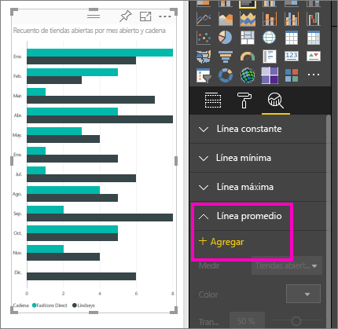

# Panel de análisis del servicio Power BI
Con el panel **Análisis** en **Servicio Power BI**, puede agregar *líneas de referencia* dinámicas a visualizaciones y destacar las tendencias o detalles importantes.

> [!NOTE]
> El panel **Análisis** solo se muestra cuando se selecciona un objeto visual en el lienzo del informe.
> 
> 

## Usar el panel Analytics
Con el panel **Analytics**, puede crear los siguientes tipos de líneas de referencia dinámicas (no todas las líneas están disponibles para todos los tipos visuales):

* Línea constante del eje X
* Línea constante del eje Y
* Línea mínima
* Línea máxima
* Línea promedio
* Línea mediana
* Línea de percentil

Las secciones siguientes muestran cómo se puede usar el panel **Analytics** y las líneas de referencia dinámicas en las visualizaciones.

Para ver las líneas de referencia dinámicas disponibles para un objeto visual, siga estos pasos:

1. Seleccione o cree un objeto visual y, después, seleccione el icono **Análisis** desde el panel **Visualizaciones**.
2. Seleccione la flecha hacia abajo para el tipo de línea que desea crear para expandir sus opciones. En este caso, seleccionaremos **Línea promedio**.
   
   
3. Para crear una nueva línea, seleccione **+ Agregar**. A continuación, puede especificar un nombre para la línea haciendo doble clic en el cuadro de texto y escribiendo su nombre.
   
   Tiene todo tipo de opciones para la línea, como el *color*, la *transparencia*, el *estilo* y la *posición* (con respecto a los elementos de datos del objeto visual); también puede definir si quiere incluir la etiqueta. Asimismo, puede seleccionar en qué **Medida** del objeto visual se debe basar la línea seleccionándola en el menú desplegable **Medida**, que se rellena automáticamente con los elementos de datos del objeto visual. En este caso, seleccionaremos *Open store count* (Número de almacenes abiertos) como medida, lo etiquetaremos como *Avg # Open Stores* (Nº de almacenes abiertos promedio) y personalizaremos algunas de las otras opciones, como se muestra a continuación.
   
   
4. Si desea hacer que aparezca una etiqueta de datos, active el control deslizante de **Etiqueta de datos**. Al hacerlo, obtendrá una gran variedad de opciones adicionales para la etiqueta de datos.
5. Observe el número que aparece junto al elemento **Línea promedio** en el panel **Analytics**. Eso le indica cuántas líneas dinámicas tiene actualmente en el objeto visual y de qué tipo son. Si agregamos una **línea constante** como objetivo del número de almacenes de 9, puede ver que en el panel **Análisis** se muestra que ahora también tenemos una línea de referencia de **línea constante** aplicada a este objeto visual.
   
   
   
   Si el objeto visual seleccionado no puede tener líneas de referencia dinámica aplicadas (en este caso, un objeto visual de **Mapa**), verá lo siguiente al seleccionar el panel **Analytics**.
   
   

Hay todo tipo de información interesante que puede resaltar mediante la creación de líneas de referencia dinámicas con el panel **Analysis**.

Estamos planeando más características y funcionalidades, como la ampliación de los objetos visuales que pueden tener líneas de referencia dinámicas aplicadas. Vuelva con regularidad para ver las novedades.

## Limitaciones
La capacidad de usar líneas de referencia dinámicas se basa en el tipo de objeto visual que se está usando. En la siguiente lista se muestra qué líneas dinámicas están disponibles en estos momentos para los objetos visuales:

El uso completo de líneas dinámicas está disponible en los siguientes objetos visuales:

* Gráfico de áreas
* Gráfico de líneas
* Gráfico de dispersión
* Gráfico de columnas agrupadas
* Gráfico de barras agrupadas

Los siguientes objetos visuales solo pueden usar una *línea constante* del panel **Analytics**:

* Área apilada
* Barra apilada
* Columna apilada
* Barra 100 % apilada
* Columna 100 % apilada

Para los siguientes objetos visuales, en estos momentos una *línea de tendencia* es la única opción:

* Línea no apilada
* Gráfico de columnas agrupadas

Por último, los objetos visuales no cartesianos no pueden aplicar actualmente líneas dinámicas desde el panel **Analytics**, como:

* Matriz
* Gráfico circular
* Anillo
* Tabla

## Pasos siguientes
[Panel de análisis en Power BI Desktop](desktop-analytics-pane.md)

¿Tiene más preguntas? [Pruebe la comunidad de Power BI](http://community.powerbi.com/)

