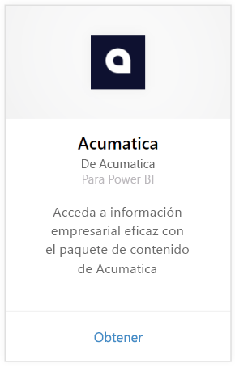
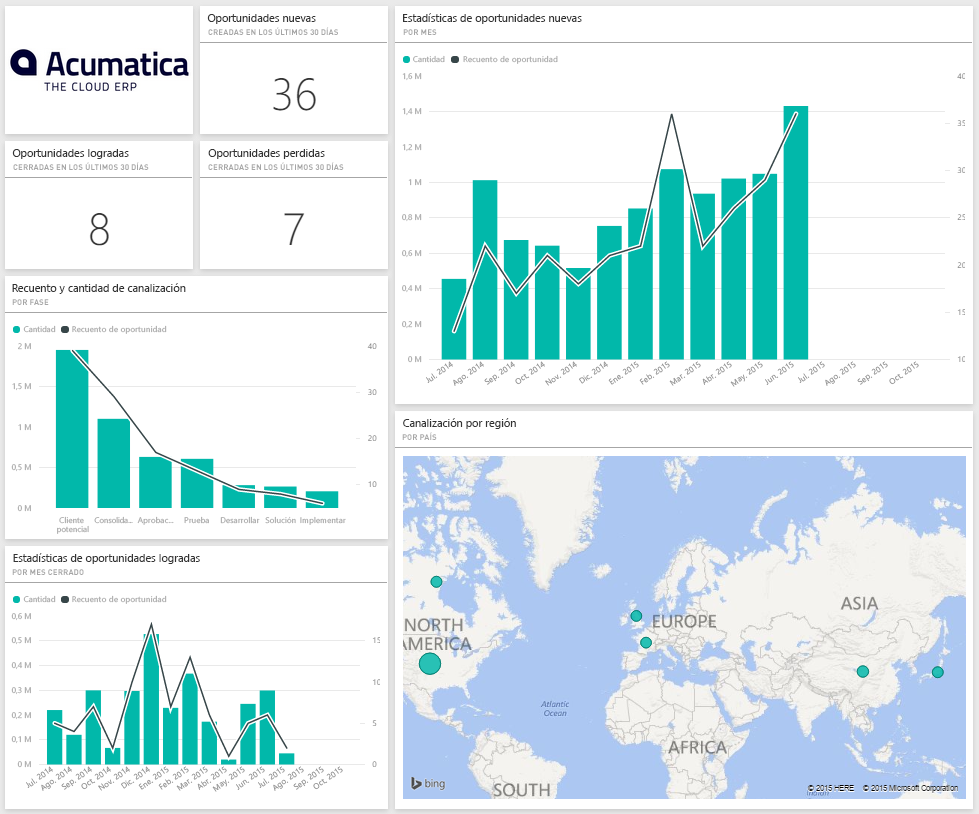
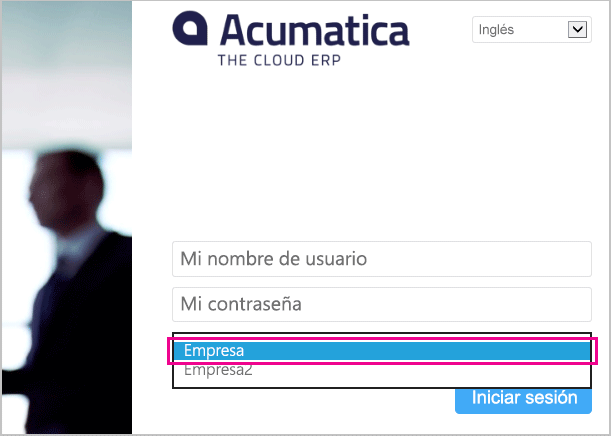

# Conexión a Acumatica con Power BI
El paquete de contenido de Acumatica para Power BI permite obtener rápidamente información sobre los datos de oportunidad. Power BI recupera los datos sobre oportunidades, cuentas y clientes para, a continuación, crear un panel predeterminado e informes relacionados basados en dichos datos.

Conéctese al [paquete de contenido de Acumatica](https://app.powerbi.com/getdata/services/acumatica) u obtenga más información sobre la [integración de Acumatica](https://powerbi.microsoft.com/integrations/acumatica) con Power BI.

>[!NOTE]
>Este paquete de contenido requiere Acumatica v5.2 o superior.

## Cómo conectarse
1. Seleccione **Obtener datos** en la parte inferior del panel de navegación izquierdo.
   
   
2. En el cuadro **Servicios** , seleccione **Obtener**.
   
   
3. Seleccione **Acumatica** \> **Obtener**.
   
   
4. Escriba el extremo de OData de Acumatica. Los extremos de OData permiten que un sistema externo pueda solicitar datos de Acumatica. El extremo de OData de Acumatica tiene el formato siguiente y debe usar HTTPS:
   
     https://[sitedomain]/odata/[companyname]
   
   El nombre de la empresa solo es necesario si tiene una implementación de varias empresas. A continuación se ofrece más información sobre cómo encontrar este parámetro en su cuenta de Acumatica.
   
   
5. En el Método de autenticación, seleccione **Básico**. Escriba el nombre de usuario y la contraseña de la cuenta de Acumatica y haga clic en **Iniciar sesión**.
   
    
6. Una vez que Power BI importe los datos, verá un nuevo panel, el informe y el conjunto de datos en el panel de navegación izquierdo. Los nuevos elementos se muestran marcados con un asterisco amarillo \* que desaparece una vez que se realiza la selección. Al elegir el panel se mostrará un diseño similar al siguiente:
   
    

**¿Qué más?**

* Pruebe a [hacer una pregunta en el cuadro de preguntas y respuestas](power-bi-q-and-a.md), en la parte superior del panel.
* [Cambie los iconos](service-dashboard-edit-tile.md) en el panel.
* [Seleccione un icono](service-dashboard-tiles.md) para abrir el informe subyacente.
* Aunque el conjunto de datos se programará para actualizarse diariamente, puede cambiar la programación de actualización o actualizarlo a petición mediante **Actualizar ahora**.

## Requisitos del sistema
Este paquete de contenido requiere Acumatica v5.2 o superior. Confirme la versión con el administrador de Acumatica.

## Búsqueda de parámetros
**Punto de conexión de OData de Acumatica**

El extremo de OData de Acumatica tiene el formato siguiente y debe usar HTTPS:

    https://[sitedomain]/odata/[companyname]

El dominio del sitio de aplicación puede encontrarse en la barra de direcciones del explorador tras iniciar sesión en Acumatica. En el ejemplo siguiente, el dominio del sitio es "https://pbi.acumatica.com". Por lo tanto, el extremo de OData que debe proporcionar sería "https://pbi.acumatica.com/odata".

 

El nombre de la empresa solo es necesario si tiene una implementación de varias empresas. Encontrará esta información en la página de inicio de sesión de Acumatica.

## Solución de problemas
Si no puede iniciar sesión, compruebe que el extremo de OData de Acumatica proporcionado tiene el formato correcto.

    https://<application site domain>/odata/<company name>

Si tiene problemas para conectarse, confirme con su administrador la versión de Acumatica. Este paquete de contenido requiere la versión 5.2 o posterior.

## Pasos siguientes
[Introducción a Power BI](service-get-started.md)

[Obtener datos en Power BI](service-get-data.md)

