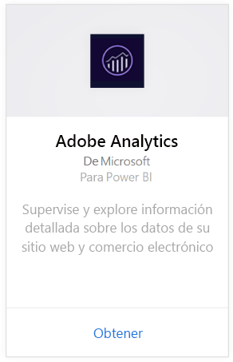
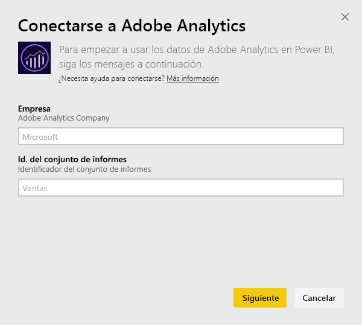
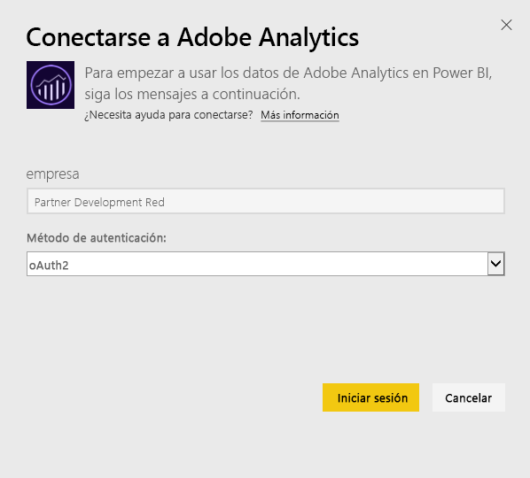
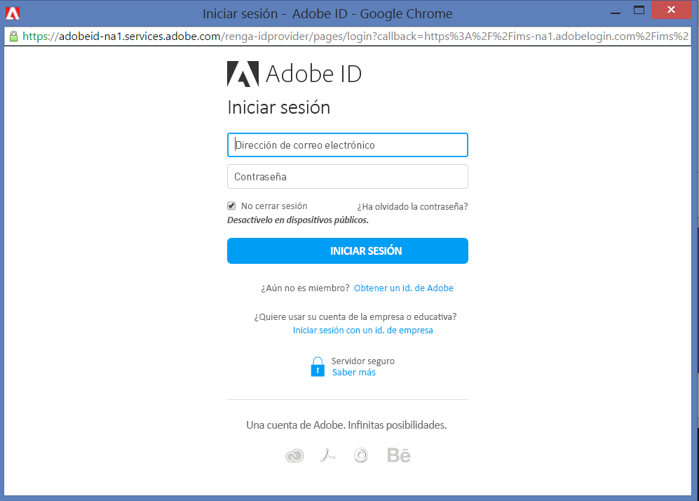
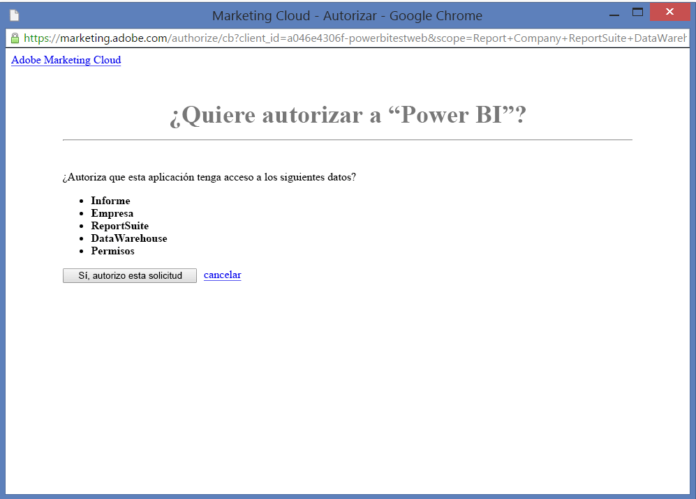
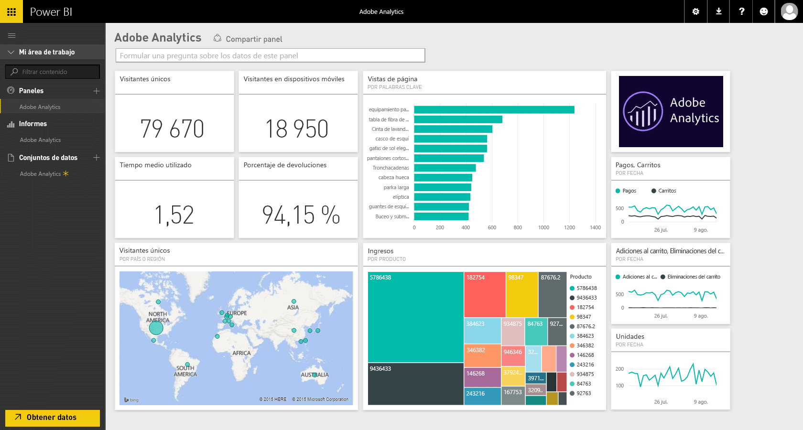

# Conexión a Adobe Analytics con Power BI
Para conectarse a Adobe Analytics a través de Power BI, empiece por conectarse a su cuenta de Adobe Analytics Marketing Cloud. Aparece una aplicación con un panel de Power BI y un conjunto de informes de Power BI que proporcionan información acerca del tráfico de su sitio y las dimensiones de usuarios. Los datos se actualizan automáticamente una vez al día. Puede interactuar con el panel y los informes, pero no puede guardar los cambios.

Conéctese a [Adobe Analytics](https://app.powerbi.com/getdata/services/adobe-analytics) u obtenga más información acerca de la [integración de Adobe Analytics](https://powerbi.microsoft.com/integrations/adobe-analytics) con Power BI.

## Cómo conectarse
[!INCLUDE [powerbi-service-apps-get-more-apps](./includes/powerbi-service-apps-get-more-apps.md)]

3. Seleccione **Adobe Analytics** \>  **Obtener**.
   
   
4. Power BI se conecta a una empresa de Adobe Analytics y al identificador del conjunto de informes concretos (no al nombre del conjunto de informes). Vea los detalles sobre [cómo encontrar esos parámetros](#FindingParams) a continuación.
   
   
5. En **Método de autenticación**, seleccione **oAuth2** \> **Iniciar sesión**. Cuando se le solicite, escriba sus credenciales de Adobe Analytics. 
   
    
   
    
6. Haga clic en **Aceptar** para permitir que Power BI tenga acceso a los datos de Adobe Analytics.
   
   
7. Tras la aprobación, el proceso de importación comienza automáticamente. 

## Visualización del panel y los informes de Adobe Analytics
[!INCLUDE [powerbi-service-apps-open-app](./includes/powerbi-service-apps-open-app.md)]

   

[!INCLUDE [powerbi-service-apps-open-app](./includes/powerbi-service-apps-what-now.md)]

## Qué se incluye
Power BI usa la API de informes de Adobe Analytics para definir y ejecutar informes para las siguientes tablas:

| **Nombre de tabla** | **Detalles de columna** |
| --- | --- |
| Productos |elements= "product" (top 25)   metrics="cartadditions", "cartremovals", "carts", "cartviews", "checkouts", "revenue", "units" |
| Exploradores |elements= "browser" (top 25)   metrics="bounces", "bouncerate", "visitors", "visits", "uniquevisitors", "totaltimespent", "pageviews" |
| Páginas |elements= "page" (top 25)   metrics="cartadditions", "cartremovals", "carts", "cartviews", "checkouts", "revenue", "units", "visits", "uniquevisitors", "pageviews", "bounces", "bouncerate", "totaltimespent" |
| JavaScript habilitado |elements= "javascriptenabled”, “browser” (top 25) |
| SO móvil |elements= "mobileos"(top 25)  metrics="bounces", "bouncerate", "visitors", "visits", "uniquevisitors", "totaltimespent", "cartadditions", "cartremovals", "checkouts", "revenue", "units", "pageviews" |
| Palabras clave de motores de búsqueda |elements= "searchengine" "searchenginekeyword"   metrics="bounces", "bouncerate", "visitors", "visits", "entries", "uniquevisitors", "totaltimespent", "cartadditions", "cartremovals", "carts", "cartviews", "checkouts", "revenue", "units", "pageviews" |
| Motor de búsqueda de productos |elements= "searchengine", "product"   metrics="bounces", "bouncerate", "visitors", "visits", "entries", "uniquevisitors", "totaltimespent", "cartadditions", "cartremovals", "carts", "cartviews", "checkouts", "revenue", "units", "pageviews" |
| Páginas remitentes |elements= "referrer" (top 15), “page" (top 10)   metrics="bounces", "bouncerate", "visitors", "visits", "entries", "uniquevisitors", "totaltimespent", "cartadditions", "cartremovals", "carts", "cartviews", "checkouts", "revenue", "units", "pageviews" |
| Páginas Geocountry |elements= "geocountry" (Top 20), "page"   metrics="bounces", "bouncerate", "visitors", "visits", "entries", "uniquevisitors", "totaltimespent", "cartadditions", "cartremovals", "carts", "cartviews", "checkouts", "revenue", "units", "pageviews" |
| Producto Geocountry |elements= "geocountry" (Top 20), "product"  metrics="bounces", "bouncerate", "visitors", "visits", "entries", "uniquevisitors", "totaltimespent", "cartadditions", "cartremovals", "carts", "cartviews", "checkouts", "revenue", "units" |
| Búsqueda de país y región |elements= "geocountry" (Top 200)   metrics="bounces", "bouncerate", "visitors", "visits", "entries", "uniquevisitors", "totaltimespent", "cartadditions", "cartremovals", "carts", "cartviews", "checkouts", "revenue", "units" |
| Idioma |elements= "language", "browser" (Top 25)   metrics="bounces", "bouncerate", "visitors", "visits", "uniquevisitors", "totaltimespent", "pageviews", "cartadditions", "cartremovals", "checkouts", "carts", "cartviews" |
| Búsqueda de motores de búsqueda |elements= "searchengine" (top 100)   metrics="bounces", "bouncerate", "visitors", "visits", "entries", "uniquevisitors", "totaltimespent", "cartadditions", "cartremovals", "carts", "cartviews", "checkouts", "revenue", "units" |
| Búsqueda de exploradores |elements= "browser" (top 25) |

## Requisitos del sistema
Es necesario disponer de acceso a [Adobe Analytics](http://www.adobe.com/marketing-cloud/web-analytics.html), incluido el acceso a los parámetros correctos, como se describe a continuación.

## Búsqueda de parámetros
**Empresa**

Encontrará el valor de la empresa en la parte superior derecha de la cuenta una vez que haya iniciado sesión. El valor distingue mayúsculas de minúsculas y el espaciado. Escríbalo exactamente como aparece en su cuenta.

**Id. del conjunto de informes**

El identificador del conjunto de informes se crea cuando se crea el conjunto de informes. Puede ponerse en contacto con el administrador para identificar el valor del identificador. Este no es el nombre del conjunto de informes.

En la [documentación](https://marketing.adobe.com/resources/help/en_US/reference/new_report_suite.html) de Adobe:

## Solución de problemas
Si después de proporcionar las credenciales aparece un error que indica que no tiene permisos, confirme con el administrador que tiene acceso a la API de Adobe Analytics. Confirme también que el id. de Adobe proporcionado está vinculado a la organización de Marketing Cloud (asociada a una compañía de Adobe Analytics).

Si ha pasado correctamente la pantalla de credenciales antes de que se produzca un error, es posible que los informes estén tardando demasiado tiempo en completarse. Un error común es *"Failed to get data from the Adobe Analytics report. Contents included &quot;referrer, page&quot;, approximate duration was xx seconds"* (No se pudieron obtener datos del informe de Adobe Analytics. El contenido incluía "origen de referencia, página", la duración aproximada fue de xx segundos"). Revise la sección "Qué se incluye" y compare con el tamaño de la instancia de Adobe. Lamentablemente, en la actualidad no hay forma de evitar este tiempo de espera. Pero se está considerando la posibilidad de realizar actualizaciones para admitir instancias mayores, por lo que le solicitamos que envíe sus comentarios al equipo de Power BI a través de https://ideas.powerbi.com

## Pasos siguientes
* [¿Qué son las aplicaciones en Power BI?](service-create-distribute-apps.md)
* [Obtener datos en Power BI](service-get-data.md)
* ¿Tiene más preguntas? [Pruebe a preguntar a la comunidad de Power BI](http://community.powerbi.com/)

