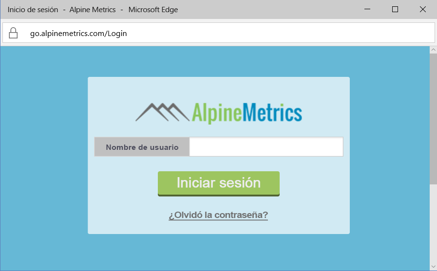
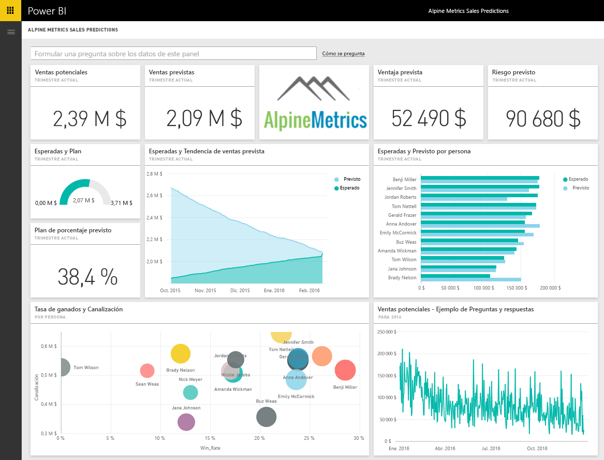

# Conexión a Alpine Metrics Sales Predictions con Power BI
Alpine Metrics proporciona una moderna optimización del proceso de ventas predictivo en la nube y a petición para organizaciones de ventas grandes y pequeñas. El paquete de contenido de predicciones de ventas de Alpine Metrics para Power BI incluye métricas como las ventas y los riesgos potenciales y previstos, lo que permite un conocimiento más profundo hacia el futuro de su negocio. 

Conéctese al [paquete de contenido de predicciones de ventas de Alpine Metrics](https://app.powerbi.com/getdata/services/alpine-metrics) para Power BI.

## Cómo conectarse
1. Seleccione Obtener datos en la parte inferior del panel de navegación izquierdo.  
   
    
2. En el cuadro **Servicios** , seleccione **Obtener**.  
   
    
3. Seleccione **AlpineMetrics Sales Predictions** (Predicciones de ventas de AlpineMetrics) y luego **Obtener**.  
   
    
4. Seleccione **OAuth 2** y, a continuación, **Iniciar sesión**. Cuando se le solicite, proporcione las credenciales de AlpineMetrics.
   
    
   
    
5. Una vez conectado, se cargarán automáticamente un panel, un informe y un conjunto de datos. Una vez completado, los iconos se actualizarán con los datos de su cuenta.
   
    

**¿Qué más?**

* Pruebe a [hacer una pregunta en el cuadro de preguntas y respuestas](power-bi-q-and-a.md), en la parte superior del panel.
* [Cambie los iconos](service-dashboard-edit-tile.md) en el panel.
* [Seleccione un icono](service-dashboard-tiles.md) para abrir el informe subyacente.
* Aunque el conjunto de datos se programará para actualizarse diariamente, puede cambiar la programación de actualización o actualizarlo a petición mediante **Actualizar ahora**.

## Qué se incluye
El paquete de contenido incluye datos de las tablas siguientes:  

    - Account (Cuenta)    
    - Profesional    
    - País    
    - Industry (Sector)    
    - Opportunity (Oportunidad)  
    - Person (Persona)  
    - Prediction (Predicción)    
    - Prediction History (Historial de predicciones)    
    - Product (Producto)  
    - Region (Región)    

## Requisitos del sistema
Se requiere una cuenta de Alpine Metrics con permisos para las tablas anteriores para crear una instancia de este paquete de contenido.

## Pasos siguientes
[Introducción a Power BI](service-get-started.md)

[Power BI: Conceptos básicos](service-basic-concepts.md)

