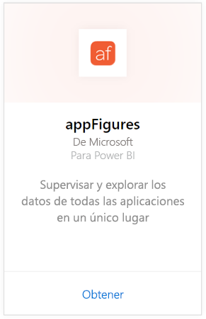
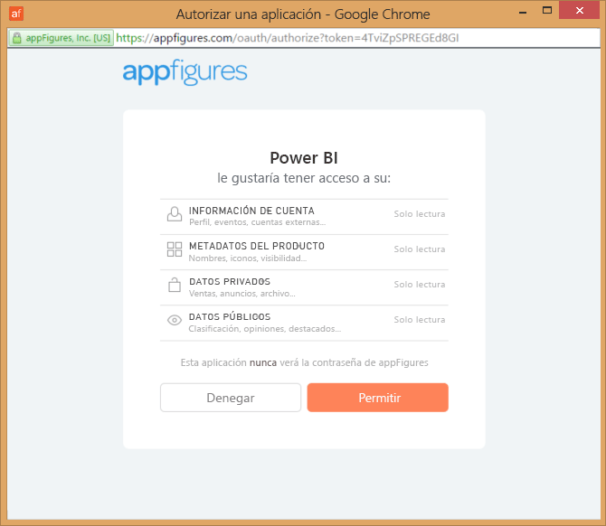
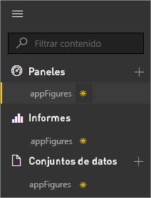
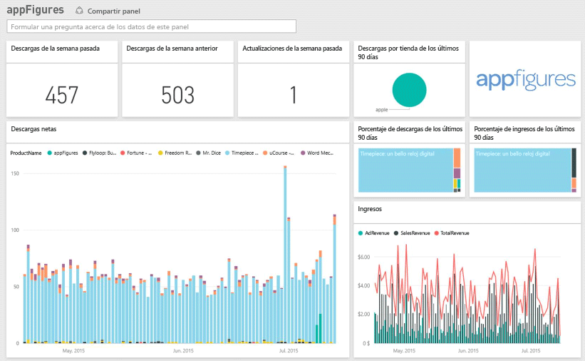

# Conexión a appFigures con Power BI
Realizar un seguimiento de las estadísticas importantes sobre sus aplicaciones es fácil con Power BI y el paquete de contenido de appFigures. Power BI recupera los datos, como las ventas, descargas y estadísticas de anuncios de las aplicaciones, y, a continuación, crea un panel predeterminado e informes relacionados en función de esos datos.

Conéctese al [paquete de contenido de appFigures](https://app.powerbi.com/getdata/services/appfigures) u obtenga más información sobre la [integración de appFigures](https://powerbi.microsoft.com/integrations/appfigures) con Power BI.

## Cómo conectarse
1. Seleccione **Obtener datos** en la parte inferior del panel de navegación izquierdo.
   
   
2. En el cuadro **Servicios** , seleccione **Obtener**.
   
   
3. Seleccione **appFigures** \>  **Obtener**.
   
   
4. En **Método de autenticación**, seleccione **oAuth2** \> **Iniciar sesión**. Cuando se le solicite, escriba sus credenciales de appFigures y siga el proceso de autenticación de appFigures.
   
   La primera vez que se conecte, Power BI le solicitará que permita acceso de solo lectura a la cuenta. Seleccione **Permitir** para comenzar el proceso de importación. Esto puede tardar unos minutos, según el volumen de datos en su cuenta.
   
   
5. Una vez que Power BI importe los datos, verá un nuevo panel, el informe y el conjunto de datos en el panel de navegación izquierdo. Los nuevos elementos se marcan con un asterisco amarillo \*:
   
    
6. Seleccione el panel de appFigures. Este es el panel predeterminado que crea Power BI para mostrar los datos. Puede modificar este panel para que muestre los datos de la forma que desee.
   
    

**¿Qué más?**

* Pruebe a [hacer una pregunta en el cuadro de preguntas y respuestas](power-bi-q-and-a.md), en la parte superior del panel.
* [Cambie los iconos](service-dashboard-edit-tile.md) en el panel.
* [Seleccione un icono](service-dashboard-tiles.md) para abrir el informe subyacente.
* Aunque el conjunto de datos se programará para actualizarse diariamente, puede cambiar la programación de actualización o actualizarlo a petición mediante **Actualizar ahora**.

## Qué se incluye
Los siguientes datos están disponibles desde appFigures en Power BI.

| **Nombre de tabla** | **Descripción** |
| --- | --- |
| Países |Esta tabla proporciona información de nombre del país. |
| Fechas |Esta tabla contiene las fechas desde hoy hasta la primera fecha de publicación de las aplicaciones que están activas y visibles en su cuenta de appFigures. |
| Eventos |Esta tabla contiene información de descarga, ventas y anuncios de cada aplicación, por país, diariamente. Tenga en cuenta que en esta misma tabla hay información tanto de la aplicación como de la compra desde la aplicación. Puede usar la columna <strong>Tipo</strong> para diferenciarla. |
| Desde la aplicación |Esta tabla contiene datos sobre los diferentes tipos de compras desde la aplicación que se relacionan con aplicaciones activas y visibles en la cuenta de appFigures. |
| Productos |Esta tabla contiene datos sobre las aplicaciones que están activas y visibles en su cuenta de appFigures. |

## Solución de problemas
Si los datos de algunas de sus aplicaciones no aparecen en Power BI, asegúrese de que esas aplicaciones estén visibles y activas en la pestaña **Aplicaciones** del sitio de appFigures.

## Pasos siguientes
* [Introducción a Power BI](service-get-started.md)
* [Obtener datos en Power BI](service-get-data.md)

