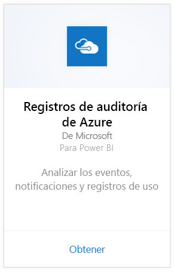
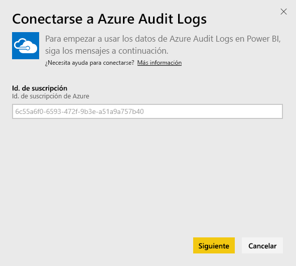
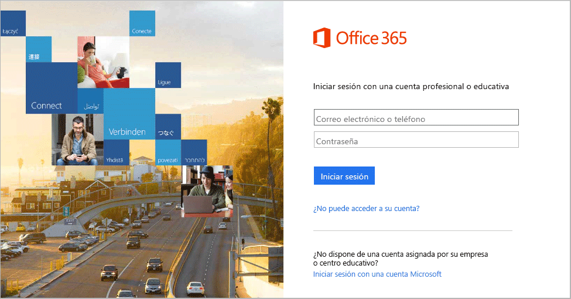
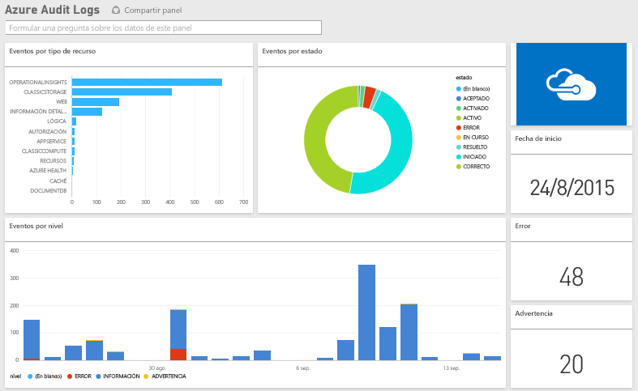

# Conexión a Azure Audit Logs con Power BI
Con el paquete de contenido de Registros de auditoría de Azure puede analizar y visualizar la información almacenada en los registros de auditoría. Power BI recupera los datos, crea un panel integrado y crea informes basados en esos datos.

[Conéctese al paquete de contenido de Registros de auditoría de Azure](https://app.powerbi.com/getdata/services/azure-audit-logs) u obtenga más información sobre la [integración de Registros de auditoría de Azure](https://powerbi.microsoft.com/integrations/azure-audit-logs) con Power BI.

## Cómo conectarse
1. Seleccione **Obtener datos** en la parte inferior del panel de navegación izquierdo.  
   
    
2. En el cuadro **Servicios** , seleccione **Obtener**.  
   
     
3. Seleccione **Registros de auditoría de Azure** > **Obtener**.  
   
   
4. Cuando se le solicite, escriba su **identificador de suscripción de Azure**. Vea los detalles acerca de cómo buscar el [identificador de suscripción](#FindingParams) a continuación.   
   
    
5. En **Método de autenticación**, seleccione **oAuth2** \> **Iniciar sesión**.
   
    
6. Escriba sus credenciales de cuenta para finalizar el proceso de inicio de sesión.
   
    
7. Power BI recuperará los datos de Registros de auditoría de Azure y creará un panel y un informe listos para usar. 
   
    

**¿Qué más?**

* Pruebe a [hacer una pregunta en el cuadro de preguntas y respuestas](power-bi-q-and-a.md), en la parte superior del panel.
* [Cambie los iconos](service-dashboard-edit-tile.md) en el panel.
* [Seleccione un icono](service-dashboard-tiles.md) para abrir el informe subyacente.
* Aunque el conjunto de datos se programará para actualizarse diariamente, puede cambiar la programación de actualización o actualizarlo a petición mediante **Actualizar ahora**.

## Requisitos del sistema
El paquete de contenido de registros de auditoría de Azure requiere acceso a los registros de auditoría en Azure Portal. Consulte más detalles [aquí](https://azure.microsoft.com/documentation/articles/insights-debugging-with-events/).

## Búsqueda de parámetros
Existen dos métodos sencillos de buscar el identificador de suscripción.

1. Desde https://portal.azure.com -&gt; Examinar -&gt; Suscripciones -&gt; Id. de suscripción
2. Desde https://manage.windowsazure.com -&gt; Configuración -&gt; Id. de suscripción

El identificador de suscripción será un conjunto largo de números y caracteres, similar al ejemplo del paso \#4 anterior. 

## Solución de problemas
Si ve un error en las credenciales o un error al intentar actualizar debido a credenciales no válidas, vuelva a intentar eliminar todas las instancias del paquete de contenido de Registros de auditoría de Azure y conéctese de nuevo.

## Pasos siguientes
[¿Qué es Power BI?](power-bi-overview.md)  
[Power BI: Conceptos básicos](service-basic-concepts.md)  

