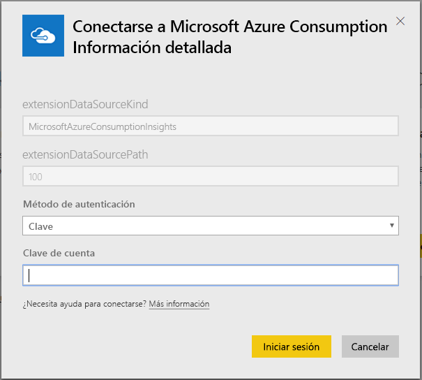

# Conexión a Microsoft Azure Consumption Insights con Power BI
Explore y supervise sus datos de consumo de Microsoft Azure en Power BI con el paquete de contenido de Power BI. Los datos se actualizan automáticamente una vez al día.

Conéctese al [Paquete de contenido de Microsoft Azure Consumption Insights](https://app.powerbi.com/getdata/services/azureconsumption) para Power BI.

## Cómo conectarse
1. Seleccione **Obtener datos** en la parte inferior del panel de navegación izquierdo.
   
    
2. En el cuadro **Servicios** , seleccione **Obtener**.
   
   
3. Seleccione **Microsoft Azure Consumption Insights** \> **obtenerla ahora**. 
   
   
4. Proporcione la cantidad de meses durante los que desea importar datos y el número de inscripción de Azure Enterprise. Consulte los detalles acerca de la [búsqueda de parámetros](#FindingParams) más adelante.
   
    
5. Proporcione la clave de acceso para conectarse. Puede encontrar su clave de registro en el Portal de EA de Azure. 
   
    
6. El proceso de importación se inicia automáticamente. Cuando haya finalizado, aparecen un nuevo panel, informe y modelo en el panel de navegación. Seleccione el panel para ver los datos importados.
   
   

**¿Qué más?**

* Pruebe a [hacer una pregunta en el cuadro de preguntas y respuestas](consumer/end-user-q-and-a.md), en la parte superior del panel.
* [Cambie los iconos](service-dashboard-edit-tile.md) en el panel.
* [Seleccione un icono](consumer/end-user-tiles.md) para abrir el informe subyacente.
* Aunque el conjunto de datos está programada para actualizarse diariamente, puede cambiar la programación de actualización o actualizarlo a petición mediante **actualizar ahora**

## Qué se incluye
El paquete de contenido de Microsoft Azure Consumption Insights incluye datos para el intervalo de meses que proporcionó cuando se conecta de informes mensuales. El intervalo es una ventana móvil, por lo que las fechas incluidas se actualizan cuando se actualiza el conjunto de datos.

## Requisitos del sistema
El paquete de contenido requiere acceso a las características empresariales de Azure portal. 

## Búsqueda de parámetros
Informes de Power BI están disponible para directos con contrato Enterprise, asociados y clientes indirectos que puede ver la información de facturación. Lea la información siguiente para obtener más información sobre cómo buscar cada uno de los valores que se espera que el flujo de conexión.

**Número de meses**

* El número de meses (1 y 36) de datos de hoy en día que le gustaría importar.

**Número de inscripción**

* El número de inscripción de Azure Enterprise, que puede encontrar en el [Azure Enterprise Portal](https://ea.azure.com/) pantalla principal en **Enrollment Detail**.
  
    

**Clave de acceso**

* Puede encontrar la clave de acceso en el portal de Azure Enterprise en **descargar uso** > **API Access Key**.
  
    

**Ayuda adicional**

* Para obtener ayuda adicional para configurar el paquete de Azure Enterprise Power BI, inicie sesión en Azure Enterprise Portal y ver el archivo de Ayuda de API en **ayuda**. También puede encontrar instrucciones adicionales en **informes** -> **descargar uso** -> **API Access Key**.

## Pasos siguientes
[Introducción a Power BI](service-get-started.md)

[Obtener datos en Power BI](service-get-data.md)

