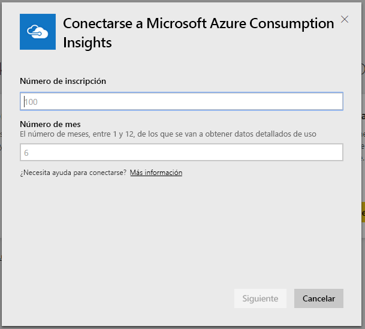

# Conexión a Microsoft Azure Consumption Insights con Power BI
Explore y supervise sus datos de consumo de Microsoft Azure en Power BI con el paquete de contenido de Power BI. Los datos se actualizarán automáticamente una vez al día.

Conéctese al [Paquete de contenido de Microsoft Azure Consumption Insights](https://app.powerbi.com/getdata/services/azureconsumption) para Power BI.

## Cómo conectarse
1. Seleccione **Obtener datos** en la parte inferior del panel de navegación izquierdo.
   
    
2. En el cuadro **Servicios** , seleccione **Obtener**.
   
   
3. Seleccione **Microsoft Azure Consumption Insights** \> **Obtener**. 
   
   
4. Proporcione la cantidad de meses durante los que desea importar datos y el número de inscripción de Azure Enterprise. Consulte los detalles acerca de la [búsqueda de parámetros](#FindingParams) más adelante.
   
    
5. Proporcione la clave de acceso para conectarse. La clave de la inscripción puede encontrarse en el Portal de Azure EA. 
   
    
6. El proceso de importación se iniciará automáticamente. Cuando haya finalizado, aparecerá un nuevo panel, informes y modelo en el panel de navegación. Seleccione el panel para ver los datos importados.
   
   

**¿Qué más?**

* Pruebe a [hacer una pregunta en el cuadro de preguntas y respuestas](power-bi-q-and-a.md), en la parte superior del panel.
* [Cambie los iconos](service-dashboard-edit-tile.md) en el panel.
* [Seleccione un icono](service-dashboard-tiles.md) para abrir el informe subyacente.
* Aunque el conjunto de datos se programará para actualizarse diariamente, puede cambiar la programación de actualización o actualizarlo a petición mediante **Actualizar ahora**.

## Qué se incluye
El paquete de contenido de Microsoft Azure Consumption Insights incluye datos de informes mensuales para el intervalo de meses que indique durante el flujo de conexión. El intervalo es una ventana móvil, por lo que las fechas incluidas se actualizarán a medida que se actualice el conjunto de datos.

## Requisitos del sistema
El paquete de contenido requiere acceso a las características empresariales en Azure Portal. 

## Búsqueda de parámetros
Los informes de Power BI están disponible para clientes directos, socios y clientes indirectos de EA que pueden ver la información de facturación. Consulte a continuación los detalles sobre la búsqueda de los valores previstos del flujo de conexión.

**Número de meses**

* Debe ser un número entre 1 y 36 que represente el número de meses (desde hoy) durante los que desee importar datos.

**Número de inscripción**

* Este es el número de inscripción de Azure Enterprise que se encuentra en la pantalla principal de [Azure Enterprise Portal](https://ea.azure.com/) en "Enrollment Detail".
  
    

**Clave de acceso**

* La clave se puede encontrar en el portal de Azure Enterprise, en "Descargar uso" > "Clave de acceso de la API"
  
    

**Ayuda adicional**

* Para obtener ayuda adicional para configurar el módulo Power BI de Azure Enterprise, inicie sesión en Azure Enterprise Portal para ver el archivo de ayuda de la API en "Ayuda" e instrucciones adicionales en Reports -> Download Usage -> API Access Key. 

## Pasos siguientes
[Introducción a Power BI](service-get-started.md)

[Obtener datos en Power BI](service-get-data.md)

