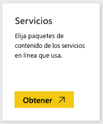
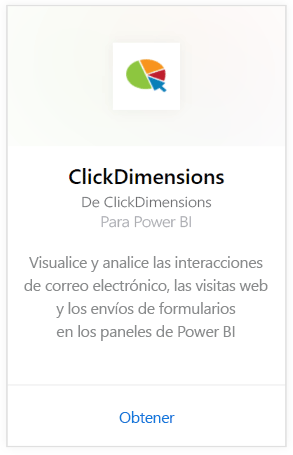
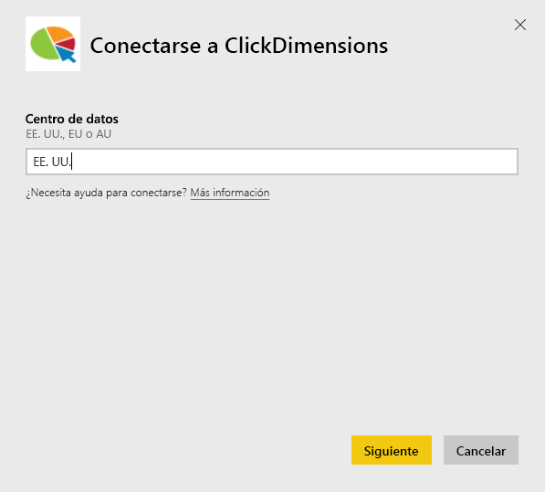
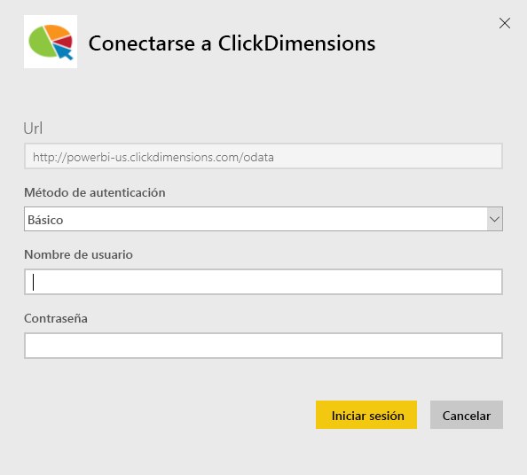

# Conexión a ClickDimensions con Power BI
El paquete de contenido de ClickDimensions para Power BI permite a los usuarios utilizar datos de marketing de ClickDimensions en Power BI, de forma que los equipos de administración obtienen información detallada del éxito de sus esfuerzos de ventas y marketing. Visualice y analice las interacciones de correo electrónico, las visitas web y los envíos de formularios en los paneles e informes de Power BI.

Conéctese al [paquete de contenido de ClickDimensions](https://app.powerbi.com/getdata/services/click-dimensions) para Power BI.

## Cómo conectarse
1. Seleccione **Obtener datos** en la parte inferior del panel de navegación izquierdo.
   
   
2. En el cuadro **Servicios** , seleccione **Obtener**.
   
   
3. Seleccione **ClickDimensions** \>  **Obtener**.
   
   
4. Proporcione la ubicación de su centro de datos (Estados Unidos, la Unión Europea o AU) y seleccione **Siguiente**.
   
   
5. En **Método de autenticación**, seleccione **Básico** \> **Iniciar sesión**. Cuando se le solicite, escriba sus credenciales de ClickDimensions. Vea los detalles sobre [cómo encontrar esos parámetros](#FindingParams) a continuación.
   
    
6. Tras la aprobación, el proceso de importación se iniciará automáticamente. Cuando haya finalizado, aparecerá un nuevo panel, informes y modelo en el panel de navegación. Seleccione el panel para ver los datos importados.
   
     

**¿Qué más?**

* Pruebe a [hacer una pregunta en el cuadro de preguntas y respuestas](power-bi-q-and-a.md), en la parte superior del panel.
* [Cambie los iconos](service-dashboard-edit-tile.md) en el panel.
* [Seleccione un icono](service-dashboard-tiles.md) para abrir el informe subyacente.
* Aunque el conjunto de datos se programará para actualizarse diariamente, puede cambiar la programación de actualización o actualizarlo a petición mediante **Actualizar ahora**.

## Requisitos del sistema
Para conectar con el paquete de contenido de Power BI, debe proporcionar el centro de datos correspondiente a su cuenta e iniciar sesión con su cuenta de ClickDimensions. Si no está seguro de qué centro de datos proporcionar, consulte con su administrador.

## Búsqueda de parámetros
La clave de cuenta se encuentra en Configuración de CRM \> Configuración de ClickDimensions. Copie la clave de la cuenta de Configuración de ClickDimensions y péguela en el campo de nombre de usuario.  

  

Copie el token de Power BI de Configuración de ClickDimensions y péguelo en el campo de contraseña. El token de Power BI se encuentra en Configuración de CRM \> Configuración de ClickDimensions.  

  

## Pasos siguientes
[Introducción a Power BI](service-get-started.md)

[Obtener datos en Power BI](service-get-data.md)

