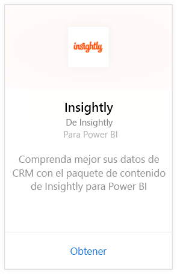
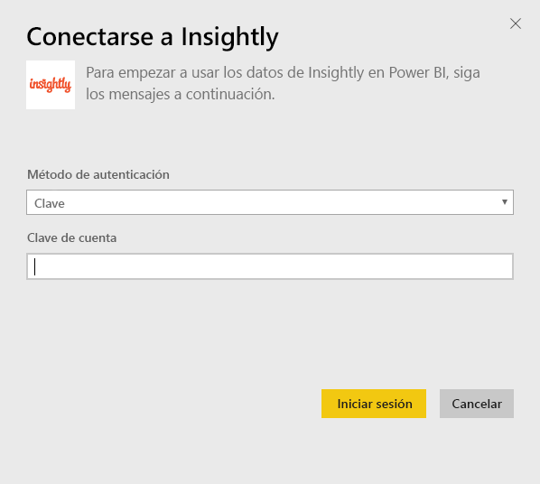
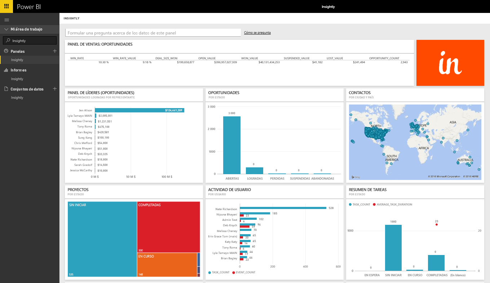

# Conexión a Insightly con Power BI
Visualice y comparta los datos de CRM Insightly en Power BI con el paquete de contenido de Insightly. Conéctese a Power BI mediante la clave de API de Insightly para ver y generar informes y paneles a partir de los datos de CRM. Con Power BI, puede analizar los datos de nuevas maneras, crear gráficos eficaces y mostrar contactos, clientes potenciales y organizaciones en un mapa.

Conéctese al [paquete de contenido de Insightly](https://app.powerbi.com/getdata/services/insightly) para Power BI.

## Cómo conectarse
1. Seleccione **Obtener datos** en la parte inferior del panel de navegación izquierdo.
   
   
2. En el cuadro **Servicios** , seleccione **Obtener**.
   
   
3. Seleccione **Insightly** \>  **Obtener**.
   
   
4. Seleccione **Clave** como tipo de autenticación, proporcione su clave de API de Insight y seleccione **Iniciar sesión**. Consulte los detalles que se muestran a continuación sobre cómo [buscarla](#FindingParams).
   
   
5. Tras la aprobación, el proceso de importación se iniciará automáticamente. Cuando haya finalizado, aparecerá un nuevo panel, informes y modelo en el panel de navegación. Seleccione el panel para ver los datos importados.
   
     

**¿Qué más?**

* Pruebe a [hacer una pregunta en el cuadro de preguntas y respuestas](power-bi-q-and-a.md), en la parte superior del panel.
* [Cambie los iconos](service-dashboard-edit-tile.md) en el panel.
* [Seleccione un icono](service-dashboard-tiles.md) para abrir el informe subyacente.
* Aunque el conjunto de datos se programará para actualizarse diariamente, puede cambiar la programación de actualización o actualizarlo a petición mediante **Actualizar ahora**.

## Qué se incluye
El paquete de contenido incluye las siguientes tablas con campos de los registros correspondientes:

| Tablas |  |  |  |
| --- | --- | --- | --- |
| Contactos |Oportunidades |Etapas de la canalización |Fecha de finalización de la tarea |
| Campos personalizados |Fecha de cierre de la oportunidad |Fecha de finalización del proyecto |Tareas |
| Eventos |Fecha de previsión de la oportunidad |Proyectos |Equipos y miembros |
| Clientes potenciales |Organizaciones |Etiquetas |Usuarios |

Muchas tablas e informes también incluyen campos calculados únicos, tales como:  

* Tablas con fechas de cierre de previsión de oportunidades "agrupadas", fechas de cierre reales de oportunidades, fechas de finalización del proyecto y fechas de finalización de las tareas para realizar análisis por mes, trimestre o año.  
* Campo de valor ponderado para oportunidades (valor de la oportunidad * probabilidad de ganar).  
* Campos de duración promedio y total de las tareas, basada en las fechas de inicio y finalización.  
* Informes con campos calculados para la tasa de oportunidades ganadas (número de oportunidades ganadas/número total de oportunidades) y valor de la tasa de oportunidades ganadas (valor de las oportunidades ganadas/valor total de las oportunidades).  

## Requisitos del sistema
Se necesita una cuenta de Insightly con acceso a la API de Insightly. Los permisos de visibilidad se basarán en la clave de API que se use para establecer la conexión a Power BI. Los registros de Insightly visibles para usted también serán visibles en los informes y paneles de Power BI que comparta con otros usuarios.

## Búsqueda de parámetros
**Clave de API**

Para copiar la clave de API de Insightly, seleccione Configuración de usuario en el menú de perfil de Insightly y desplácese hacia abajo. Esta cadena de caracteres se usará para conectar sus datos a Power BI.

## Solución de problemas
Los datos se importan a través de la API de Insightly, que incluye un límite diario basado en el nivel del plan de suscripción a Insightly. Los límites se muestran en la sección Rate Limiting/Throttling Requests (Limitación de velocidad/Solicitudes de limitación) de la documentación de la API: https://api.insight.ly/v2.2/Help#!/Overview/Introduction#ratelimit

Los informes proporcionados usan campos predeterminados de Insightly y podrían no incluir sus personalizaciones. Edite el informe para ver todos los campos disponibles.

## Pasos siguientes
[Introducción a Power BI](service-get-started.md)

[Obtener datos en Power BI](service-get-data.md)

