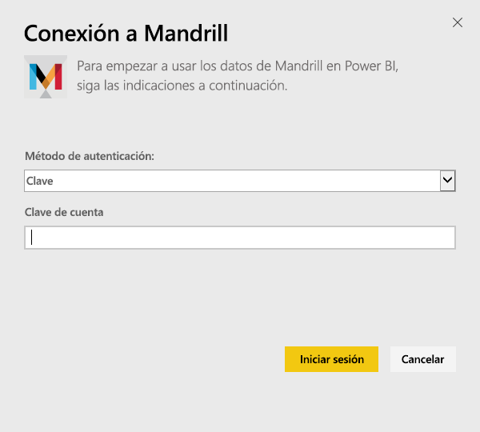

# Conexión a Mandrill con Power BI
El paquete de contenido de Power BI extrae datos de la cuenta de Mandrill y genera un panel, un conjunto de informes y un conjunto de datos que permiten explorar los datos. Utilice los análisis de Mandrill obtener rápidamente información sobre boletines o campañas de marketing. Los datos están configurados para actualizarse diariamente, lo que garantiza que los datos que está supervisando estén actualizados.

Conéctese al [paquete de contenido de Mandrill para Power BI.](http://app.powerbi.com/getdata/services/mandrill)

## Cómo conectarse
1. Seleccione **Obtener datos** en la parte inferior del panel de navegación izquierdo.
   
    
2. En el cuadro **Servicios** , seleccione **Obtener**.
   
    
3. Seleccione **Mandrill** > **Obtener**.
   
    
4. En **Método de autenticación**, seleccione **Clave** e indique su clave de API. Puede encontrar la clave en la pestaña **Configuración** del panel Mandrill. Seleccione **Iniciar sesión** para iniciar el proceso de importación, que puede tardar unos minutos según el volumen de datos de su cuenta.
   
    
5. Una vez que Power BI importe los datos, verá un nuevo panel, el informe y el conjunto de datos en el panel de navegación izquierdo. Este es el panel predeterminado que creó Power BI para mostrar los datos.
   
    

**¿Qué más?**

* Pruebe a [hacer una pregunta en el cuadro de preguntas y respuestas](power-bi-q-and-a.md), en la parte superior del panel.
* [Cambie los iconos](service-dashboard-edit-tile.md) en el panel.
* [Seleccione un icono](service-dashboard-tiles.md) para abrir el informe subyacente.
* Aunque el conjunto de datos se programará para actualizarse diariamente, puede cambiar la programación de actualización o actualizarlo a petición mediante **Actualizar ahora**.

## Pasos siguientes
[Introducción a Power BI](service-get-started.md)

[Power BI: Conceptos básicos](service-basic-concepts.md)

