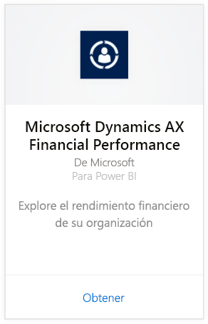
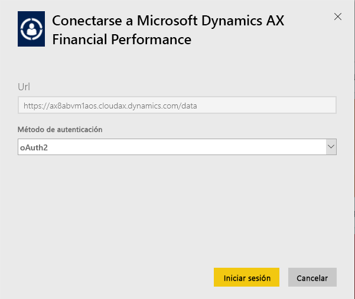
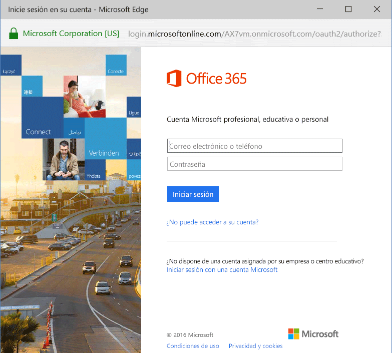
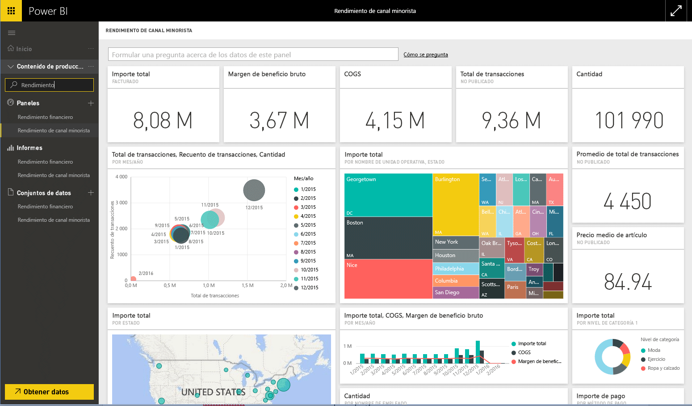

# Conexión al paquete de contenido de Microsoft Dynamics AX con Power BI
Microsoft Dynamics AX tiene tres paquetes de contenido de Power BI destinados a diferentes usuarios empresariales. El paquete de contenido de rendimiento financiero, diseñado específicamente para directores financieros, proporciona acceso a información detallada sobre el rendimiento financiero de su organización. El paquete de contenido de rendimiento de canal minorista está destinado a administradores de canal y se centra en el rendimiento de las ventas para predecir tendencias y revelar información detallada mediante el uso directo de los datos de venta minorista y comercio. La administración de costos está diseñada para directores generales y directores financieros y proporciona detalles sobre el rendimiento de las operaciones.

Conéctese al paquete de contenido de [rendimiento de canal minorista](https://app.powerbi.com/getdata/services/dynamics-ax-retail-channel-performance), [rendimiento financiero](https://app.powerbi.com/getdata/services/dynamics-ax-financial-performance) o [administración de costos](https://app.powerbi.com/getdata/services/dynamics-ax-cost-management) de Microsoft Dynamics AX para Power BI.

## Cómo conectarse
1. Seleccione **Obtener datos** en la parte inferior del panel de navegación izquierdo.
   
   
2. En el cuadro **Servicios** , seleccione **Obtener**.
   
   
3. Seleccione uno de los paquetes de contenido de Dynamics AX y elija **Obtener**.
   
   
4. Especifique la dirección URL de su entorno de Dynamics AX 7. Vea los detalles sobre [cómo encontrar esos parámetros](#FindingParams) a continuación.
   
   
5. En **Método de autenticación**, seleccione **oAuth2** \> **Iniciar sesión**. Cuando se le solicite, escriba sus credenciales de Dynamics AX.
   
    
   
    
6. Tras la aprobación, el proceso de importación se iniciará automáticamente. Cuando haya finalizado, aparecerá un nuevo panel, informes y modelo en el panel de navegación. Seleccione el panel para ver los datos importados.
   
     

**¿Qué más?**

* Pruebe a [hacer una pregunta en el cuadro de preguntas y respuestas](power-bi-q-and-a.md), en la parte superior del panel.
* [Cambie los iconos](service-dashboard-edit-tile.md) en el panel.
* [Seleccione un icono](service-dashboard-tiles.md) para abrir el informe subyacente.
* Aunque el conjunto de datos se programará para actualizarse diariamente, puede cambiar la programación de actualización o actualizarlo a petición mediante **Actualizar ahora**.

## Qué se incluye
El paquete de contenido usa la fuente OData de Dynamics AX 7 para importar datos relacionados con el rendimiento del canal minorista, financiero y de administración de costos, respectivamente.

## Requisitos del sistema
Este paquete de contenido requiere una dirección URL del entorno de Dynamics AX 7 y el usuario debe tener acceso a la fuente OData.

## Búsqueda de parámetros

La dirección URL del entorno de Dynamics AX 7 se puede encontrar en el explorador cuando el usuario inicia sesión. Simplemente copie la dirección URL del entorno raíz de Dynamics AX en el cuadro de diálogo de Power BI.

## Solución de problemas
Los datos pueden tardar algún tiempo en cargarse según el tamaño de la instancia. Si ve informes vacíos en Power BI, confirme que tiene acceso a las tablas de OData necesarias para los informes.

## Pasos siguientes
[Introducción a Power BI](service-get-started.md)

[Obtener datos en Power BI](service-get-data.md)

