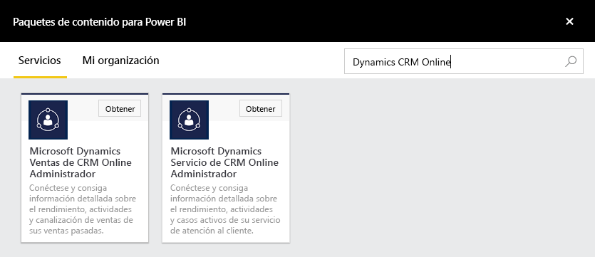
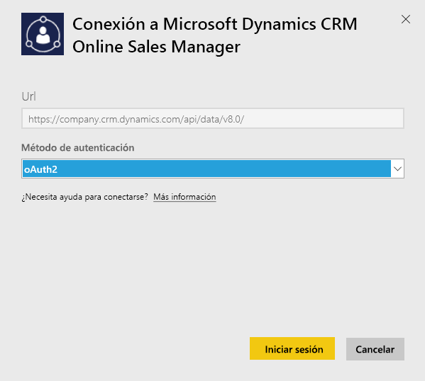
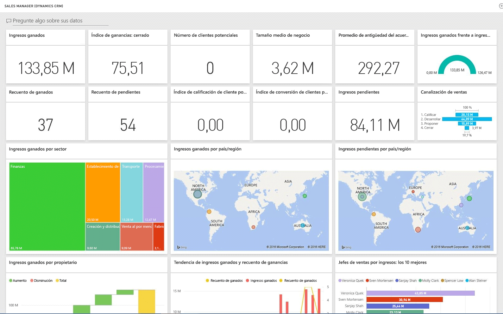

# Conexión a Microsoft Dynamics CRM con Power BI
Microsoft Dynamics CRM Online para Power BI permite acceder a los datos y analizarlos fácilmente. Power BI usa la fuente OData para crear un modelo descriptivo, con todas las entidades y medidas necesarias, como cuentas, actividades, oportunidades, productos, clientes potenciales, usuarios, etc. Después de instalar la aplicación, tanto el panel como los informes se pueden ver en el servicio Power BI ([https://powerbi.com](https://powerbi.com)) y en las aplicaciones móviles de Power BI. 

Conéctese a los roles de [Sales Manager](https://msit.powerbi.com/groups/me/getdata/services/dynamics-crm-sales-manager) o [Service Manager](https://msit.powerbi.com/groups/me/getdata/services/dynamics-crm-customer-service) de Dynamics CRM Online. Obtenga más información acerca de la [integración de Dynamics CRM Online](https://powerbi.microsoft.com/integrations/microsoft-dynamicscrm) con Power BI.

Esta conexión requiere **Microsoft Dynamics CRM Online 2016, o una versión posterior**. Consulte más detalles sobre los [requisitos](#Requirements) a continuación.

## Cómo conectarse
[!INCLUDE [powerbi-service-apps-get-more-apps](./includes/powerbi-service-apps-get-more-apps.md)]
3. Seleccione **Microsoft Dynamics CRM Online Sales Manager** o **Microsoft Dynamics CRM Online Service Manager** y haga clic en **Conectar**.
   
   
4. Proporcione la URL de servicio asociada a su cuenta.  Adoptará la forma `https://company.crm.dynamics.com`. Puede ver más detalles [a continuación](#FindingParams).
   
   
5. Cuando se le solicite, proporcione sus credenciales (este paso se podría omitir si ya ha iniciado sesión con el explorador). En el Método de autenticación, escriba **oAuth2** y haga clic en **Iniciar sesión**:
   
   
6. Después de conectarse, verá un panel personalizado para un jefe de ventas o un administrador de servicios, relleno con sus propios datos:
   
   

## Ver el panel y los informes de Microsoft Dynamics CRM
[!INCLUDE [powerbi-service-apps-open-app](./includes/powerbi-service-apps-open-app.md)]

[!INCLUDE [powerbi-service-apps-open-app](./includes/powerbi-service-apps-what-now.md)]

## Qué se incluye
En las siguientes secciones se detalla lo que se incluye en los roles [Sales Manager](#Sales) y [Service Manager](#Service).

Los datos están limitados según el rol de seguridad asignado al usuario de Dynamics CRM Online.

El fin del panel y de los informes es proporcionar informes operativos de los datos a corto plazo de un equipo o grupo. Cada consulta está limitada para recuperar un máximo de 100 000 registros de Dynamics CRM Online. Si se supera este límite debido al gran volumen de datos de la organización, el aprovisionamiento genera un error y se finaliza la actualización de datos de Dynamics CRM Online. Si la cuenta es demasiado grande, considere la posibilidad de conectarse a través de Power BI Desktop para crear una solución personalizada.

### Sales Manager
El panel y los informes contienen métricas clave como:  

* Ingresos ganados   
* Tasa de ganados   
* Ingresos abiertos   
* Ingresos perdidos   
* Ingresos previstos  
* Tamaño medio de negocio, etc.  

También contienen gráficos clave, como:  

* Tendencia de ingresos ganados y perdidos, ingresos ganados frente a tendencia de ingresos previstos  
* Ingresos ganados por varias dimensiones como sector, región, territorio   
* Jefes de ventas por ingresos, actividades,   
* Mejores cuentas, mejores ofertas ganadas o perdidas,    
* Nueva tendencia de clientes potenciales, potencial de ventas, etc.   

Estas métricas y gráficos ayudan a comprender el rendimiento de la organización de ventas y analizar el potencial de ventas en el equipo de ventas.

En la siguiente tabla se enumeran las entidades de CRM disponibles para este servicio y también se proporciona información sobre los filtros aplicados a cada uno de los registros de entidad.

| Entidad de CRM | Filtros aplicados |
| --- | --- |
| Cuenta |Todas las cuentas que tienen oportunidades relacionadas que se han modificado en los últimos 365 días. |
| Actividad |Todas las actividades modificadas en los últimos 90 días   [modifiedon] > hoy - 90 días |
| Business Unit (Unidad de negocio) |Todas las unidades de negocio que no están deshabilitadas   [isdisabled] = false |
| Lead (Cliente potencial) |Todos los clientes potenciales modificados en los últimos 180 días   [modifiedon] > hoy - 180 días |
| Opportunity (Oportunidad) |Todas las oportunidades modificadas en los últimos 365 días   [modifiedon] > hoy - 365 días |
| Opportunity Product (Producto de oportunidad) |Todos los productos de oportunidad modificados en los últimos 365 días   [modifiedon] > hoy - 365 días |
| Product (Producto) |Todos los productos activos   [statecode] <> 1 |
| Territory (Territorio) |Todos los territorios |
| User (Usuario) |Todos los usuarios activos y administradores no delegados    [isdisabled] = false y [accessmode] <> 4 |

### Service Manager
El panel y los informes contienen métricas clave como:  

* Porcentaje CSAT   
* Porcentaje SLA Met   
* Porcentaje de casos escalados   
* Tiempo medio de manipulación   
* Total de casos resueltos  
* Total de casos activos  
* Número de veces que se ha usado el artículo de KB en casos, etc.    

También contienen gráficos clave, como:   

* Tendencias de volumen de casos para casos entrantes, casos resueltos, casos escalados   
* Volumen de casos por varias dimensiones como origen, ubicación, prioridad, tipo  
* Jefes por porcentaje CSAT, porcentaje SLA Met, actividades, casos resueltos  
* Artículos de KB más usados y visualizados, etc.  
    Estas métricas y gráficos ayudan a comprender el rendimiento de la organización de soporte técnico y analizar la carga de trabajo de casos activos en el equipo de servicio y las colas de servicio.

La siguiente tabla enumera las entidades CRM disponibles para este servicio, así como detalles sobre los filtros aplicados a cada uno de los registros de entidad.

| Entidad de CRM | Filtros aplicados |
| --- | --- |
| Account (Cuenta) |Todas las cuentas que tienen casos relacionados que se han modificado en los últimos 90 días. |
| Activity (Actividad) |Todas las actividades modificadas en los últimos 90 días   [modifiedon] > hoy - 90 días |
| Case (caso) |Todos los casos modificados en los últimos 90 días   [modifiedon] > hoy - 90 días |
| Case Resolution Activity (Actividad de resolución de caso) |Todas las actividades de resolución de caso modificadas en los últimos 90 días   [modifiedon] > hoy - 90 días |
| Contacto |Todos los contactos que tienen casos relacionados que se han modificado en los últimos 90 días. |
| Knowledge Article (Artículo de conocimientos) |Todas las versiones más recientes de los artículos de conocimientos    [islatestversion] = true |
| Knowledge Article Incident (Incidente de artículo de conocimientos) |Todos los incidentes de artículo de conocimientos que se han modificado en los últimos 90 días   [modifiedon] > hoy - 90 días |
| Queue (Cola) |Todas las colas activas    [statecode] = 0 |
| Queue Item (Elemento de cola) |Todos los elementos de cola relacionados con casos creados en los últimos 365 días    [createdon] > hoy día, 365 días y   [objecttypecode] = 112 |
| User (Usuario) |Todos los usuarios activos    [isdisabled] = false |

## Requisitos del sistema
* Una instancia válida de Dynamics CRM Online 2016, o una versión posterior, (Power BI no funcionará con una versión de CRM local). Si no tiene la versión 2016 o una posterior:
* Un administrador debe habilitar el extremo de OData en la configuración del sitio.
* Una cuenta con menos de 100 000 registros en cualquiera de las tablas. Tenga en cuenta que si la cuenta tiene acceso a más de 100 000 registros, se producirá un error en la importación.

## Búsqueda de parámetros
La dirección de la instancia se encuentra en la barra de URL del navegador. Normalmente tiene el formato: `https://[instance_name].crm.dynamics.com`.

Power BI solo admite los puntos de conexión de Dynamics CRM 2016. La conexión no funcionará con las versiones anteriores de CRM Online. Use Power BI Desktop para conectarse directamente a su cuenta.

## Solución de problemas
Si tiene problemas para conectarse, confirme que:  

* está proporcionando la dirección URL de la instancia correcta (consúltelo con su administrador)  
* la instancia es CRM Online 2016  
* el punto de conexión de OData está habilitado  

Además, intente conectarse directamente en Power BI Desktop con la dirección URL de OData `https://[instance_name].crm.dynamics.com/api/data/v8.0/`.

Si ha confirmado que tiene Dynamics CRM Online 2016, pero sigue con problemas de conexión, póngase en contacto con el administrador de CRM para asegurarse de que dispone de todas las actualizaciones disponibles.

Si no tiene CRM Online 2016, o cualquier versión posterior, use Power BI Desktop para conectarse directamente a la cuenta.

Si ve el error "Data refresh failed as query exceeded the maximum limit of 100000 records" (No se han podido actualizar los datos debido a que la consulta ha superado el límite máximo de 100 000 registros), considere la posibilidad de conectarse directamente desde Power BI Desktop o de utilizar la plantilla de soluciones de CRM.

## Pasos siguientes
* [¿Qué son las aplicaciones en Power BI?](service-create-distribute-apps.md)
* [Obtener datos en Power BI](service-get-data.md)
* ¿Tiene más preguntas? [Pruebe a preguntar a la comunidad de Power BI](http://community.powerbi.com/)

