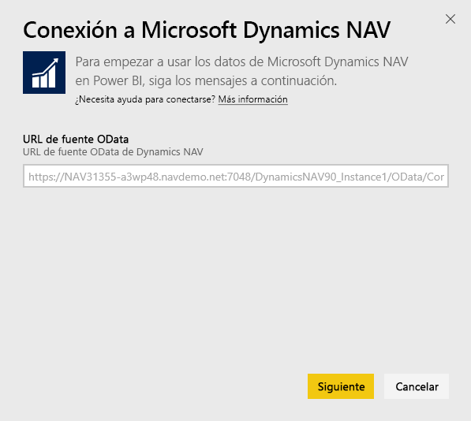
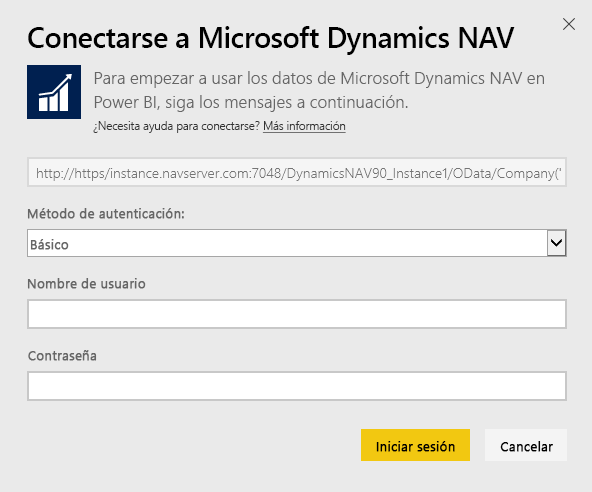

# Conexión a Microsoft Dynamics NAV con Power BI
Obtener información sobre los datos de Microsoft Dynamics NAV es sencillo con Power BI. Power BI recupera los datos (tanto de ventas como financieros) y, después, compila una aplicación con un panel e informes basados en dichos datos. Power BI requiere permisos en las tablas de las que se recuperan los datos, en este caso, datos de ventas y finanzas. Consulte más detalles sobre los requisitos a continuación. Después de instalar la aplicación tanto el panel como los informes se pueden en el servicio Power BI ([https://powerbi.com](https://powerbi.com)) y en las aplicaciones móviles de Power BI. 

[Conéctese a Microsoft Dynamics NAV para Power BI](https://app.powerbi.com/getdata/services/microsoft-dynamics-nav) o lea más sobre la [integración de Dynamics NAV](https://powerbi.microsoft.com/integrations/microsoft-dynamics-nav) con Power BI.

## Cómo conectarse
[!INCLUDE [powerbi-service-apps-get-more-apps](./includes/powerbi-service-apps-get-more-apps.md)]

1. Seleccione **Microsoft Dynamics NAV** y luego **Obtener**.  
   
2. Cuando se le solicite, escriba la dirección URL de OData de Microsoft Dynamics NAV. La dirección URL debe coincidir con el patrón siguiente:
   
    `https//instance.navserver.com:7048/DynamicsNAV90_Instance1/OData/Company('CRONUS%20International%20Ltd.')`
   
   * "instance.navserver.com" con el nombre del servidor NAV
   * "DynamicsNAV90\_Instance1" con el nombre de instancia del servidor NAV
   * "Company('CRONUS%20International%20Ltd.')" con el nombre de la compañía NAV
     
     Una manera fácil de obtener esta dirección URL es dirigirse a Servicios web en Dynamics NAV, buscar el servicio web powerbifinance y copiar la dirección URL de OData, pero dejando fuera "/powerbifinance" de la cadena de la dirección URL.  
     
3. Seleccione **Básica** y escriba sus credenciales de Microsoft Dynamics NAV.
   
    Necesita credenciales de administrador (o al menos permisos para los datos de ventas y finanzas) de su cuenta de Microsoft Dynamics NAV.  Actualmente solo se admite la autenticación básica (nombre de usuario y contraseña).
   
    
4. Power BI recuperará los datos de Microsoft Dynamics NAV y creará un panel y un informe listos para usar.   
   

## Visualización del panel y los informes
[!INCLUDE [powerbi-service-apps-open-app](./includes/powerbi-service-apps-open-app.md)]

[!INCLUDE [powerbi-service-apps-open-app](./includes/powerbi-service-apps-what-now.md)]

## Qué se incluye
El panel y los informes contienen datos de las tablas siguientes (con distinción entre mayúsculas y minúsculas):  

* ItemSalesAndProfit  
* ItemSalesByCustomer  
* powerbifinance  
* SalesDashboard  
* SalesOpportunities  
* SalesOrdersBySalesPerson  
* TopCustomerOverview  

## Requisitos del sistema
Para importar los datos de Microsoft Dynamics NAV en Power BI, debe tener permisos para las tablas de datos de ventas y finanzas de las que se recuperan los datos (antes indicadas). Las tablas también deben tener algunos datos; actualmente, las tablas vacías no se puede importar.

## Solución de problemas
Power BI usa los servicios web de Microsoft Dynamics NAV para recuperar los datos. Si tiene una gran cantidad de datos en su instancia de Microsoft Dynamics NAV, para minimizar el impacto sobre el uso del servicio web, se recomienda cambiar la frecuencia de actualización según sus necesidades. Otra sugerencia es que un administrador cree la aplicación y la comparta, en lugar de que cada administrador cree las suyas propias.

**"Error en la validación de parámetros. Compruebe que todos los parámetros son válidos"**  
Si ve este error después de escribir la dirección URL de Microsoft Dynamics NAV: Asegúrese de que se cumplen los requisitos siguientes:

* La dirección URL sigue exactamente este patrón:
  
    `https//instance.navserver.com:7048/DynamicsNAV90_Instance1/OData/Company('CRONUS%20International%20Ltd.')`
  
  * "instance.navserver.com" con el nombre del servidor NAV
  * "DynamicsNAV90\_Instance1" con el nombre de instancia del servidor NAV
  * "Company('CRONUS%20International%20Ltd.')" con el nombre de la compañía NAV
* Asegúrese de que todas las letras estén en minúsculas.  
* Asegúrese de que la dirección URL esté en 'https'.  
* Asegúrese de que no hay ninguna barra diagonal al final de la dirección URL.

**"Error de inicio de sesión"**  
Si recibe un error "Error de inicio de sesión" después de iniciar sesión con sus credenciales de Microsoft Dynamics NAV, es posible que se esté enfrentando a uno de los siguientes problemas:

* La cuenta que está usando no tiene permisos para recuperar datos de Microsoft Dynamics NAV de su cuenta. Compruebe que se trata de una cuenta de administrador y vuelva a intentarlo.
* La instancia de Dynamics NAV a la que intenta conectarse no tiene un certificado SSL válido. En este caso, verá un mensaje de error más detallado ("no se puede establecer una relación SSL de confianza"). Tenga en cuenta que no se admiten certificados autofirmados.

**"¡Vaya!"**  
Si ve un cuadro de diálogo de error "¡Vaya!" después de pasar el cuadro de diálogo de autenticación, significa que en Power BI ha aparecido un problema al cargar los datos.

* Compruebe que la dirección URL sigue el patrón especificado anteriormente. Un error común es especificar:
  
    `https//instance.navserver.com:7048/DynamicsNAV90\_Instance1/OData`
  
    Sin embargo, es preciso que incluya la sección 'Company('CRONUS%20International%20Ltd.')' con el nombre de la compañía NAV:
  
    `https//instance.navserver.com:7048/DynamicsNAV90\_Instance1/OData/Company('CRONUS%20International%20Ltd.')`

## Pasos siguientes
* [¿Qué son las aplicaciones en Power BI?](service-install-use-apps.md)
* [Obtener datos en Power BI](service-get-data.md)
* ¿Tiene más preguntas? [Pruebe a preguntar a la comunidad de Power BI](http://community.powerbi.com/)

