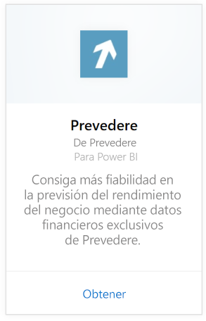
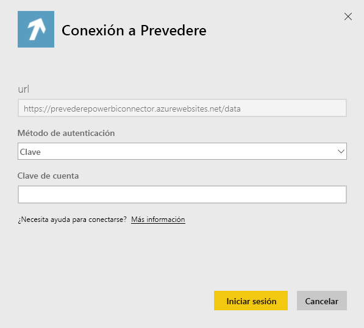
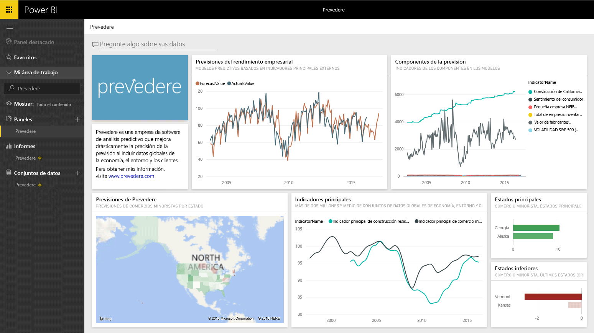

# Conexión a Prevedere con Power BI
Acceda a información financiera exclusiva y crítica para impulsar su negocio con confianza y de forma proactiva.

Conéctese al [paquete de contenido Prevedere](https://app.powerbi.com/getdata/services/prevedere) para Power BI.

>[!NOTE]
>Si no es un usuario Prevedere existente, use la [clave de ejemplo](https://prevederepowerbiconnector.azurewebsites.net/static/learnmore.html) para probarlo.

## Cómo conectarse
1. Seleccione **Obtener datos** en la parte inferior del panel de navegación izquierdo.
   
   
2. En el cuadro **Servicios** , seleccione **Obtener**.
   
   
3. Seleccione **Prevedere** y, después, **Obtener**.
   
   
4. En **Método de autenticación**, seleccione **Clave** y escriba su clave de API de Prevedere.
   
    
5. Seleccione **Iniciar sesión** para comenzar el proceso de importación. Cuando haya finalizado, aparecerá un nuevo panel, informes y modelo en el panel de navegación. Seleccione el panel para ver los datos importados.
   
     

**¿Qué más?**

* Pruebe a [hacer una pregunta en el cuadro de preguntas y respuestas](power-bi-q-and-a.md), en la parte superior del panel.
* [Cambie los iconos](service-dashboard-edit-tile.md) en el panel.
* [Seleccione un icono](service-dashboard-tiles.md) para abrir el informe subyacente.
* Aunque el conjunto de datos se programará para actualizarse diariamente, puede cambiar la programación de actualización o actualizarlo a petición mediante **Actualizar ahora**.

## Qué se incluye
El paquete de contenido obtiene información sobre las previsiones de minorista, los modelos de previsión, indicadores importantes, etc.

## Requisitos del sistema
Este paquete de contenido requiere acceso a una clave de API de Prevedere o a la clave de ejemplo (ver más adelante).

## Búsqueda de parámetros

Los clientes existentes pueden acceder a sus datos mediante la clave de API. Si aún no es un cliente, puede ver un ejemplo de los datos y análisis con la [clave de ejemplo](https://prevederepowerbiconnector.azurewebsites.net/static/learnmore.html).

## Solución de problemas
Los datos pueden tardar algún tiempo en cargarse según el tamaño de la instancia.

## Pasos siguientes
[Introducción a Power BI](service-get-started.md)

[Obtener datos en Power BI](service-get-data.md)

