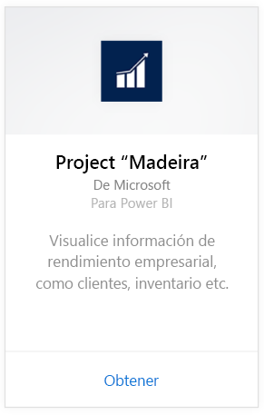
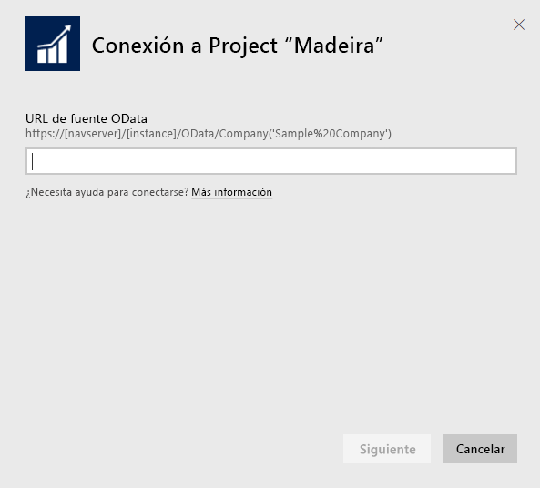
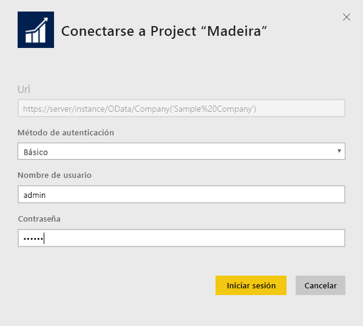
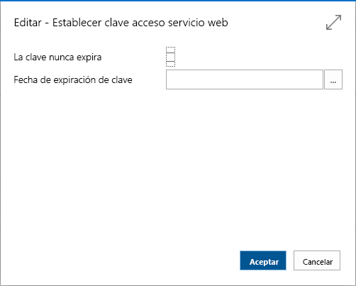

# Conexión a Project "Madeira" con Power BI
Obtener información sobre los datos de Project "Madeira" es fácil con Power BI y el paquete de contenido de Project "Madeira". Power BI recupera los datos (tanto de ventas como financieros) y, a continuación, crea un panel integrado e informes basados en esos datos.
Conéctese a Project "Madeira" para Power BI o lea más sobre la integración de Project "Madeira" con Power BI.

>[!NOTE]
>Este paquete de contenido requiere permisos para las tablas de las que se recuperan los datos, en este caso, datos de ventas y finanzas. Consulte más detalles sobre los requisitos [a continuación](#Requirements).

Conéctese al [paquete de contenido de Project "Madeira"](https://app.powerbi.com/getdata/services/project-madeira) para Power BI.

## Cómo conectarse
1. Seleccione **Obtener datos** en la parte inferior del panel de navegación izquierdo.  
    
2. En el cuadro **Servicios** , seleccione **Obtener**.  
    
3. Seleccione **proyecto "Madeira"** y, a continuación, seleccione **Obtener**.  
    
4. Cuando se le solicite, escriba la dirección URL de Project "Madeira". La dirección URL debe seguir exactamente el siguiente patrón https://mycronusus.projectmadeira.com:7048/NAV/OData/Company('CRONUS%20US') con el nombre de la compañía Project “Madeira”. Tenga en cuenta que no hay ninguna barra diagonal al final de la dirección y que la conexión debe ser https. Consulte los detalles que se muestran [a continuación](#FindingParams) sobre cómo buscar esta dirección URL.  
   
    
5. Cuando se le solicite, seleccione Básico en Método de autenticación, escriba su dirección de correo electrónico de Project “Madeira” como el nombre de usuario y luego escriba la clave de acceso del servicio web para su cuenta de Project “Madeira” como la contraseña. Si ya inició sesión en Project “Madeira” en el explorador, puede que no se le soliciten las credenciales. Consulte [a continuación](#FindingParams) los detalles sobre la generación de esta clave de acceso.  
   
    >[!NOTE]
    >Debe ser un superusuario en Project “Madeira”.
   
   
6. Una vez conectado, se cargarán automáticamente un panel, un informe y un conjunto de datos. Una vez completado, los iconos se actualizarán con los datos de su cuenta.  
   
    

**¿Qué más?**

* Pruebe a [hacer una pregunta en el cuadro de preguntas y respuestas](power-bi-q-and-a.md), en la parte superior del panel.
* [Cambie los iconos](service-dashboard-edit-tile.md) en el panel.
* [Seleccione un icono](service-dashboard-tiles.md) para abrir el informe subyacente.
* Aunque el conjunto de datos se programará para actualizarse diariamente, puede cambiar la programación de actualización o actualizarlo a petición mediante **Actualizar ahora**.

## Requisitos del sistema
Para importar los datos de Project “Madeira” en Power BI, debe tener permisos para las tablas de datos de ventas y finanzas de las que se recuperan los datos. Las tablas (con distinción entre mayúsculas y minúsculas) necesarias para el paquete de contenido incluyen:  
 
    ´´´ 
    - ItemSalesAndProfit  
    - ItemSalesByCustomer  
    - powerbifinance  
    - SalesDashboard  
    - SalesOpportunities  
    - SalesOrdersBySalesPerson  
    - TopCustomerOverview  
    ´´´ 

## Búsqueda de parámetros
**Obtención de la dirección URL correcta** Una manera sencilla de obtener esta dirección URL es dirigirse a Servicios web en Project “Madeira”, buscar el servicio web powerbifinance y copiar la dirección URL de Odata (haga clic con el botón derecho y seleccione Copiar acceso directo), pero dejando fuera “/powerbifinance…” de la cadena de dirección URL.

**Claves de acceso de servicio de web** Para utilizar datos de Project "Madeira", debe crear una clave de acceso de servicio web para su cuenta de usuario. En Project “Madeira”, busque la página de usuarios y abra la tarjeta para su cuenta de usuario. Aquí puede generar una nueva clave de acceso de servicios web y copiarla en el campo Contraseña en la página de conexión de Power BI.

Cuando empiece a usar las claves de acceso de servicio web tendrá que usarla en el futuro, así que seleccione Aceptar en el mensaje que aparece.
Al crear la clave puede seleccionar si expira en una fecha concreta o no.

Cuando elija Aceptar, se creará una clave, que pueda copiar en el campo Contraseña en la página de conexión de Power BI.

## Solución de problemas
El panel de Power BI se basa en los servicios web publicados anteriormente y mostrará datos de la compañía de demostración o su compañía si importa datos desde la solución actual de finanzas. Sin embargo, si algo va mal, en esta sección se proporciona una solución alternativa para los problemas más habituales.

**"Error en la validación de parámetros. Compruebe que todos los parámetros son válidos"**

Si ve este error después de escribir la dirección URL de Project "Madeira", asegúrese de que se cumplen los requisitos siguientes:  

   - La dirección URL sigue exactamente este patrón: https://*mycronusus*.projectmadeira.com:7048/NAV/OData/Company('*CRONUS%20US*')  
   - Elimine todo el texto que haya después del nombre de la compañía entre paréntesis  
   - Asegúrese de que no hay ninguna barra diagonal al final de la dirección URL.  
   - Asegúrese de que la dirección URL usa una conexión segura, como indica la dirección URL que empieza por https.  

**"Error de inicio de sesión."** Si recibe el error "Error de inicio de sesión." cuando inicia sesión en el panel, mediante las credenciales de Project “Madeira” , esto puede deberse a uno de los siguientes problemas:  

    - La cuenta que usa no tiene permisos para leer datos del proyecto "Madeira" de su cuenta. Compruebe su cuenta de usuario en Project "Madeira" y asegúrese de que ha utilizado la tecla de acceso de servicio web correcta como la contraseña y, luego, vuelva a intentarlo.  
    - La instancia del proyecto "Madeira" a la que intenta conectarse no tiene un certificado SSL válido. En este caso, verá un mensaje de error más detallado ("no se puede establecer una relación SSL de confianza"). Tenga en cuenta que no se admiten certificados autofirmados.  

**"¡Vaya!"** Si ve un cuadro de diálogo de error "¡Vaya!" después de pasar el cuadro de diálogo de autenticación, suele deberse a un problema al conectarse a los datos del paquete de contenido. Compruebe que la dirección URL sigue el patrón que se especificó anteriormente:  
    https://*mycronusus*.projectmadeira.com:7048/NAV/OData/Company('*CRONUS%20US*')

Un error común es especificar la dirección URL completa para un servicio web específico:  
    https://*mycronusus*.projectmadeira.com:7048/NAV/OData/Company('*CRONUS%20US*')/powerbifinance

O bien, puede que haya olvidado especificar el nombre de la compañía:   
    https://*mycronusus*.projectmadeira.com:7048/NAV/OData/

## Pasos siguientes
[Introducción a Power BI](service-get-started.md)

[Power BI: Conceptos básicos](service-basic-concepts.md)

