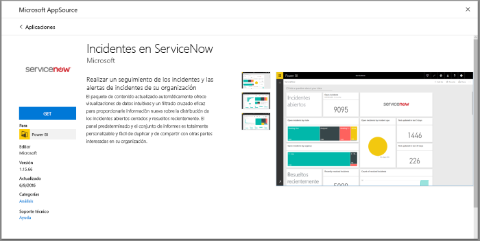
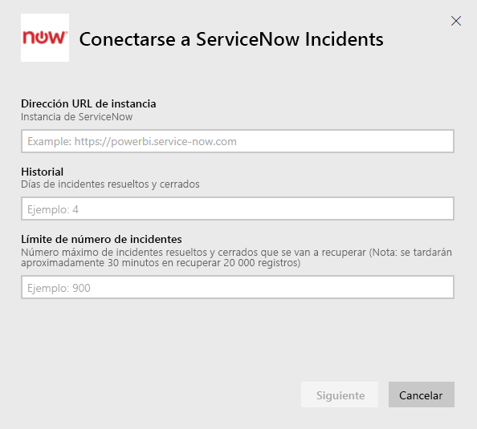
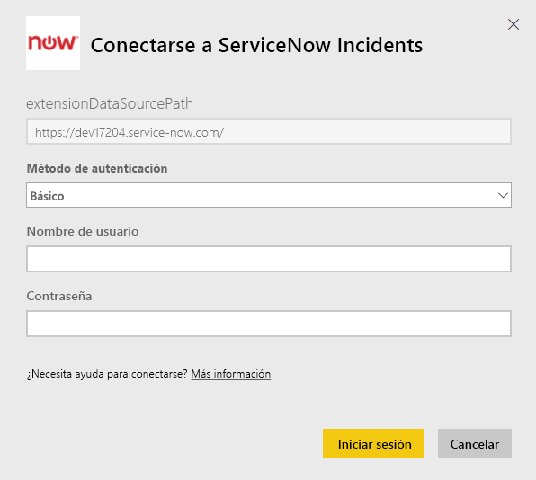
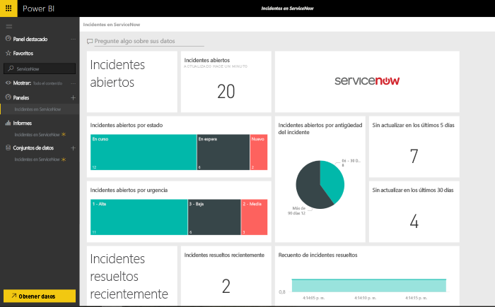

# Conexión a ServiceNow con Power BI para generar informes de incidentes
ServiceNow ofrece varios productos y soluciones que incluyen administración de TI, operaciones y negocios para mejorar su empresa. Este paquete de contenido incluye varios informes e información sobre sus incidentes abiertos resueltos recientemente y los cerrados recientemente.  

Conéctese al paquete de contenido de Power BI para los [incidentes de ServiceNow](https://app.powerbi.com/getdata/services/servicenow).

## Cómo conectarse
1. Seleccione **Obtener datos** en la parte inferior del panel de navegación izquierdo.
   
    
2. En el cuadro **Servicios** , seleccione **Obtener**.
   
    
3. Seleccione **incidentes de ServiceNow** \> **Obtener**.
   
   
4. Proporcione la dirección URL de su instancia de ServiceNow y el intervalo de días o registros que se va a incorporar. Tenga en cuenta que tan pronto como se alcance un límite, la importación se detendrá.
   
   
5. Cuando se le solicite, escriba sus credenciales **básicas** de ServiceNow. Tenga en cuenta que el inicio de sesión único no se admite en estos momentos. Puede encontrar más información sobre los requisitos del sistema a continuación.
   
   
6. Una vez completado el flujo de inicio de sesión, se iniciará el proceso de importación. Cuando haya finalizado, aparecerá un nuevo panel, informes y modelo en el panel de navegación. Seleccione el panel para ver los datos importados.
   
    

**¿Qué más?**

* Pruebe a [hacer una pregunta en el cuadro de preguntas y respuestas](power-bi-q-and-a.md), en la parte superior del panel.
* [Cambie los iconos](service-dashboard-edit-tile.md) en el panel.
* [Seleccione un icono](service-dashboard-tiles.md) para abrir el informe subyacente.
* Aunque el conjunto de datos se programará para actualizarse diariamente, puede cambiar la programación de actualización o actualizarlo a petición mediante **Actualizar ahora**.

## Requisitos del sistema
Para conectarse necesitará:  

* Una cuenta que tenga acceso a suorganización.service-now.com con la autenticación básica (el inicio de sesión único no se admite en esta versión)  
* La cuenta debe tener el rol rest_service y acceso de lectura a la tabla de incidentes.  

## Solución de problemas
Si se encuentra un error de credenciales durante la carga, revise los requisitos de acceso anteriores. Si tiene los permisos correctos y todavía tiene problemas, póngase en contacto con su administrador de ServiceNow para asegurarse de que tiene todos los permisos adicionales que pueden ser necesarios para su instancia personalizada.

Si experimenta períodos de carga largos, revise el número de incidentes y el número de días que ha especificado durante la conexión, y considere la posibilidad de reducirlo.

## Pasos siguientes
[Introducción a Power BI](service-get-started.md)

[Power BI: Conceptos básicos](service-basic-concepts.md)

