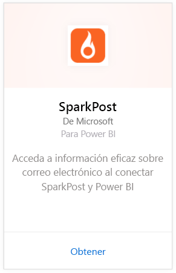
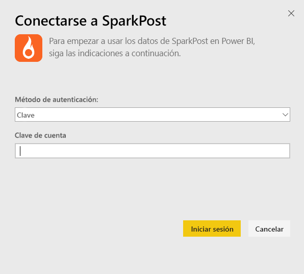
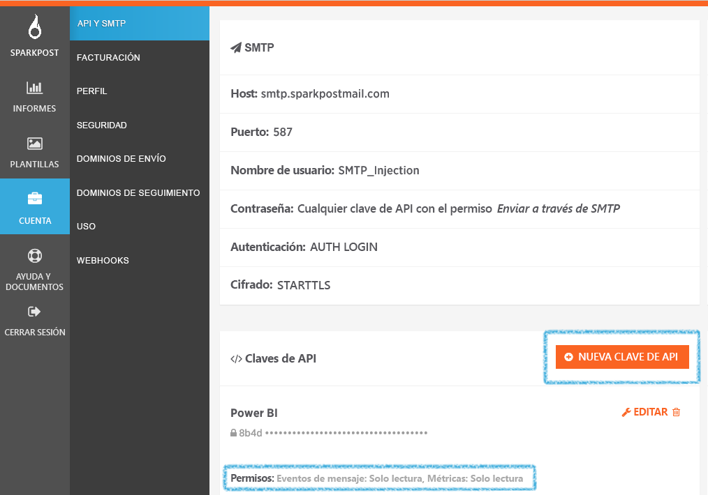

# Conexión a SparkPost con Power BI
El paquete de contenido de Power BI para SparkPost permite extraer conjuntos de datos valiosos de su cuenta de SparkPost en un panel intuitivo. El paquete de contenido de SparkPost permite visualizar las estadísticas de correo electrónico generales, incluidos los dominios, las campañas y el compromiso de ISP.

Conéctese al [paquete de contenido de SparkPost](https://app.powerbi.com/getdata/services/spark-post) para Power BI.

## Cómo conectarse
1. Seleccione **Obtener datos** en la parte inferior del panel de navegación izquierdo.
   
   
2. En el cuadro **Servicios** , seleccione **Obtener**.
   
   
3. Seleccione el paquete de contenido de **SparkPost** y haga clic en **Obtener**. 
   
   
4. Cuando se le solicite, proporcione la clave de API de SparkPost y seleccione Iniciar sesión. Consulte los detalles acerca de la [búsqueda de este parámetro](#FindingParams) más adelante.
   
   
5. Los datos comenzarán a cargarse, lo que según el tamaño de la cuenta puede tardar cierto tiempo. Después de que Power BI importe los datos, verá el panel predeterminado, el informe y el conjunto de datos en el panel de navegación izquierdo, rellenado con las estadísticas de correo electrónico de los últimos 90 días. Los nuevos elementos se marcan con un asterisco amarillo \*.
   
   

**¿Qué más?**

* Pruebe a [hacer una pregunta en el cuadro de preguntas y respuestas](power-bi-q-and-a.md), en la parte superior del panel.
* [Cambie los iconos](service-dashboard-edit-tile.md) en el panel.
* [Seleccione un icono](service-dashboard-tiles.md) para abrir el informe subyacente.
* Aunque el conjunto de datos se programará para actualizarse diariamente, puede cambiar la programación de actualización o actualizarlo a petición mediante **Actualizar ahora**.

## Qué se incluye
El paquete de contenido de SparkPost para Power BI incluye información como clics únicos, tasas de aceptados, tasas de rechazo, tasas de retrasados, tasas de rechazados, etc.

## Búsqueda de parámetros
El paquete de contenido usa una clave de API para conectar su cuenta de SparkPost a Power BI. Puede encontrar la clave de API en su cuenta, bajo Cuenta \> API y SMTP (más detalles [aquí](https://support.sparkpost.com/customer/portal/articles/1933377-create-api-keys)). Se recomienda usar una clave de API con permisos para `Message Events: Read-only ` y `Metrics: Read-only`.

