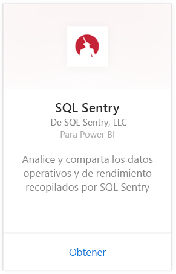
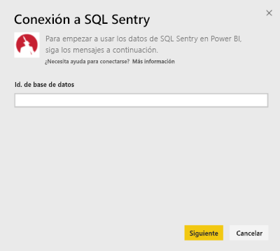
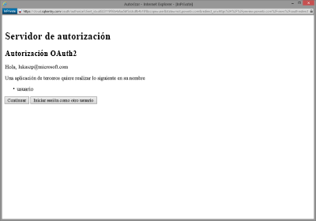
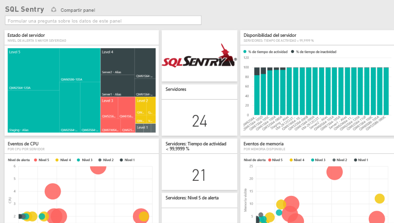
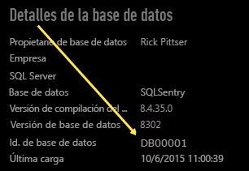

# Conexión a SQL Sentry con Power BI
Analizar los datos de rendimiento recopilados por SQL Sentry es fácil con Power BI. Power BI recupera los datos y, a continuación, crea un panel predeterminado e informes relacionados en función de esos datos.

Conéctese al [paquete de contenido de SQL Sentry](https://app.powerbi.com/groups/me/getdata/services/sql-sentry) para Power BI.

>[!NOTE]
>Se necesita acceso a una cuenta de SQL Sentry que use para conectarse a http://cloud.sqlsentry.com y un identificador de la base de datos que se va a supervisar para conectarse.  A continuación se muestran instrucciones sobre dónde encontrar el identificador de la base de datos.

## Cómo conectarse
1. Seleccione **Obtener datos** en la parte inferior del panel de navegación izquierdo.
   
   
2. En el cuadro **Servicios** , seleccione **Obtener**.
   
    
3. Seleccione **SQL Sentry  \> Obtener**.
   
   
4. Especifique el **Id. de base de datos** de la base de datos que le gustaría supervisar en Power BI. A continuación, consulte más detalles sobre cómo [encontrarlo](#FindingParams).
   
   
5. En Método de autenticación, seleccione **oAuth2 \> Iniciar sesión**.
   
   Cuando se le solicite, escriba sus credenciales de cloud.sqlsentry.com y siga el proceso de autenticación de SQL Sentry.
   
   
   
   La primera vez que se conecte, Power BI le solicitará que permita acceso de solo lectura a la cuenta. Seleccione Conceder para comenzar el proceso de importación.  El proceso de importación puede tardar unos minutos, según el volumen de datos en su cuenta.
   
   
6. Una vez que Power BI importe los datos, verá un nuevo panel, el informe y el conjunto de datos en el panel de navegación izquierdo. Los nuevos elementos se marcan con un asterisco amarillo \*:
   
   
7. Seleccione el panel de SQL Sentry.
   
   Este es el panel predeterminado que crea Power BI para mostrar los datos. Puede modificar este panel para que muestre los datos de la forma que desee.
   
   

**¿Qué más?**

* Pruebe a [hacer una pregunta en el cuadro de preguntas y respuestas](power-bi-q-and-a.md), en la parte superior del panel.
* [Cambie los iconos](service-dashboard-edit-tile.md) en el panel.
* [Seleccione un icono](service-dashboard-tiles.md) para abrir el informe subyacente.
* Aunque el conjunto de datos se programará para actualizarse diariamente, puede cambiar la programación de actualización o actualizarlo a petición mediante **Actualizar ahora**.

## Qué se incluye
Los siguientes datos están disponibles desde SQL Sentry en Power BI:

| Nombre de tabla | Descripción |
| --- | --- |
| Conexión |Esta tabla proporciona información acerca de las conexiones de SQL Sentry definidas. |
| Fecha  |Esta tabla contiene las fechas desde hoy hasta la fecha más antigua de recopilación y conservación de los datos de rendimiento. |
| Tiempo de inactividad  |Esta tabla contiene información relacionada con el tiempo de inactividad y el tiempo de actividad supervisado de cada servidor de su entorno. |
| Uso de memoria  |Esta tabla contiene datos sobre la cantidad de memoria disponible o libre en cada uno de los servidores.  |
| Servidor  |Esta tabla contiene los registros para cada servidor de su entorno. |
| Estado del servidor  |Esta tabla contiene datos de todos los eventos generados por las condiciones personalizadas en su entorno, incluidos la gravedad y el recuento. |

## Búsqueda de parámetros
El **Id. de base de datos** puede encontrarse si se inicia sesión en <https://cloud.sqlsentry.com> en una nueva ventana del explorador web.  El **Id. de base de datos** aparece en la página de información general principal:

    

El **Id. de base de datos** también se muestra en la pantalla de detalles de la base de datos:

    

## Solución de problemas
Si los datos de algunas de las aplicaciones no aparece en Power BI, asegúrese de que está usando el identificador de base de datos correcto y de que tiene la autoridad para ver los datos. 

Si no es el propietario de la base de datos de SQL Sentry que se está sincronizando en <https://cloud.sqlsentry.com>, póngase en contacto con su administrador para asegurarse de que tiene derechos para ver los datos recopilados.

## Pasos siguientes
[Introducción a Power BI](service-get-started.md)

[Obtener datos para Power BI](service-get-data.md)

