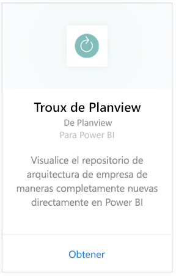
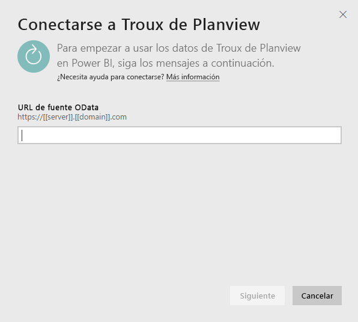
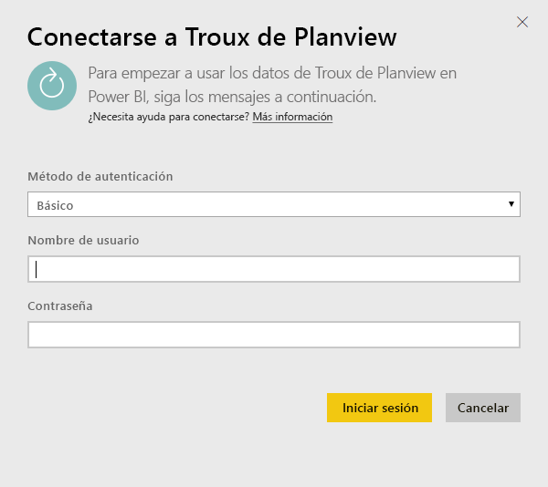
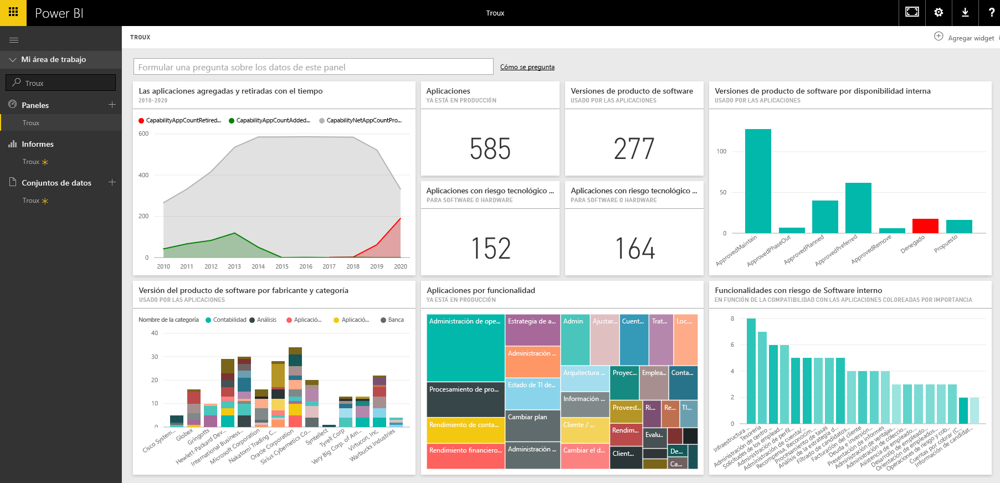

# Conexión a Troux para Power BI
El paquete de contenido de Troux permite visualizar el repositorio de arquitectura de empresa de maneras completamente nuevas directamente en Power BI. El paquete de contenido ofrece un conjunto de información sobre las capacidades empresariales, las aplicaciones que ofrecen estas capacidades y las tecnologías compatibles con dichas aplicaciones que pueden se pueden personalizar totalmente con Power BI.

Conéctese al [paquete de contenido de Troux](https://app.powerbi.com/getdata/services/troux) para Power BI.

## Cómo conectarse
1. Seleccione **Obtener datos** en la parte inferior del panel de navegación izquierdo.
   
   
2. En el cuadro **Servicios** , seleccione **Obtener**.
   
   
3. Seleccione **Troux** \> **Obtener**.
   
   
4. Especifique la dirección URL de OData de Troux. Vea los detalles sobre [cómo encontrar esos parámetros](#FindingParams) a continuación.
   
   
5. En **Método de autenticación**, seleccione **Básico** , proporcione el nombre de usuario y la contraseña (distingue mayúsculas de minúsculas), y haga clic en **Iniciar sesión**.
   
    
6. Tras la aprobación, el proceso de importación se iniciará automáticamente. Cuando haya finalizado, aparecerá un nuevo panel, informes y modelo en el panel de navegación. Seleccione el panel para ver los datos importados.
   
     

**¿Qué más?**

* Pruebe a [hacer una pregunta en el cuadro de preguntas y respuestas](consumer/end-user-q-and-a.md), en la parte superior del panel.
* [Cambie los iconos](service-dashboard-edit-tile.md) en el panel.
* [Seleccione un icono](consumer/end-user-tiles.md) para abrir el informe subyacente.
* Aunque el conjunto de datos se programará para actualizarse diariamente, puede cambiar la programación de actualización o intentar actualizar a petición mediante **Actualizar ahora**

## Requisitos del sistema
Se requiere acceso a la fuente de OData de Troux y a Troux 9.5.1 o posterior.

## Búsqueda de parámetros
El equipo de atención al cliente puede proporcionarle una dirección URL de fuente de OData de Troux única para usted

## Solución de problemas
Si ve un error de tiempo de espera después de proporcionar las credenciales, intente conectarse de nuevo.

## Pasos siguientes
[Introducción a Power BI](service-get-started.md)

[Obtener datos en Power BI](service-get-data.md)

